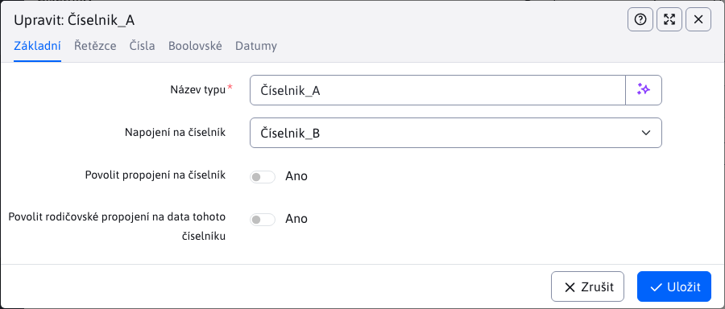

# Číselníky

Aplikace Číselníky umožňuje vytvářet/editovat/mazat a duplikovat pojmenované typy číselníků, do kterých je následně možné ukládat data těchto číselníků. Typy a data číselníků lze také exportovat a importovat pomocí souboru.

## Typy číselníků

Při vytváření nového typu číselníku musíte zadat jméno, které bude unikátní. Ostatní pole jsou volitelná. Všimněte si karty **Řetězce** / **Čísla** / **Boolovské** / **Data**, které obsahují několik očíslovaných polí. Těmito poli zadefinujete jaký formát budou mít data daného číselníku. Pokud zadáte název, v datech číselníku se vygeneruje pole s jméno, které odpovídá zadanému textu a typu dané karty.

Příklad: pokud vyplníte 2 pole v kartě **Řetězce**

a jedno pole v kartě **Boolovské**,

tak se v datech daného číselníku zobrazí 2 sloupce/pole typu řetězec a 1 sloupec/pole typu boolean s názvy, které byly zadány (viz obrázek v sekci [Seznam dat číselníků](#seznam-dat-číselníků)).

To znamená, že si můžete zadefinovat formát dat číselníků pro každý číselník zvlášť. Jak již napovídají názvy karet, můžete kombinovat textová, číselná, boolovská nebo datová pole. Jejich počet je omezen pro každý typ počtem polí v jednotlivých kartách.

### Karta Základní

V kartě "Základní" se nastavují vlastnosti:
- Název typu - jedinečný název pro typ číselníku, nesmí být prázdný.
- Propojení na číselník - výběr ze všech číselníků pro propojení číselníku.
- Povolit propojení na číselník - povolení propojení na jiný číselník (stejně jako v případě typu číselníku).
- Povolit rodičovské propojení na data tohoto číselníku - určuje, zda budou mít data daného číselníku povoleno zvolení rodičovského propojení.

Nemůžete mít současně povoleno pro data "propojení na číselník" a "rodičovské propojení".

**Propojení na číselník** má určitá omezení a proto se některé možnosti buď nedají zvolit (označené šedou barvou) nebo jejich zvolení vrátí chybovou zprávu.

1. Propojení číselníku samého na sebe je zakázáno. V případě že pro číselník **B** vybíráte propojení na jiný číselník, v seznam bude i on sám, ale tato možnost se nebude dát zvolit.

2. Kruhové propojení číselníků je zakázáno. Pokud si číselník **A** zvolí propojení na číselník **B**, tak číselník **B** se nemůže propojit zpět na číselník **A**. Možnost zvolit číselník **A** bude pro číselník **B** sice viditelná a bude ji moci i zvolit, ale při pokusu o uložení bude vrácena chybová zpráva.

3. Propojení na již vymazaný číselník. Může nastat situace, že číselník **C** se propojil na číselník **D**, který byl následně smazán. V tomto případě uvidíte smazaný číselník **D** v možnostech s prefixem **`(!deleted)_`**. Tento prefix bude jasně dávat najevo, že číselník již byl smazán a taková možnost nebude možné zvolit. Avšak číselník **C**, který se propojil ještě před smazáním číselníku **D** si toto propojení ponechá. Toto propojení bude možné změnit, ale po změně se zpětně na vymazaný číselník již znovu nedokáže propojit.

**Povolit odkaz na číselník** pokud je povoleno, jednotlivá data číselníku se budou moci propojovat na číselníky. I v tomto případě zde jsou určitá omezení.

1. Propojení na číselníky ze kterého data vycházejí je zakázáno. Pokud data vytváříte pod číselníkem X mají povoleno propojení na číselník, tak možnost na číselník X se ani nezobrazí.

2. Propojení na již vymazaný číselník. Tento případ má stejné podmínky jako **Propojení na číselník** u typu číselníku.

**Povolit rodičovský odkaz na data tohoto číselníku** je-li povoleno, jednotlivá data číselníku si budou moci zvolit rodiče z ostatních dat pod týmž číselníkem. I v tomto případě zde jsou určitá omezení.

1. V tomto případě musí být splněna jedna podmínka. Pro používání rodičovského propojení musí mít typ číselníku definovanou možnost pro **Řetězec 1**. Důvodem je fakt, že hodnota ve vygenerovaném sloupci **Řetězec 1** se bude používat jako identifikátor, kterým se bude dát zvolit propojení na rodiče.

2. Propojení záznamu číselníku na sebe je zakázáno. Data číselníku při výběru rodičovského propojení nebudou vidět mezi možnostmi sami sebe.

!>**Upozornění:** pokud "povolení propojení na číselník" nebo "povolení rodičovského propojení" bude odebráno, všechna propojení, která byla vytvořena u dat tohoto číselníku budou odstraněna a to iv případě, že toto povolení bude zpětně uděleno opět.

Jako příklad mějme situaci, kdy si vytvoříme typ číselníku s označením X a tento typ číselníku povoluje „propojení na číselník“. Pod tímto typem číselníku vytvoříme záznam, který má povolené propojení na číselník a bude se propojovat na číselník Z. Pokud pak u typu číselníku X povolení "propojení na číselník" zrušíme, takto záznam tohoto číselníku, který se propojil na číselník Z, přijde o toto propojení natrvalo. Pokud bychom "propojení na číselník" opět povolili, u záznamu by se zobrazila možnost, ale předchozí volba na číselník Z by byla vynulována.

## Seznam dat číselníků

Data číselníků umožňuje editovat data vytvořených typů číselníků. Je třeba z nabídky v hlavičce stránky vybrat číselník, který se bude spravovat. Po výběru konkrétního číselníku se zobrazí jeho příslušná data. V případě, že typ číselníku má některé sloupce nepojmenované, tyto sloupce a jejich data nebudou zobrazeny.

!>**Upozornění:** v nabídce jsou pouze číselníky, které nebyly vymazány.

Příklad:

Při vytváření číselníku **A** jsme vyplnili pole **Řetězec 1**, **Řetězec 2** a **Boolean 1**. Vidíme, že tabulka mě přesně ty sloupce, které jsme v číselníku zadefinovali. Pokud budeme vytvářet nový záznam (nová data) pro číselník, v editoru se nám vygenerují 2 pole typu řetězec a 1 pole typu boolean. Názvy těchto polí budou stejné jako ty, co jsme zadali při vytváření číselníku. Samozřejmě, pokud to jsme při vytváření číselníku povolili, v editoru můžeme mít **rodičovské propojení** nebo **propojení na číselník**.

Při změně vybraného typu číselníku se může změnit celá tabulka i editor dat číselníků.

## Mazání dat

Standardně se při smazání záznamu typu číselníku nebo dat fyzicky nesmažou z databáze, ale se označí jako smazané. Je to ochrana před chybami získání dat ve starých údajích. Např. používá-li se číselník Barva auta a už pro nové záznamy nechceme nějakou barvu mít na výběr, ale zároveň ve starých záznamech je třeba barvu zobrazit. Technicky lze smazaný záznam obnovit přímo v databázi nastavením atributu `hidden`, ale uživatelské rozhraní to aktuálně neumožňuje.
