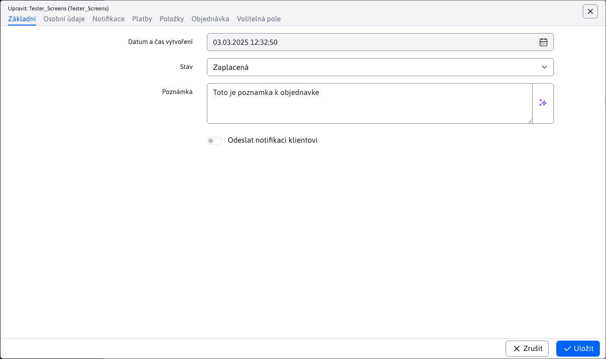
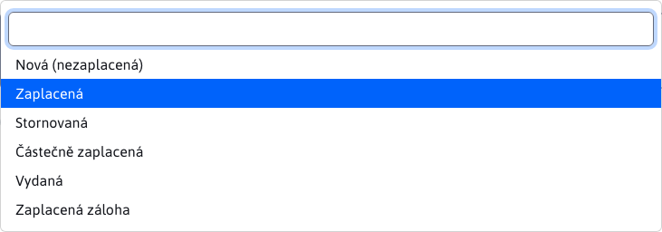
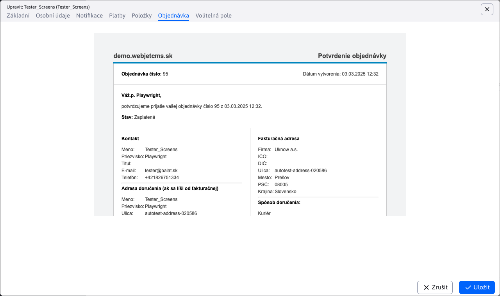

# Seznam objednávek

Aplikace Seznam objednávek poskytuje přehled všech vytvořených objednávek pomocí elektronického obchodu, s možností jejich spravování.

Aplikace neumožňuje přidávání nových objednávek pomocí vytvoření/duplikování/importování. Povolené akce jsou pouze úprava/mazání/exportování.

Můžete si všimnout, že sloupce **Jméno** a **Příjmení** mají některé hodnoty kombinovány. První hodnota **vždy** zobrazuje jméno jako kontakt (fakturační jméno). Druhé jméno v závorce se zobrazí, pouze pokud byla zadána adresa doručení, která je jiná než fakturační. Protože fakturační jméno a jméno pro doručení se mohou lišit. Při filtrování se hledá shoda pro obě tyto hodnoty. Totéž platí iu sloupce příjmení.

## Úprava objednávky

Okno pro úpravu objednávky sestává z karet:
- Základní
- Osobní údaje
- Notifikace
- Platby
- Položky
- Zobrazení objednávky
- Volitelná pole

### Karta - Základní

Poskytuje základní informace o objednávce.

Důležitý je parametr **Stav**, který indikuje aktuální stav objednávky, ve kterém se právě nachází.

Zobrazené stavy jsou automaticky dostupné. Pokud si přejete přidat nové stavy, můžete tak učinit pomocí konfigurační proměnné `basketInvoiceBonusStatuses`. Nový status přidáte jako hodnotu id\_statusu|překladový\_klíč.

!>**Upozornění:** hodnota id\_statusu musí být rovna nebo větší než číslo 10. Přidané statusy s menší hodnotou než 10 budou ignorovány.

Pokud zvolíte možnost **Odeslat notifikaci klientovi**, tak notifikace bude odeslána při uložení upravované objednávky (přehled notifikace v následující kapitole).

### Karta - Osobní údaje

Poskytuje přehled o **adrese doručení** jakož i **kontaktní informace** kupujícího. Hodnoty jsou získány z formuláře při vytváření objednávky v elektronickém obchodě.

### Karta - Notifikace

Poskytuje náhled emailové notifikace na zákazníka, s možností změny textu. Notifikace se odešle pouze v případě zvolení možnosti **Odeslat notifikaci klientovi** v kartě Základní.

**Odesílatel** - automatický vyplněná hodnota s emailem aktuálně přihlášeného uživatele. Slouží jako email odesílatele notifikace a lze tuto adresu změnit. **Předmět** - automatický vyplněná hodnota s textem **Změna stavu objednávky (id objednávky)**. Slouží jako předmět odeslaného emailu (notifikace) a lze ji změnit.

**Text notifikace** - tělo/text odeslaného emailu. Hodnota `{STATUS}` bude při odeslání nahrazena aktuálním stavem objednávky. Hodnota `{ORDER_DETAILS}` na nahradí celkovým přehledem objednávky, který naleznete v části [Karta - Zobrazení objednávky](#karta-zobrazení-objednávky).

### Karta - Platby

Poskytuje [přehled všech plateb](payments.md) k této objednávce (ve formě vnořené tabulky) a možnost správy plateb.

### Karta - Položky

Poskytuje přehled [všech položek objednávky](items.md) a možnost správy položek.

### Karta - Zobrazení objednávky

Poskytuje celkový přehled objednávky, včetně plateb a položek. Tento přehled **není možné upravovat**, slouží pouze pro informační účely. Také se tento přehled vloží do odeslané [notifikace](#karta-notifikace) uživateli, jako náhrada hodnoty `{ORDER_DETAILS}`.

Při změně hodnot [plateb](#karta-platby) nebo hodnot [položek](#karta-položky) se se tento přehled objednávky obnoví a poskytuje tak vždy aktuální informace.

### Karta Volitelná pole

V kartě Volitelná pole můžete nastavovat hodnoty polí podle potřeb vaší implementace.

## Změna stavu objednávky

Pokud objednávce byla přidána platba (nebo více plateb), která **nepokrývá celkovou částku objednávky** k uhrazení, tak se stav objednávky na pozadí automaticky nastaví na hodnotu **Částečně zaplacená**.

Pokud objednávce byla přidána platba (nebo více plateb), která **pokrývá celkovou částku objednávky** k uhrazení, tak se stav objednávky na pozadí automaticky nastaví na hodnotu **Zaplacená**.

## Vymazání objednávky

Chcete-li vymazat objednávku, je třeba nejprve změnit stav na **Stornována**. Po vymazání se automaticky vymažou i související platby a položky objednávky.
