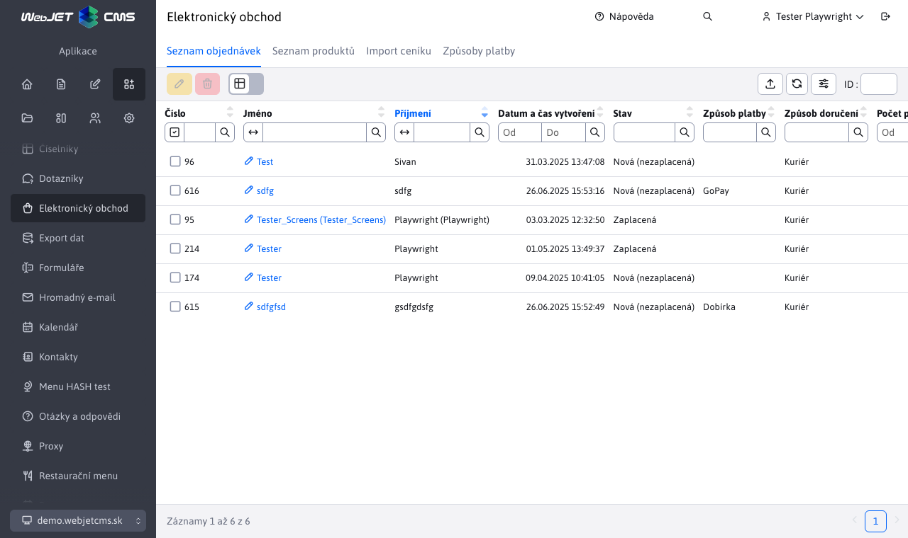

# Seznam objednávek

Aplikace Seznam objednávek poskytuje přehled všech objednávek vytvořených pomocí elektronického obchodu s možností jejich správy.

Aplikace neumožňuje přidávání nových objednávek pomocí vytvoření/duplikace/importu. Povoleny jsou pouze akce editace/odstranění/export.

## Úprava objednávky

Okno pro úpravu objednávky se skládá z karet:
- Základní
- Oznámení
- Platby
- Položky
- Zobrazit objednávky

### Karta - Základní

Poskytuje základní informace o objednávce.

Důležitým parametrem je **Stav** který označuje aktuální stav objednávky, v níž se právě nachází.

Zobrazené stavy jsou k dispozici automaticky. Pokud chcete přidat nové stavy, můžete tak učinit pomocí konfigurační proměnné `basketInvoiceBonusStatuses`. Přidejte nový stav jako id\_status|translation\_key.

!>**Varování:** hodnota id\_status musí být rovna nebo větší než 10. Přidané stavy s hodnotou menší než 10 nebudou ignorovány.

Pokud zvolíte možnost **Odeslání oznámení klientovi**, bude po uložení upravené zakázky odesláno oznámení (přehled oznámení naleznete v následující kapitole).

### Karta - Oznámení

Poskytuje náhled e-mailového oznámení zákazníkovi s možností změny textu. Oznámení bude odesláno pouze v případě, že je tato možnost vybrána **Odeslání oznámení klientovi** na kartě Základní.

**Odesílatel** - automaticky vyplněná hodnota s e-mailem aktuálně přihlášeného uživatele. Slouží jako e-mail odesílatele oznámení a tuto adresu je možné změnit.

**Příjemce** - hodnota je získána z formuláře při vytváření objednávky v e-shopu. E-mail příjemce lze také změnit.

**Předmět** - automaticky vyplněná hodnota s textem **Stav objednávky změny (ID objednávky)**. Slouží jako předmět odeslaného e-mailu (oznámení) a lze jej změnit.

**Text oznámení** - tělo/text odeslaného e-mailu. Hodnota `{STATUS}` bude po odeslání nahrazen aktuálním stavem objednávky. Hodnota `{ORDER_DETAILS}` bude nahrazen celkovým přehledem objednávek, který lze nalézt v části [Karta - Zobrazit objednávku](#karta-zobrazení-objednávky).

### Karta - Platby

Poskytuje [přehled všech plateb](payments.md) k této objednávce (ve formě vnořené tabulky) a možnost spravovat platby.

### Karta - Předměty

Poskytuje přehled [všechny položky objednávky](items.md) a možnost spravovat položky.

### Karta - Zobrazit objednávku

Poskytuje celkový přehled o objednávce, včetně plateb a položek. Tento přehled **nelze upravovat**, má pouze informativní charakter. Je rovněž vložen do zaslaných [oznámení](#karta-oznámení) uživateli jako náhradní hodnotu `{ORDER_DETAILS}`.

Při změně hodnot [platby](#platby-kartou) nebo hodnoty [položky](#karta-položky) tento přehled objednávek je aktualizován a poskytuje tak vždy aktuální informace.

## Stav změnového příkazu

Pokud byla do objednávky přidána platba (nebo více plateb), která **nepokrývá celkovou částku objednávky** k úhradě, stav objednávky na pozadí se automaticky nastaví na hodnotu **Částečně uhrazeno**.

Pokud byla do objednávky přidána platba (nebo více plateb), která **pokrývá celkovou částku objednávky** k úhradě, stav objednávky na pozadí se automaticky nastaví na hodnotu **Placené**.

## Odstranění objednávky

Chcete-li objednávku odstranit, musíte nejprve změnit její stav na. **Zrušeno**. Po vymazání se automaticky vymažou související platby a položky objednávky.
