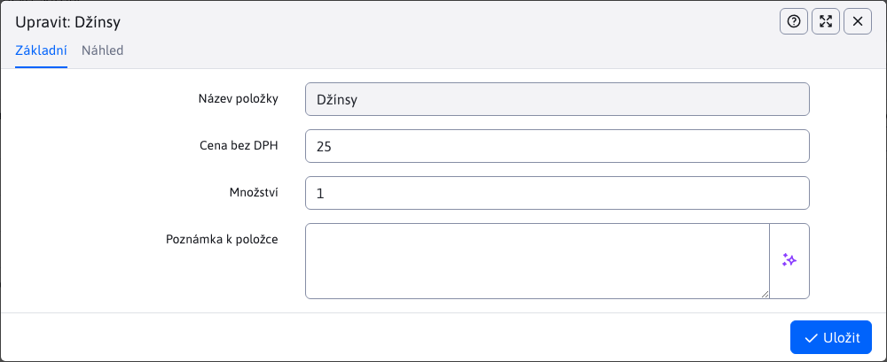

# Položky

Vnořená tabulka Položky v detailu objednávky poskytuje přehled položek konkrétní objednávky, počet kusů i jednotlivou nebo celkovou cenu. Uváděny jsou ceny bez a včetně DPH.

Umožněny jsou pouze operace pro úpravu a mazání položek objednávky. Přidávání nových položek je možné pouze přímo v elektronickém obchodu.

# Úprava položky

Okno editoru položek nabízí možnost změny pouze jediného parametru a to **Množství** kusů dané položky. Typ položky i cena bez DPH jsou fixní a nelze je změnit.

## Patička tabulky

Patička tabulky obsahuje užitečnou informaci o tom, jaká je celková částka objednávky k uhrazení, včetně DPH. Pokud se počet položek změní nebo je nějaká položka vymazána, tato hodnota se automaticky upraví.

Tato změna se automaticky projeví i patičce tabulky [platby](./payments.md#patička-tabulky).
