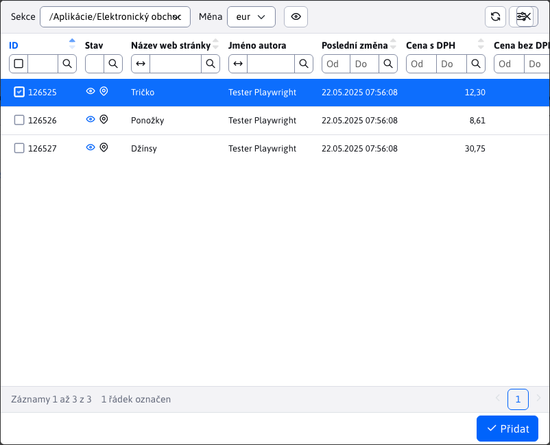

# Položky

Vnořená tabulka **Položky** v detailu objednávky poskytuje přehled položek konkrétní objednávky, počet kusů i jednotlivou nebo celkovou cenu. Uváděny jsou ceny bez a včetně DPH.

## Stav položek

Jelikož mezi položky objednávky se počítá i zvolený způsob platby a zvolený způsob doručení, sloupec **Stav** rozeznává jednotlivé typy položek následujícími ikonami:
- <i class="ti ti-shopping-bag" ></i> - objednaná položka z obchodu
- <i class="ti ti-truck-delivery" ></i> - zvolený způsob doručení
- <i class="ti ti-cash" ></i> - zvolený způsob platby

## Přidání položek

Při přidání položek se nám v okně zobrazí celá sekce [Seznam produktů](../product-list/README.md).V tomto okně můžete provádět klasické filtrování, ale jakákoliv úprava není povolena.<button class="btn btn-sm btn-outline-secondary" type="button"><i class="ti ti-eye" ></i></button> pro zobrazení stránky produktu.

Pro přidání produktů je musíte označit a svoji volbu potvrdit tlačítkem <button class="btn btn-primary"><i class="ti ti-check" ></i>Přidat. Pokud tento produkt/položka v objednávce ještě nebyla, bude přidána. Pokud se v objednávce tento produkt/položka již nachází, jen se zvýší množství o hodnotu </button>.`1`Úprava položky

## Okno editoru položek nabízí možnost změny poli&#x20;

Cena bez DP&#x48;**,&#x20;**&#x4D;nožstv&#xED;**,&#x20;**&#x50;oznámka k položc&#x65;**. Takto umíte v objednávce změnit množství položek nebo pokud položka poškozena, dát na ni slevu atp.**&#x50;atička tabulky

## Patička tabulky obsahuje užitečnou informaci o tom, jaká je celková částka objednávky k uhrazení, včetně DPH. Pokud se počet nějaká položka přidá, upraví nebo vymaže, hodnota se automaticky upraví.

Tato změna se automaticky projeví i patičce tabulky&#x20;

platby[.](./payments.md#patička-tabulky) !>

Upozornění:**&#x20;pokud provádíte úpravy v seznamu položek měli byste pro tuto objednávku&#x20;**&#x4F;deslat notifikaci klientov&#x69;**&#x20;, protože změna ceny k zaplacení může změnit i stav celé objednávky.**
