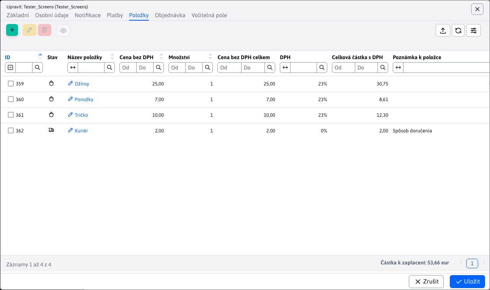

# Položky

Vnořená tabulka Položky v detailu objednávky poskytuje přehled o položkách v konkrétní objednávce, počtu položek a také o individuální nebo celkové ceně. Ceny jsou uvedeny bez DPH a včetně DPH.

Povoleny jsou pouze operace pro úpravu a mazání položek objednávky. Přidávání nových položek je možné pouze přímo v e-shopu.

# Úprava položky

Okno editoru položek nabízí možnost změnit pouze jeden parametr, a to **Množství** kusů dané položky. Typ položky a cena bez DPH jsou pevné a nelze je měnit.

## Tabulka v zápatí

Zápatí tabulky obsahuje užitečné informace o tom, jaká je celková částka objednávky k úhradě včetně DPH. Pokud se změní počet položek nebo se některá položka odstraní, tato hodnota se automaticky upraví.

Tato změna se automaticky promítne do zápatí tabulky. [platby](./payments.md#noha-stolu).
