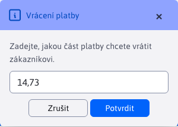
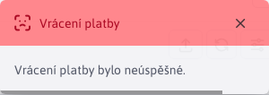
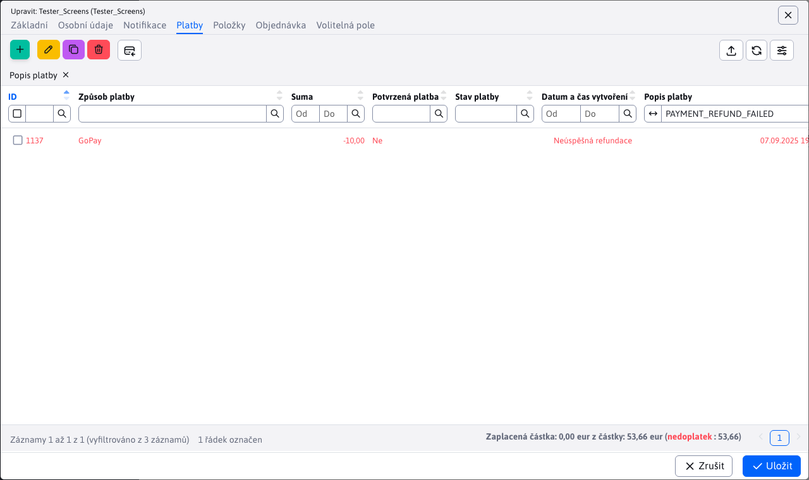
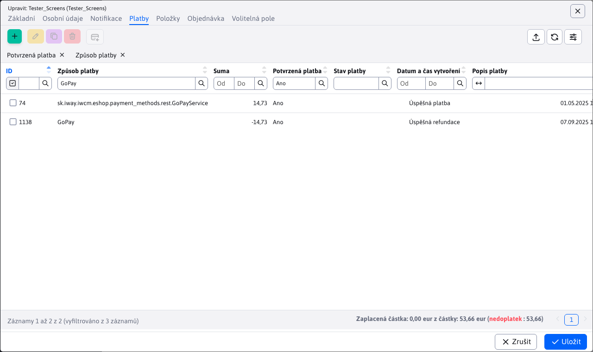
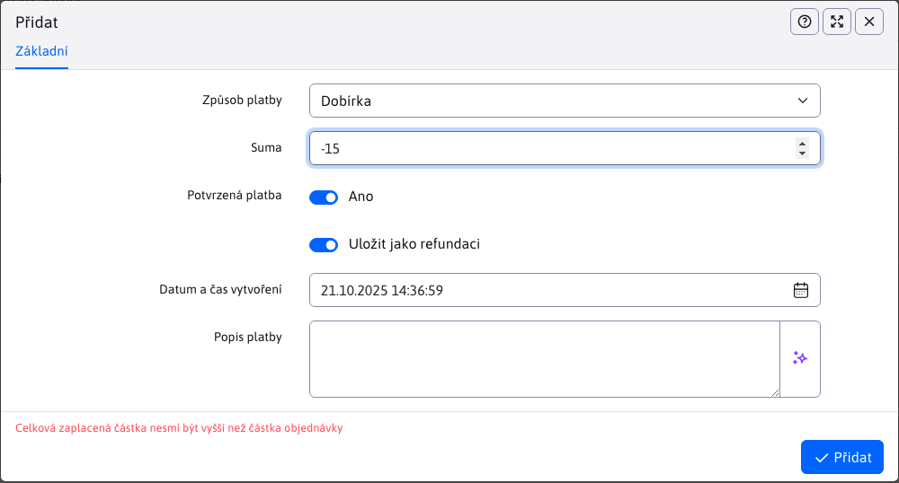

# Platby

Vnořená tabulka **Platby** v detailu objednávky poskytuje přehled plateb ke konkrétní objednávce.

Požadovaná částka objednávky nemusí být zaplacena najednou, ale může být zaplacena v jednotlivých platbách, některé platby mohou být refundovány nebo čekající na schválení, což je důvod proč jsou platby vedeny v samostatné tabulce.

## Stav platby

Stavy platby je automaticky nastavovaná hodnota, která může nabýt stavy:
- **Neúspěšná platba**, platba která byla vytvořena ale nepodařila se, například kvůli problému s platební bránou.
- **Úspěšná platba**, úspěšně zpracovaná platba.
- **Úspěšná refundace**, úspěšná refundace stávající platby nebo refundace částky.
- **Neúspěšná refundace**, neúspěšná refundace jiné stávající platby.
- **Refundovaná platba**, platba, která byla úspěšně refundována v plné částce.
- **Částečně refundovaná platba**, platba, která byla úspěšně refundována pouze z části (není ještě plně refundována).
- **Neznámý stav**, platba je v neznámém stavu. Například ručně vytvořená platba, která teprve není potvrzena.

## Akce nad platbami

Akce přidání/úpravy/mazání jsou povoleny, pouze pokud je povolí programátor, který přidával platební metodu do systému. V některých případech, může programátor tuto volbu přidat do konfigurace [způsobu platby](../payment-methods/README.md), například jako u způsobu platby`GoPay`, kde je tato možnost označena jako**Umožnit administrátorovi editaci plateb**.

## Přidání platby z aplikace

Po vytvoření objednávky v aplikaci **Elektronický obchod**, může nastat jedna z těchto situací, podle toho, jaký způsob platby byl vybrán:
- **platba se automaticky vytvoří**, v případě, že zvolený způsob platby neimplementuje platební bránu (jako například způsoby platby **dobírka** nebo **převod**). K dané objednávce se automaticky vytvoří záznam platby daným způsobem. Tento záznam platby je v plné ceně objednávky a je přednastaven jako **nepotvrzená platba**. To znamená, že tato platba má **Neznámý stav** a nepočítá se mezi úspěšné platby. Je pak na Vás, abyste ověřili, zda byla částka zaplacena a následně označili platbu v administraci jako **potvrzená platba**.

!>**Upozornění:** jelikož takové platby vyžadují manuální změnu stavu v administraci, ujistěte se, že implementace způsobu platby umožňuje editaci v administraci.

- **platba se automaticky nevytvoří**, v případě, že zvolený způsob platby implementuje platební bránu. Poskytne vám možnost tuto objednávku okamžitě zaplatit. Je na Vás, jestli se to rozhodnete zaplatit okamžitě nebo později. Všechny úspěšné i neúspěšné pokusy o zaplacení objednávky (přes platební bránu) zvoleného způsobu platby se automaticky uloží. Takže jsou v tabulce platby viditelné.

!>**Upozornění:** jelikož platba přes implementovanou platební bránu je automatizovaný proces nastavený programátorem, silně doporučujeme**nepovolit** editaci platby v administraci pro daný způsob platby.

## Přidání platby z administrace

V ideálním případě nebude nutné přidávání nové platby přes administraci, ale pouze její úpravu nebo refundaci. Nicméně, ruční přidání nové platby je dostupné a má parametry:
- **Způsob platby**, poskytuje na výběr dostupné způsoby platby, které jsou **nakonfigurováno**.
- **Suma**, zaplacená částka objednávky. Zadaná částka má své [omezení](./payments.md#omezení-částky).
- **Potvrzená platba**, potvrzení, že platba byla úspěšně provedena/přijata. Před-nastaveně je platba potvrzena.
- **Uložit jako refundaci**, uložit platbu jako [refundační platbu](./payments.md#refundační-platba).
- **Datum**, automatické nastavené aktuální datum, kdy je platba vytvářena (lze změnit).
- **Popis platby**, dobrovolný popis k platbě, který slouží jako bonusové informační pole. Např. proč se platba nezdařila, nebo jakou platbu tato refunduje.

!>**Upozornění:** daný způsob platby musí podporovat [akce nad platbami](./payments.md#akce-nad-platbami).

### Omezení částky

Zadaná částka nesmí být menší, než povolené minimum `0.01`.

Celková zaplacená částka nesmí být větší, než je celková částka objednávky. Při přidávání platby přes administraci, se kontroluje součet částek z plateb, včetně právě přidávané platby.

Počítají se pouze částky plateb, které jsou:
- potvrzené platby
- platby s úspěšným stavem:
  - **Úspěšná platba**
  - **Úspěšná refundace**
  - **Částečně refundovaná platba**
  - **Refundovaná platba**

Pokud platba při vytváření **není** označena jako **potvrzena**, validace zadané částky se nekoná. Provede se až při úpravě, když se označí za potvrzenou.

### Stav vytvářené platby

Vytvářená platba přes administraci může nabýt stavu:
- **Úspěšná platba**, pokud vytvářená platba má platnou částku a je označena jako **potvrzená platba**
- **Neznámý stav**, pokud vytvářená platba**není** označena jako **potvrzená platba**
- **Úspěšná refundace**, pokud jde o úspěšně vytvořenou [refundační platbu](./payments.md#refundační-platba).

## Refundace platby

Refundace platby slouží k vrácení částečné nebo plné částky stávající platby. K refundaci slouží tlačítko <button class="btn btn-sm btn-outline-secondary" type="button"><i class="ti ti-credit-card-refund" ></i></button>. Platba se dá refundovat pouze pokud:
- refundace tohoto typu platby je povolena v anotacích `@PaymentMethod` a je řádně implementována (např přes platební bránu). Více se dočtete v části [způsoby platby](../../../../custom-apps/apps/eshop/payment-methods/README.md).
- platba je **potvrzena**
- refundujete částku menší rovnou než zůstatková částka platby, která ještě nebyla refundována
- platba je ve stavu:
  - **Úspěšná platba**
  - **Částečně refundovaná platba**

### Průběh refundace

Označíte platbu (pouze jednu), kterou chcete refundovat. Následně stisknete tlačítko <button class="btn btn-sm btn-outline-secondary" type="button"><i class="ti ti-credit-card-refund" ></i></button> k refundaci. Zobrazí se dialog, kde musíte zadat částku, kterou chcete refundovat. Před-nastavena je celá částka platby. Můžete refundovat najednou celou platbu, nebo jen část platby. Po zadání částky pokračuje stisknutím tlačítka <button type="button" class="btn btn-primary">Potvrdit</button>

Následně může nastat jedna z následujících situací.

**Neplatná refundace**

Pokusili jste se refundovat platbu, která není v dobrém stavu, nemá povolenou refundaci nebo jste refundovali špatnou částku (atd.). V takovém případě se vrátí jen chybová hláška, která Vás upozorní, proč se platba nedá refundovat.

**Refundace selhala**

Refundovali jste povolenou platbu i správnou částku, ale refundace se nezdařila. Chyba se například mohla stát na straně platební brány, která se starala o žádost k refundaci platby. V takovém případě, se do tabulky vloží záznam o neúspěšné refundaci, čili platba ve stavu **Neúspěšná refundace**. Automatický je tato platba označena jako**nepotvrzená** a v poli **popis platby** bude také chybová hláška. Formát hlášky se může měnit v závislosti na způsobu platby a tom, jak tuto platbu implementoval programátor.

**Refundace se podařila**

V případě, že všechny podmínky byly splněny a při procesu refundace nenastála žádná chyba. Do tabulky plateb bude automaticky přidána platba ve stavu **Úspěšná refundace**. Všimněte si, že **suma refundace má zápornou hodnotu**, protože jsme odebírali ze zaplacené částky. V závislosti na implementaci refundovaného způsobu platby, může pole **popis platby** obsahovat také bonusové informace, jako `id` refundované platby.

Platba kterou jste refundovali, nabude stavu **Refundovaná platba** nebo **Částečně refundovaná platba**, podle toho zda jste je refundovali celou nebo jen částečně. Pokud platbu refundujete na vícekrát, každá refundace bude mít svou reprezentaci ve formě platby se stavem **Úspěšná refundace** (pokud se povedla).

!>**Upozornění:** součet refundované částky platby, nesmí být větší než částka samotné platby.

## Refundační platba

Jelikož ne všechny způsoby platby lze refundovat automatizovaně, tabulka plateb umožňuje manuální přidání refundační platby. Rozdíl oproti klasické refundaci je ten, že tato refundační platba neovlivní již existující platbu. Prakticky je to pouze záznam, který říká, že nějaká částka byla refundována, ale neříká, že konkrétní platba byla refundována.

### Přidání refundační platby

Refundační platba se přidává jako klasická platba, ale jsou zde 2 hlavní rozdíly:
- musí být zvolena možnost**Uložit jako refundaci**
- hodnota pole **Suma** musí být záporná (minimální částka refundace je `-0.01`)

Pokud refundační platbu uložíte jako **potvrzenou platba** stav této platby bude **Úspěšná refundace** jinak bude stav nastaven jako **Neznámý stav**. Doporučujeme přidat bonusové informace o této akci do pole **Popis platby**.

!>**Upozornění:** Jako u klasických plateb, i zde je omezení zadané částky. Nemůžete refundovat více, než je celková zaplacená částka.

## Patička tabulky

Patička tabulky obsahuje užitečnou informaci o tom, kolik z celkové částky objednávky je již reálně uhrazeno a také to, jaká je ta celková cena objednávky. Uživatel má tak přehled, kolik ještě musí zaplatit nebo ať už je vše zaplaceno. Počítají se pouze platby a refundace, které jsou **potvrzeno**.

Informace v patičce se automaticky mění v čase při každé úpravě platby, nebo [položky](./items.md#patička-tabulky).

!>**Upozornění:** pokud děláte úpravy v **Přehledu plateb**, měli byste pro tuto objednávku **Odeslat notifikaci klientovi**, protože změna ceny k zaplacení může změnit i stav celé objednávky.
