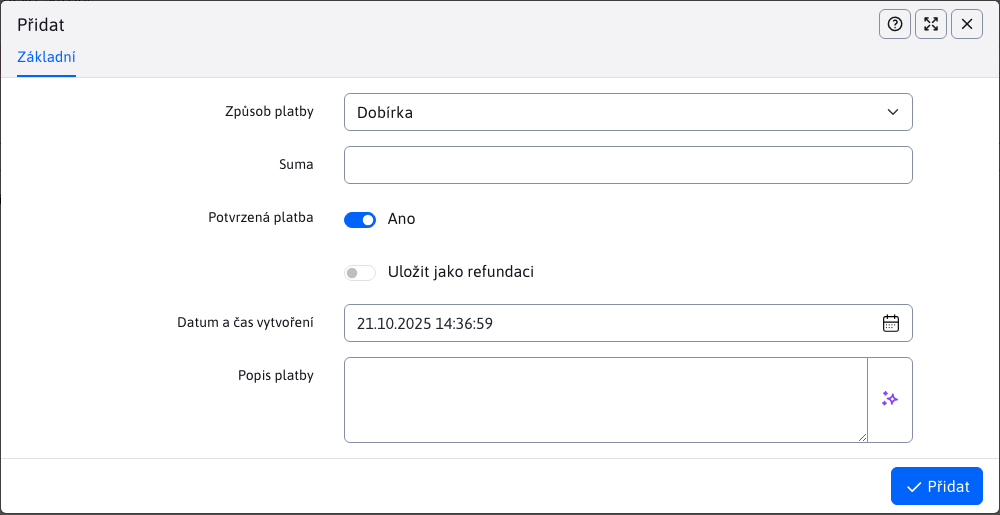
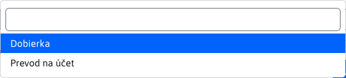
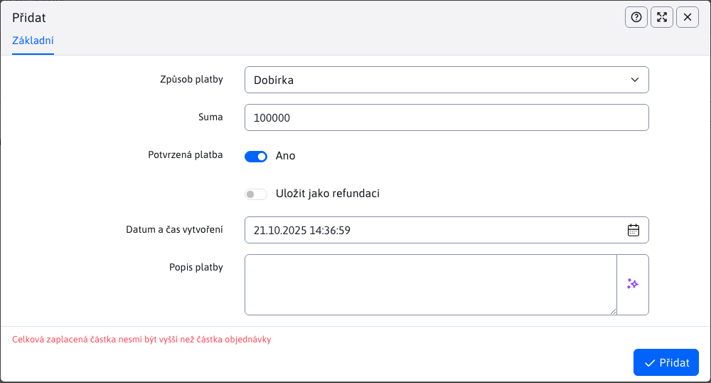

# Platby

Vnořená tabulka Platby v podrobnostech objednávky poskytuje přehled plateb pro konkrétní objednávku. Nad touto tabulkou je možné provádět všechny datové operace.

Požadovaná částka příkazu nemusí být uhrazena jednorázově, ale může být uhrazena v jednotlivých platbách, proto jsou platby vedeny v samostatné tabulce.

## Přidání/změna plateb

Okno editoru plateb obsahuje pouze několik parametrů.

**Datum**, automaticky nastaví aktuální datum při vytvoření platby. Tuto hodnotu nelze změnit a při editaci zůstává nezměněna.

**Způsob platby**, nabízí následující možnosti.

**Součet**, výši platby na objednávku. Zadaná částka má svá omezení.

Zadaná částka nesmí být menší než 0,01.

Součet všech plateb nebo jedna platba nesmí být vyšší než celková částka příkazu k úhradě.

## Tabulka v zápatí

Zápatí tabulky obsahuje užitečné informace o tom, kolik z celkové částky objednávky bylo skutečně zaplaceno a jaká je celková cena objednávky. Uživatel tak má přehled o tom, kolik ještě musí zaplatit, nebo zda je již vše zaplaceno.

Informace v zápatí se automaticky mění v průběhu času, kdykoli je platba změněna, nebo. [položky](./items.md#noha-stolu).
