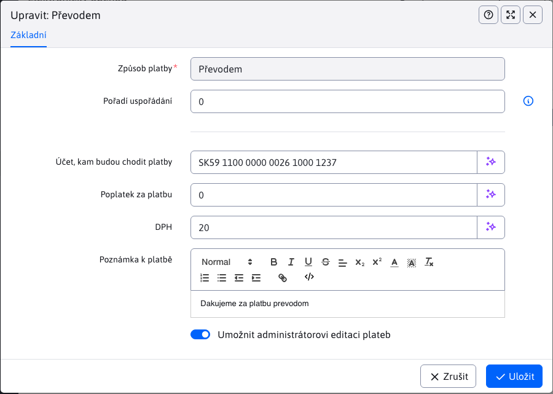
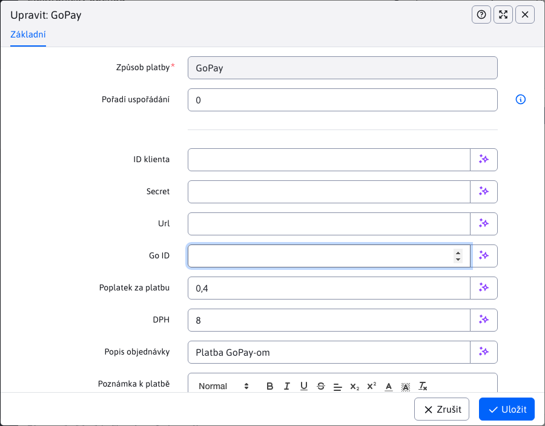

# Způsoby platby

Aplikace Způsoby platby umožňuje nakonfigurovat dostupné způsoby plateb. Základními sloupci tabulky je pouze název platby a stav, zda je daná platba nakonfigurována.

## Vytváření / duplikování způsobu platby

Vytváření nových způsobů plateb (nebo jejich duplikování) není možné přes uživatelské rozhraní, je možné pouze naprogramováním `BackeEnd` funkcionality. Bližší informace [pro programátora](../../../../custom-apps/apps/eshop/payment-methods/README.md).

## Úprava/konfigurace způsobu platby

Tato aplikace je speciální v tom, že editor každé platby může vypadat úplně jinak, jelikož každá platební metoda může vyžadovat jiné vstupní hodnoty (jejich počet, typ, formát ...).

Stále jsou pouze pole:
- **Způsob platby**, nezměnitelná hodnota reprezentující název způsobu platby
- **Pořadí uspořádání**, číselná hodnota k uspořádání způsobu platby. Čím menší hodnota, tím bude plaba výše v seznamu seznamu plateb např. v elektronickém obchodě nebo v administraci.

Příklad editoru způsobu platby **Převodem**:

editor pro způsob platby [GoPay](https://www.gopay.com), vypadá takto:

## Mazání způsobu platby

Mazání není možné, v pravém slova smyslu. Samotný způsob platby se v tabulce bude **vždy zobrazovat**, a to i po jeho vymazání. Akcí vymazání se pouze odstraní nastavená konfigurace (hodnoty z editoru). Můžete si toho všimnout na hodnotě sloupce stav. Pokud byl způsob platby **nakonfigurován**, po vymazání se změní jeho stav na **není nakonfigurován**.
