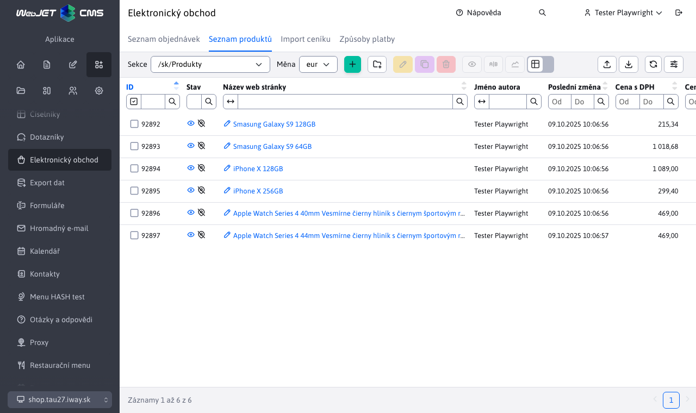
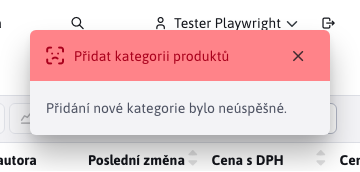

# Seznam produktů

Aplikace Seznam produktů poskytuje přehled a správu dostupných produktů pro elektronický obchod.

Zobrazené produkty jsou filtrovány podle zvolené **kategorie produktů**. Taková kategorie produktů je reprezentována složkou. V levém horním rohu aplikace se nachází filtr kategorie  čímž se vlastně odfiltrují data pro danou složku ale i všechny podsložky.

Dostupné složky reprezentující kategorie jsou uspořádány do tzn. stromu, kde pod-složky jsou vždy po příslušnou rodičovskou složku.

Hodnoty ve výběrovém poli sekce v hlavičce se generují:
- automaticky - je-li konf. proměnná `basketAdminGroupIds` nastavena na prázdnou hodnotu získá se seznam ID složek s novinkami vyhledáváním výrazu `%!INCLUDE(/components/eshop/%", "%!INCLUDE(/components/basket/%", "%product-list.jsp%", "%products.jsp%"` v tělech stránek.
- podle konf. proměnné `basketAdminGroupIds`, kde je možné zadat čárkou oddělený seznam ID složek, například. `17,23*,72`, přičemž pokud ID složky končí na znak `*` načtou se při výběru i produkty (web stránky) z pod složek.

## Přidání nové kategorie produktů

Přidáním nové kategorie se vytvoří podsložka, která bude umístěna pod právě zvolenou složku (kategorii).

Příklad. Máme-li právě zvolená složka  a vytvoříme nový s názvem **Android**, tak nám vznikne nová složka na adrese 

Novou složku přidáme tlačítkem <button class="btn btn-sm btn-outline-secondary" type="button"><i class="ti ti-folder-plus" ></i></button>. Po jeho stisknutí se zobrazí okno pro přidání složky

Okno obsahuje také informaci o tom, pod jakou složku se tato nová vytvoří. Po (ne)vyplnění pole v okně a potvrzení tlačítkem <button class="btn btn-primary" type="button">Potvrdit</button> mohou nastat čtyři situace:
- pokud název nové kategorie nebude zadán, vytvoření se nezdaří a zobrazena bude hláška

- pokud název nové kategorie nebude unikátní (unikátní pro danou složku), vytvoření se nezdaří a zobrazena bude hláška

- nastane-li jiná chyba, bude zobrazena hláška

- pokud vše proběhne úspěšně

## Správa produktů

Produkty jsou reprezentovány stránkami, které můžete přidávat pod konkrétní kategorie. Nadřazená složka se ve stránce automaticky přednastaví podle aktuálně zvolené kategorie (ale je možné ji změnit). Nad produkty (stránkami) je možné provádět všechny operace jak vytvořit/upravit/klonovat/importovat...

## Důležitá nastavení

### Karta **Perex**

V kartě **Perex** je důležité nastavení:
- hodnoty **Obrázek**. Tento obrázek se zobrazí v elektronickém obchodě jako náhled produktu.

- hodnoty **Značky**. Pomocí těchto značek lze v elektronickém obchodě produkty snadno filtrovat.

### Karta Atributy

V kartě atributy využijeme výběr skupiny telefonu na specifikaci zboží. Jak je to patrné na obrázku níže, pro skupinu `Monitor` je možné nastavení výrobce, úhlopříčky atp. Tato výběrová pole se zobrazují v elektronickém obchodě, u detailu produktu.

Více o atributech se dočtete v části [Atributy stránky](../../../webpages/doc-attributes/README.md).
