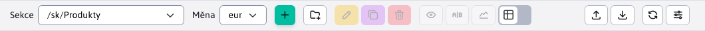

# Seznam produktů

Aplikace Seznam produktů poskytuje přehled a správu dostupných produktů pro elektronické obchodování.

Zobrazené produkty jsou filtrovány podle vybraného **kategorie produktů**. Taková kategorie výrobků je reprezentována složkou. V levém horním rohu aplikace se nachází filtr kategorií.  což ve skutečnosti zruší filtrování dat pro danou složku, ale také pro všechny podsložky.

Dostupné složky reprezentující kategorie jsou uspořádány do tzv. stromu, kde jsou podsložky vždy za příslušnou nadřazenou složkou.

První možností v seznamu je vždy hlavní sekce, která představuje všechny kategorie (zobrazí se všechny produkty). Po výběru kategorie (složky) se zobrazí údaje této složky a všech podsložek.

## Přidání nové kategorie produktů

Přidáním nové kategorie se vytvoří podsložka, která se umístí pod aktuálně vybranou složku (kategorii).

Příklad. Pokud jsme právě vybrali složku  a vytvořit nový s názvem **Android**, bude vytvořena nová složka na adrese 

Přidejte novou složku kliknutím na . Po jeho stisknutí se zobrazí okno pro přidání složky.

Okno obsahuje také informace o tom, pod jakou složkou bude tato nová složka vytvořena. Po (ne)vyplnění polí v okně a potvrzení tlačítkem  mohou nastat čtyři situace:
- pokud není zadán název nové kategorie, vytvoření se nezdaří a zobrazí se zpráva.

- pokud název nové kategorie není jedinečný (jedinečný pro danou složku), vytvoření se nezdaří a zobrazí se zpráva.

- pokud se vyskytne jiná chyba, zobrazí se zpráva.

- pokud vše půjde dobře

## Řízení produktů

Produkty jsou zastoupeny stránkami, které můžete přidat do určitých kategorií. Nadřazená složka je na stránce automaticky přednastavena podle aktuálně vybrané kategorie (lze ji však změnit). Nad produkty (stránkami) můžete provádět všechny operace, jako je vytváření/úprava/skloňování/import ...

## Důležitá nastavení

### Karta **Perex**

V kartách **Perex** je důležité nastavení:
- hodnoty **Obrázek**. Tento obrázek se zobrazí v e-shopu jako náhled produktu.

- hodnoty **Štítky**. Tyto značky usnadňují filtrování produktů v e-shopu.

### Karta Atributy

Na kartě atributy použijeme výběr skupiny telefonů ve specifikacích položky. Jak je vidět na obrázku níže, pro skupinu `iPhone X` je možné nastavit barvu a paměťovou variantu zařízení. Tato výběrová pole se zobrazují v e-shopu vedle údajů o produktu.

Další informace o atributech v [Atributy stránky](../../../webpages/doc-attributes/README.md).
