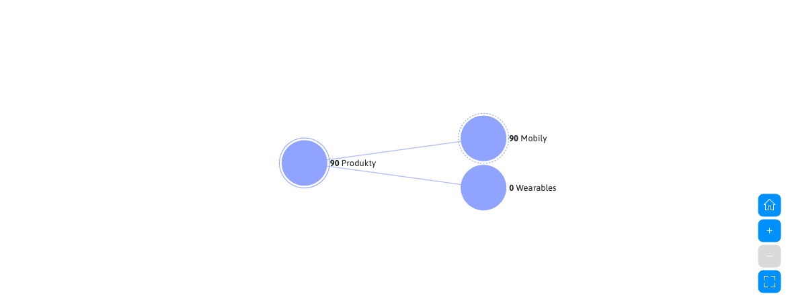

# Statistiky e-shopu

Aplikace **Statistiky e-shopu** poskytuje přehled o objednávkách, tržbách a prodeji produktů v elektronickém obchodě. Statistiky se počítají samostatně pro aktuálně zvolenou doménu.

## Filtrování

V hlavičce stránky můžete použít tyto filtry:

- **Stav** - výběr jednoho nebo více stavů objednávky. Pokud není zvolen žádný stav, zpracují se všechny objednávky.
- **Měna** - měna, ve které se zobrazí finanční hodnoty. Objednávky vedené v jiných měnách se přepočítají do zvolené měny.
- **Období** - datový rozsah vytvoření objednávek. Můžete zadat pouze datum od nebo pouze datum do. Naposledy použitý rozsah se uloží v prohlížeči a sdílí se statistikou návštěvnosti. Pokud období není zadáno, použije se posledních 30 dní.

Po změně filtru se automaticky přepočítají všechny souhrnné ukazatele a grafy.

## Souhrnné ukazatele

První řádek zobrazuje základní údaje o prodeji:

- **Počet faktur** - počet objednávek odpovídajících zvoleným filtrům.
- **Průměrná hodnota faktury** - průměrná hodnota nestornovaných objednávek s DPH.
- **Prodané produkty** - celkový počet prodaných kusů produktů.
- **Průměrný počet produktů na fakturu** - průměrný počet prodaných kusů v jedné nestornované objednávce.

Druhý řádek obsahuje finanční přehled:

- **Celková hodnota faktur** - součet nestornovaných objednávek s DPH.
- **Poplatky za doručení** - celková hodnota poplatků za zvolené způsoby doručení.
- **Poplatky za platební metody** - celková hodnota poplatků za použité platební metody.
- **Tržby bez poplatků za doručení a platbu** - hodnota objednávek po odečtení obou typů poplatků.

!>Finanční hodnoty, prodané produkty a průměrné hodnoty nezahrnují stornované objednávky. Stornované objednávky zůstávají zahrnuty v počtu faktur a v grafech rozdělení objednávek.

## Grafy

Pod souhrnnými ukazateli jsou dostupné grafy:

- **Vývoj tržeb** - vývoj tržeb v čase s DPH i bez DPH.
- **Nejprodávanější produkty** - deset produktů s nejvyšším počtem prodaných kusů.
- **Stavy faktur** - rozdělení objednávek podle jejich aktuálního stavu.
- **Způsoby doručení** - zastoupení použitých způsobů doručení.
- **Platební metody** - zastoupení použitých platebních metod.
- **Prodej podle kategorií** - stromové zobrazení prodeje podle kategorií produktů.

## Prodej podle kategorií

Strom kategorií začíná kořenovým uzlem **Produkty** a zobrazuje pouze kategorie, ve kterých jsou evidovány produkty elektronického obchodu. Systémové složky a položky způsobů dopravy se ve stromu nezobrazují.

Hodnota uzlu představuje počet prodaných kusů v kategorii včetně jejích podkategorií. Hodnota a název kategorie se zobrazují vedle kruhového uzlu, aby zůstaly dobře čitelné. Kategorie bez prodeje ve zvoleném období zůstávají ve stromu zobrazeny s hodnotou `0`. Pokud se produkty nacházejí přímo v nadřazené kategorii, zobrazí se v samostatném uzlu **Přímo v kategorii**.

Klepnutím na uzel můžete rozbalit nebo sbalit jeho podkategorie. Ovládací prvky grafu umožňují návrat na základní zobrazení, přiblížení, oddálení a maximalizování grafu na celou obrazovku. Dvouprstové posouvání na touchpadu posouvá stránku; graf se přibližuje pouze tlačítky nebo gestem pinch-to-zoom.

Při velkém počtu kategorií se zobrazí kompaktní strom s jednou rozbalenou úrovní a menšími horizontálními rozestupy. Přiblížením se zvětší rozestupy mezi uzly, přičemž text zůstane čitelný; další části stromu zobrazíte posunutím grafu nebo kliknutím na konkrétní kategorii.

