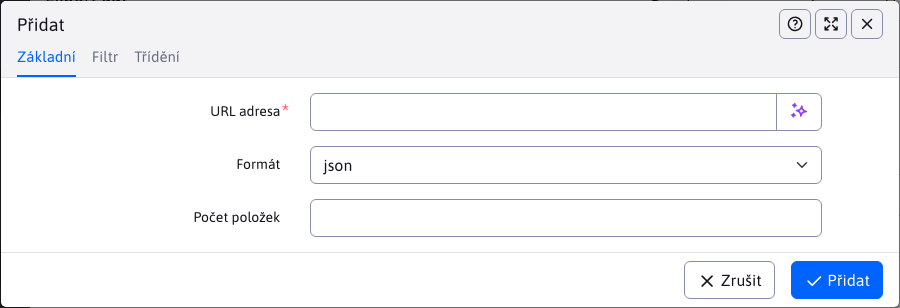

# Export dat

Aplikace Export dat umožňuje exportovat zprávy/webové stránky z WebJET CMS v různých formátech JSON nebo XML/RSS. Export lze použít v externích webových/mobilních aplikacích.


Při vytváření/duplikaci nového exportu je nutné vyplnit povinné pole "URL adresa", které definuje adresu, na níž bude export dostupný.

Ostatní pole jsou podobná těm, která se používají při vkládání seznamu novinek do webové stránky. Nastavují filtrování a uspořádání exportovaného seznamu dat.



Data lze exportovat v následujících formátech:
- JSON
- XML (formát pro čtečku RSS)
- `ud-ofngovcz` - exportní formát pro `Úradní desku` v [OpenData Česká republika](https://ofn.gov.cz/úřední-desky/2021-07-20/) Formát JSON. Při použití je nutné definovat překladové klíče v jazyce CZ. `components.ud-ofngovcz.url` s adresou URL stránky a `components.ud-ofngovcz.ico` s identifikačním číslem města. Hodnota pole Agenda se přebírá ze značky (skupina perex), přílohy ze stránky média.

Ukázka exportu ve formátu json:

```json
[
    {
        "numberItems": 10,
        "total": 6,
        "urlAddress": "/export-dat/json/"
    },
    {
        "authorEmail": "web.spam@interway.sk",
        "authorId": 1,
        "authorName": "WebJET Administrátor",
        "available": true,
        "cacheable": false,
        "data": "HTML KOD",
        "dateCreated": 1612432841000,
        "disableAfterEnd": false,
        "docId": 21,
        "docLink": "/sk/novinky/web-stranka.html",
        "eventDate": 0,
        "eventDateString": "",
        "eventTimeString": "",
        "externalLink": "",
        "fieldA": "",
        "fieldB": "",
        "fieldC": "",
        "fieldD": "",
        "fieldE": "",
        "fieldF": "",
        "fieldG": "",
        "fieldH": "",
        "fieldI": "",
        "fieldJ": "",
        "fieldK": "",
        "fieldL": "",
        "fieldM": "",
        "fieldN": "",
        "fieldO": "",
        "fieldP": "",
        "fieldQ": "",
        "fieldR": "",
        "fieldS": "",
        "fieldT": "",
        "fileName": "/SK/Novinky",
        "footerDocId": -1,
        "forumCount": 0,
        "groupId": 24,
        "headerDocId": -1,
        "historyActual": false,
        "historyApprovedBy": 0,
        "historyId": 0,
        "htmlData": "",
        "htmlHead": "",
        "logonPageDocId": 0,
        "menuDocId": -1,
        "navbar": "Web stránka",
        "passwordProtected": "",
        "perexGroup": [
            "3",
            "1"
        ],
        "perexImage": "",
        "perexPlace": "",
        "publicable": false,
        "publishEnd": 0,
        "publishEndString": "",
        "publishEndTimeString": "",
        "publishStart": 1588512660000,
        "publishStartString": "03.05.2020",
        "publishStartStringExtra": "",
        "publishStartTimeString": "15:31",
        "requireSsl": false,
        "rightMenuDocId": -1,
        "searchable": true,
        "showInMenu": true,
        "sortPriority": 80,
        "syncDefaultForGroupId": "",
        "syncId": 0,
        "syncRemotePath": "",
        "syncStatus": 1,
        "tempId": 4,
        "tempName": "",
        "title": "Web stránka",
        "viewsTotal": 0,
        "virtualPath": "/sk/novinky/web-stranka.html"
    },
    {
        "authorEmail": "web.spam@interway.sk",
        "authorId": 1,
        "authorName": "WebJET Administrátor",
        "available": true,
        "cacheable": false,
        ...
    }
]
```

Ukázka exportu ve formátu XML (formát pro čtečku RSS):

```xml
<?xml version="1.0" encoding="UTF-8"?>
<rss xmlns:atom="http://www.w3.org/2005/Atom" version="2.0">
   <channel>
      <title>RSS Feed</title>
      <link>http://domena.sk/</link>
      <description />
      <language>sk</language>
      <pubDate>Tue, 16 Nov 2021 16:08:37 GMT</pubDate>
      <generator>WebJET Content Management</generator>
      <ttl>60</ttl>
      <urlAddress>/export-dat/xml/</urlAddress>
      <numberItems>10</numberItems>
      <image>
         <title>RSS Feed</title>
         <url>http://domena.sk/images/logo.gif</url>
         <link>http://domena.sk/</link>
      </image>
      <atom:link href="http://domena.sk/export-dat/xml/" rel="self" type="application/rss+xml" />
      <item>
         <guid>/sk/novinky/web-stranka.html</guid>
         <title><![CDATA[Web stránka]]></title>
         <link>http://domena.sk/sk/novinky/web-stranka.html</link>
         <description />
         <author>web.spam@interway.sk(WebJET Administrátor)</author>
         <pubDate>Sun, 03 May 2020 13:31:00 GMT</pubDate>
      </item>
      <item>
         ...
      </item>
   </channel>
</rss>
```

## Vlastní formát exportu

Pokud potřebujete exportovat data v jiném formátu, stačí vytvořit soubor. `/components/INSTALL_NAME/export/meno.jsp` Kde: `INSTALL_NAME` je název vaší instalace (konf. proměnná `installName`). Doporučujeme vycházet ze stávajících souborů JSP a pouze upravit potřebné hodnoty klíčů.

Vytvořený soubor se automaticky nabídne jako možnost typu exportu.

Pro soubory JSP, které obsahují v názvu `rss` nebo `xml` (nebo pokud exportní adresa URL končí na) je nastavena hlavička HTTP `Content-Type` na adrese `text/xml`, pro ostatní případy se nastaví `application/json`. V případě potřeby však můžete hned na začátku nastavit konkrétní hodnotu v souboru JSP voláním:

```java
sk.iway.iwcm.Encoding.setResponseEnc(request, response, "application/ld+json");
```
