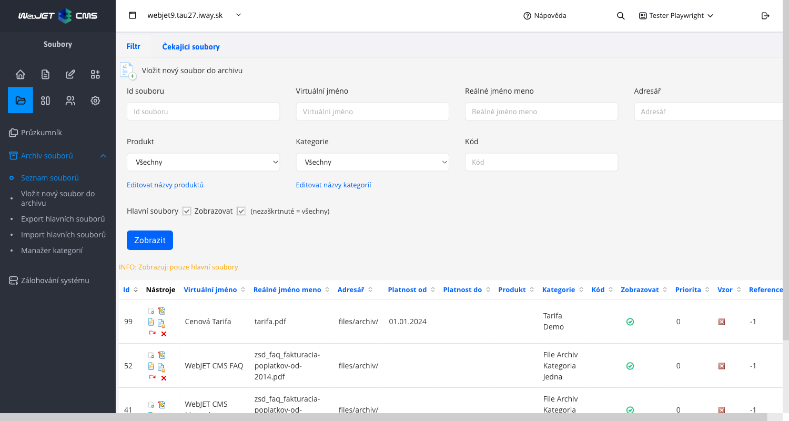
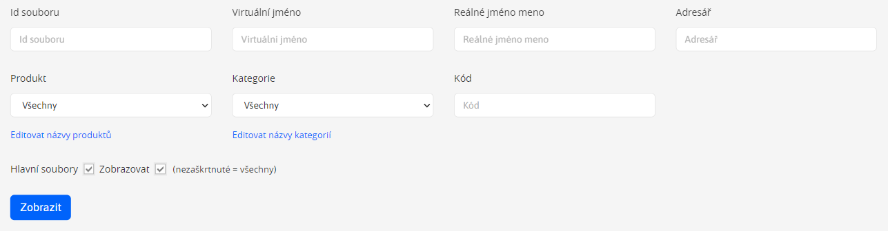
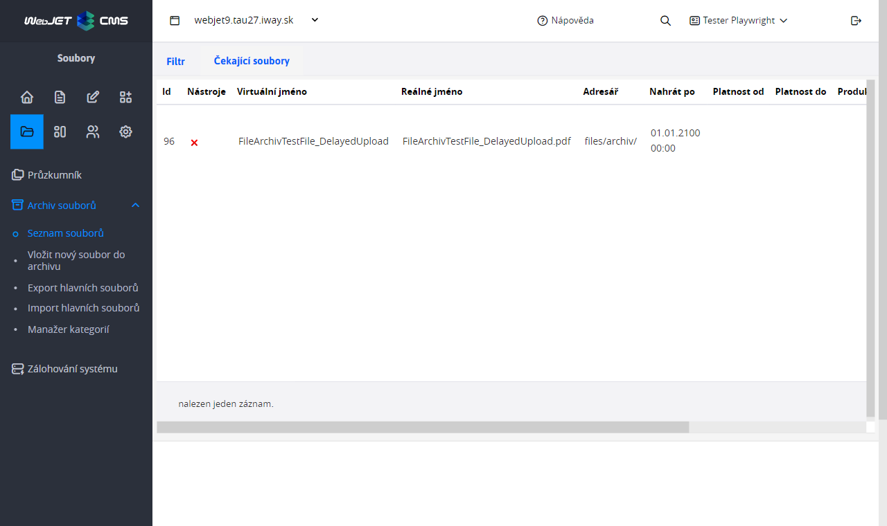
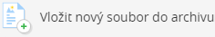
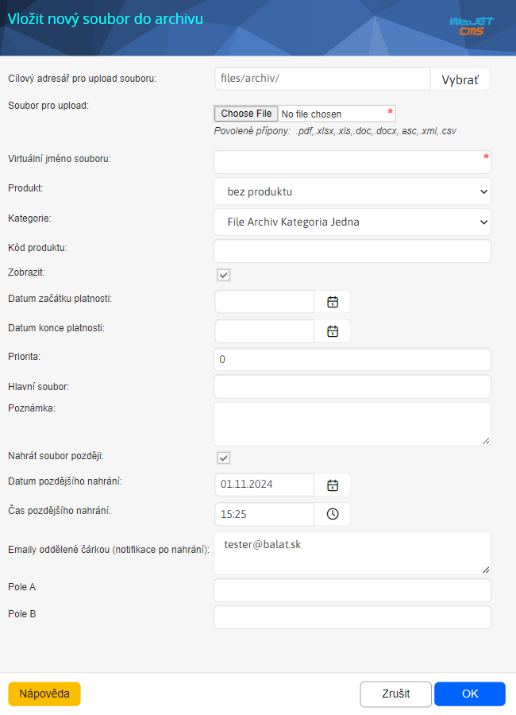
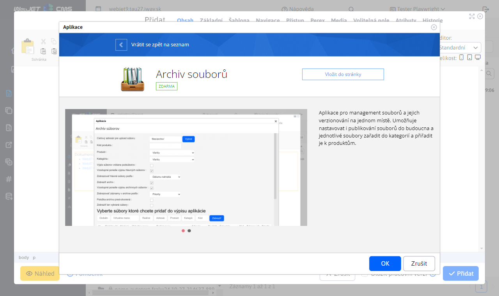
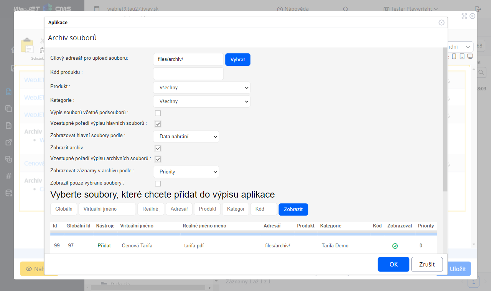

# Archiv souborů

Aplikace pro management souborů a jejich verzí na jednom místě. Umožňuje nastavovat i publikování souborů do budoucna a jednotlivé soubory zařadit do kategorií a přiřadit je k produktům.

## Seznam souborů v archivu

Vzobrazeném seznamu vidíme všechny soubory, které byly vloženy do archivu souborů v aktuálně zvolené doméně.

### Filtrování souborů

Přes filtr můžete od-filtrovat zobrazené soubory na základě:
- **id souboru** - Jedinečné id souboru
- **Virtuální jméno** - Jméno, které se zobrazí při výpisu souborů na stránce
- **Reálné jméno** - Reálné jméno souboru is příponou (např. Zmuva.pdf)
- **Adresář** - Adresář, ve kterém se nachází soubor
- **Produkt, Kategorie, Kód** - Informace které jste si nastavili při vkládání souboru
- **Hlavní soubory** – zobrazeny pouze hlavní soubory bez jejich starších verzí
- **Zobrazovat** – zobrazené soubory, které mají zobrazení povoleno

Filtrovat můžete pomocí více podmínek najednou. Např. produkt „ovoce“ kategorie „jablko“ kód „2015“. Zobrazí se vám seznam souborů, které budou splňovat všechny tyto tři podmínky filtru (nebo se nenajde žádný vyhovující soubor).

### Akce nad soubory

Přes seznam souborů můžeme nad vloženými soubory provádět různé funkce jako editaci, přejmenovat, vymazat či vkládání aktuálnější verze souboru nebo vrácení poslední změny. Funkce najdeme ve sloupci nástroje při záznamu souboru v archivu souborů:
- , **Nahrát novou verzi**, v případě, že chcete nahrát novou (aktuální) verzi již nahraného souboru, tento nástroj vám to umožňuje. Po kliknutí se Vám otevře standardní okno s nastaveními vlastností souboru, které však již budou předvyplněny podle starého souboru, který chcete aktualizovat. Tato předvyplněná pole nedoporučujeme měnit, nakolik by měla být shodná s vlastnostmi starého souboru. (kvůli filtrovanému výpisu na stránce, jelikož výpis souborů umožňuje zobrazit na stránce i starší verze souboru, ne jen aktuální)
- , **Editovat soubor** , v případě, že chcete změnit nějaké nastavení souboru, případně zjistit jaké má soubor vlastnosti, tento nástroj vám k tomu poslouží.
- , **Přejmenovat soubor** : Nástroj umožňuje přejmenovat název souboru
- , **Zobrazit seznam verzí**, tento nástroj se zobrazí až když je vložena alespoň jedna verze, Zobrazí všechny archivní verze souboru
- , **Vrácení poslední změny zpět**, tento nástroj se zobrazí až když je vložena alespoň jedna verze
- , **Odstranit soubor**, Trvale odstraní soubor z archivu

### Karta Čekající soubory

V kartě **Čekající soubory** se zobrazují soubory, kterým bylo při vkládání nastaveno pozdější nahrání.

## Vložení nového souboru do archivu

Chcete-li vložit nový soubor do archivu, můžete tak učinit kliknutím na ikonu, která se nachází nad seznamem souborů

V dialogovém okně vyberete soubor, který chcete nahrát klepnutím na tlačítko **Vybrat soubor**. Dále je třeba vyplnit minimálně povinné pole **Virtuální jméno souboru**, zbývající pole jsou nepovinná:

- **Cílový adresář pro upload souboru** - vyberte adresář, do kterého chcete soubor nahrát (později Vám to poslouží při filtrování zobrazení souborů na stránce)
- **Soubor pro upload** - vyberte soubor, který chcete nahrát do archivu
- **Virtuální jméno souboru** - zadejte jméno souboru, které se bude na stránce zobrazovat (jako odkaz na soubor)
- **Produkt** - zadejte libovolný název produktu (později Vám to poslouží při filtrování zobrazení souborů na stránce)
- **Kategorie** - zadejte libovolný název kategorie (později Vám to poslouží při filtrování zobrazení souborů na stránce)
- **Kód produktu** - zadejte libovolný název kódu produktu (později Vám to poslouží při filtrování zobrazení souborů na stránce)
- **Zobrazit** - nastavení pro zobrazení souboru na stránce (pokud nechcete soubor na stránce zobrazit, odškrtněte toto nastavení)
- **Datum začátku platnosti** - nastavení data začátku platnosti souboru
- **Datum konce platnosti** - nastavení data konce platnosti souboru
- **Priorita** - pomocí priority umíte libovolně nastavit pořadí zobrazení souborů na stránce
- **Hlavní soubor** - pokud nahrávaný soubor nechcete použít jako hlavní, jen jako vzor (vzor jiného hlavního souboru) zadejte do vstupu **Hlavní soubor**, kterému bude Vámi aktuálně nahrávaný soubor vzorem (tento soubor se pak na stránce ve výpisu souborů zobrazí spolu s hlavním souborem, jehož odkaz jste vyplnili). Pro získání odkazu hlavního souboru si najděte v seznamu daný soubor a klikněte v nástrojích na **Editovat** (  ) čímž se Vám otevře okno s nastavenými vlastnostmi souboru. Z něj si zkopírujte **Link pro odkaz** a vložte jej do vstupu **Odkaz na hlavní soubor**.
- **Poznámka** - poznámka se zobrazí na stránce při odkazu na soubor
- **Nahrát soubor později** - v případě potřeby nahrání souboru do archivu v přesný čas a datum je možné nastavit nahrání souboru automaticky v budoucnosti. Výběrem možnosti se Vám zobrazí ukrytá pole
  - **Datum pozdějšího nahrání** - vyberte den, ve kterém chcete soubor nahrát
  - **Čas pozdějšího nahrání** - vyberte čas, ve kterém chcete soubor nahrát
  - **Emaily oddělené čárkou** - zadejte emaily oddělené čárkou, na které chcete zaslat notifikaci o úspěšném/neúspěšném nahrání souboru do archivu

Po úspěšném odeslání mohou nastat následující stavy:
- Soubor se úspěšně nahraje a zobrazí se Vám ve výpisu nahraných souborů
- Soubor se úspěšně nahraje a zobrazí se Vám ve výpisu **čekající soubory** - tento stav nastane tehdy, pokud ve vlastnostech zaškrtnete a nastavíte **Nahrát soubor později**
- Zobrazí se Vám upozornění, že se již v archivu nachází soubor se stejným obsahem jako ten, který nahráváte. (Modul porovnává reálný obsah souboru, ne název). V tomto případě máte dvě možnosti:
  - **Smazat soubor** - aplikace Vám zobrazil odkaz na soubor, který se již v archivu nachází a má stejný obsah jako soubor, který jste chtěli nahrát. Tím pádem umíte tento odkaz použít na stránce a nemusíte soubor nahrávat duplicitně. V takovém případě ten soubor můžete smazat.
  - **Ponechat soubor** - pokud chcete přesto soubor do archivu nahrát a mít ho tam duplicitně, klikněte na **Ponechat soubor**

## Vložení souboru z archivu do web stránky a nastavení aplikace

Do stránky [vložte aplikaci](../../webpages/working-in-editor/README.md#vložení-aplikace) Archiv Souborů.

Při kliknutí na tlačítko "Vložit do stránky" se aplikace vloží do stránky a otevřou se nastavení. Tato nastavení slouží jako filtr při výpisu souborů na stránce.

Dialogové okno nastavení se skládá ze tří sekcí:

1. sekce pro filtrování výpisu souborů na stránku, jsou to následující atributy:
    - **Cílový adresář pro upload souboru** - vyberte složku, ze které chcete zobrazit soubory
    - **Kód produktu** - zadejte kód (jako filtr), který chcete zobrazit
    - **Produkt** - zadejte produkt (jako filtr), který chcete zobrazit
    - **Kategorie** - zadejte kategorii (jako filtr), kterou chcete zobrazit
    - **Výpis souborů včetně pod souborů** - pokud zaškrtnete tuto možnost, na stránce se Vám zobrazí i soubory, které se nacházejí ve vnořených pod-složkách daného cílového adresáře, který jste si nastavili.
    - **Vzestupné pořadí výpisu hlavních souborů** - hlavní soubory budou na stránce seřazeny vzestupně
    - **Zobrazovat hlavní soubory podle** - řazení hlavních souborů v archivu podle:
      - Priority - priority, kterou si sami nastavujete při nahrávání nového souboru
      - Datum nahrání - časové reference přidání souboru do archivu
      - Virtuální název souboru - abecedního pořadí názvů souborů
    - **Zobrazit archiv** - při zaškrtnutí se vám na stránce zobrazí i archivy hlavního souboru
    - **Vzestupné pořadí výpisu archivních souborů** - archivní soubory budou na stránce seřazeny vzestupně
    - **Zobrazovat záznamy v archivu podle** - seřazení souborů v archivu podle:
      - Reference - seřadí se podle ID záznamu
      - Priority - priority, kterou si sami nastavujete při nahrávání nového souboru
      - Pořadí - pořadí nahrání souboru
      - Datum nahrání - časové reference přidání souboru do archivu
      - Virtuální název souboru - abecedního pořadí názvů souborů
    - **Položka archivu předotevřená** - pořadovým číslem určíte, který z vláken souborů má být před otevřen.
    - **Zobrazit jen vybrané soubory** - k souborům umíte manuálně přidat i soubory, které filtr nesplňují, ale přesto je chcete k danému výpisu zobrazit

2. Vyberte soubory, které chcete přidat do výpisu aplikace. Soubory lze filtrovat podle globálního id, virtuálního jména, reálného jména, adresáře, produktu, kategorie, kódu.

3. Výsledek/tabulka z pomocného vyhledávání. V této sekci jsou očekávané soubory, kliknutím na Přidat lze přidat soubor do seznamu vybraných souborů (pokud se mají zobrazovat jen vybrané soubory).

## Zobrazení aplikace

Výsledný vzhled aplikace po přidání do stránky. Názvy jednotlivých souborů jsou odkazy ke stažení daných souborů.

