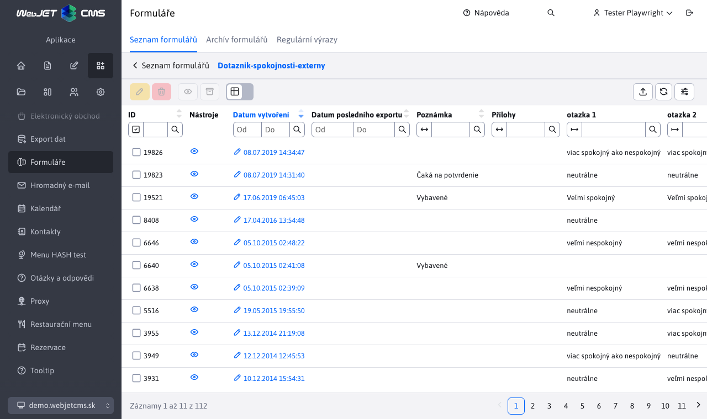
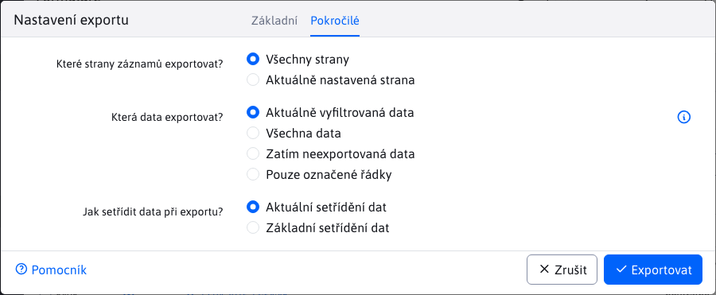

# Seznam formulářů

Aplikace formuláře slouží k pokročilé správě vyplněných formulářů. Každá web stránka může obsahovat formulář, který návštěvník vyplní. Mohou to být žádosti o pracovní místo, žádosti o podrobnější informace a podobně.

Formuláře mohou být odeslány na email adresu, přičemž v email zprávě formulář vypadá stejně jako na web stránce, lze jej vytisknout a dále zpracovat.

Navíc všechny formuláře se ukládají do databáze, v administrační části Web JET je možné se k nim kdykoli vrátit. Položky ve formulářích lze pořádat podle libovolného sloupce a exportovat do programu MS Excel.



Klepnutím na ikonu oka můžete formulář zobrazit do podoby, v jaké je na webové stránce a vytisknout jej.

V editaci formuláře můžete měnit pole poznámka (ve kterém si můžete evidovat zpracování/stav formuláře). Jednotlivá vyplněná pole jsou pouze pro čtení, nelze je po odeslání měnit. V kartě údaje jsou jednotlivé položky vyplněného formuláře, v kartě Přihlášený uživatel údaje uživatele, který formulář odeslal (pokud byl při jeho odeslání přihlášen).


## Export dat

Formulářové záznamy lze exportovat do formátu `xlsx` a `csv`. V kartě Pokročilé lze nastavit následující možnosti exportu:
- Aktuálně vyfiltrovaná data - máte-li v tabulce data filtrována podle určitého sloupce exportují se pouze tyto údaje.
- Všechna data - exportují se všechna data bez ohledu na nastavený filtr v zobrazené tabulce.
- Zatím neexportovaná data - exportují se pouze data, která zatím nebyla exportována (mají prázdnou hodnotu ve sloupci Datum posledního exportu). Můžete tak snadno postupně exportovat jen nově přidaná data.
- Pouze označené řádky - exportují se pouze označené řádky v tabulce.

Po exportu se automaticky nastaví sloupec Datum posledního exportu na aktuální datum a čas.



## Pokročilé možnosti nastavení

Formuláři lze nastavit některé skryté hodnoty, které ovlivní jeho zpracování. Standardně není třeba speciálně nastavovat ani jednu z těchto hodnot.

- `recipients` - seznam příjemců emailu. Může obsahovat více příjemců oddělených čárkou.
  - **Upozornění:** z důvodu zamezení odesílání emailů přes systém na cizí adresy (`mail relay server`) kontroluje systém, zda zadaná cílová email adresa se nachází v těle původní stránky. Pokud tedy emailovou adresu dynamicky měníte, musí se nacházet v těle stránky.
- `ccEmails` - seznam email adres oddělených čárkami na které má být zaslána kopie emailu.
- `bccEmails` - seznam email adres oddělených čárkami na které má být zaslána skrytá kopie emailu.
- `subject` - předmět emailu. Není-li vyplněno automaticky se použije podle web stránky.
- `email / e-mail` - pole určující emailovou adresu odesílatele emailu. Pokud se jedná o kontaktní formulář je ideální pokud se takto jmenuje přímo pole, kde návštěvník stránky zadává email.
- `name / firstname / lastname / meno / priezvisko / jmeno / prijmeni` - pole určující jméno odesílatele emailu. Pokud se jedná o kontaktní formulář je ideální pokud se takto jmenuje přímo pole, kde návštěvník stránky zadává své jméno.
- `savedb` - název pod kterým se formulář uloží do databáze.
- `forward` - url adresa, na kterou se má provést přesměrování po uložení formuláře. Není-li zadáno, přesměruje se na původní stránku.
- `forwardFail` - url adresa, na kterou se má provést přesměrování, pokud se formulář nepodaří odeslat. Pokud není zadáno, použije se stejná hodnota jako má `forward`.
- `forwardType` - typ přesměrování po zpracování formuláře.
  - Pokud není hodnota zadaná tak se formulář zpracuje a následně se provede přesměrování na zadanou stránku s nastaveným parametrem stavu odeslání (např.` formSend=true`).
  - Hodnota `forward` znamená, že na cílovou stránku se provede interní přesměrování. Cílová stránka má tak přístup k identickým parametrům jako formulář a může provést dodatečnou akci. Jelikož se jedná o interní přesměrování v adresním řádku prohlížeče zůstane hodnota `/formmail.do`.
  - Hodnota `addParams` provede přesměrování na cílovou stránku s přidáním jednotlivých parametrů do URL. V takovém případě přesměrování provede prohlížeč a v adresním řádku zůstane adresa cílové stránky. Jelikož ale parametry jsou přidány do URL adresy je limitován jejich počet délkou URL což je standardně 2048 znaků.
- `useFormDocId` - doc ID stránky na které se formulář nachází. Standardně se systém tuto stránku snaží určit na základě `refereru`, nebo posledně zobrazené stránky v `session`. Pro přesné určení lze zadat tuto hodnotu. Pokud není zadaná WebJET ji automaticky doplní při zobrazení formuláře.
- `useFormMailDocId` - doc ID stránky s verzí pro email. Stránku systém potřebuje k tomu, aby uměl vygenerovat emailovou podobu. Pokud je zadaná hodnota none nepoužije se určení web stránky pro email. Pokud hodnota není zadaná vůbec použije se hodnota zadaná parametrem `useFormDocId`. Hodnota je užitečná v tom případě, pokud na všech stránkách máte jeden kontaktní formulář vkládaný např. v patičce. Při generování emailu se jako kód použije kód samotné stránky, ve které se ale formulář nenachází. Takto lze říci, aby pro email použil jinou stránku.
- `forceTextPlain` - pokud parametr existuje je email odeslán jako `text/plain` verze, jinak je odeslán jako `multipart`.
- `formMailEncoding` - typ kódování znaků emailu. Standardně se použije kódování stejné jako má web stránka. Pokud je jako hodnota nastaveno ASCII tak je z textu odstraněna diakritika.
- `fieldsEmailHeader` - má-li vygenerovaný email obsahovat speciální hlavičku je možné do tohoto pole zadat čárkou oddělený seznam názvů polí, jejichž hodnoty se nastaví do hlavičky.
- `formmail_overwriteOldForms` - je-li přihlášen uživatel a toto pole je nastaveno na hodnotu `true`, tak pokud již daný uživatel formulář odeslal, bude jeho hodnota přepsána novou verzí. Formulář se takto bude v databázi od jednoho uživatele nacházet jen jednou.
- `formmail_allowOnlyOneSubmit` - je-li přihlášen uživatel a toto pole je nastaveno na hodnotu `true`, tak pokud již daný uživatel formulář odeslal, systém mu nedovolí další odeslání. Formulář se takto bude v databázi od jednoho uživatele nacházet jen jednou.
- `formmail_sendUserInfoDocId` - je-li nastaveno na hodnotu `docId` některé web stránky, tak po úspěšném uložení formuláře je na email návštěvníka (z pole email/e-mail) zaslán email s textem dané web stránky. Může se jednat například o poděkování za vyplnění formuláře, nebo další instrukce postupu.
- `isPdfVersion` - pokud je nastaveno na true, tak systém po uložení formuláře vygeneruje i jeho PDF verzi do adresáře `/WEB-INF/formfiles/ID_FORMULARU_pdf.pdf`, přičemž hodnota `ID_FORMULARU` je `id` formuláře v databázi.

## Nastavení potvrzení emailové adresy

Formuláři lze nastavit **potvrzení e-mailové adresy** ( `double opt-in` ). Dosáhnete tak potvrzení odeslání formuláře kliknutím na odkaz v e-mailu a tedy **ověříte**, že návštěvník, který formulář vyplnil, zadal **skutečně platnou e-mailovou adresu**.

Pro zapnutí potvrzení emailové adresy je třeba nastavit:

1. Ve vlastnostech formuláře, konkrétně v rozšířených nastaveních  je třeba zvolit možnost **Vyžadovat potvrzení souhlasu e-mailem**. 

2. Vytvořit stránku pro potvrzení souhlasu, v ní musí být vložena aplikace `!INCLUDE(sk.iway.iwcm.components.form.DoubleOptInComponent)!`, která souhlas na základě parametrů v databázi potvrdí. Stránka může být použita pro více různých formulářů, může mít URL adresu například `/potvrdenie-double-optin/`.

3. Vytvořit stránku s textem e-mailu "Pro potvrzení platnosti email adresy klikněte na následující odkaz" a vložit odkaz na stránku, kde bude potvrzení souhlasu. Odkaz musí obsahovat parametry `!FORM_ID!,!OPTIN_HASH!`, tedy např. `/potvrdenie-double-optin/?formId=!FORM_ID!&hash=!OPTIN_HASH!`. ID této stránky nastavit do pole `Doc ID` oznámení pro uživatele.

Po kliknutí na odkaz v emailu se ve formuláři nastaví pole Datum potvrzení souhlasu, tak umíte identifikovat formuláře, které mají souhlas potvrzen. Zároveň formuláře, které nemají potvrzený souhlas, jsou zobrazeny červenou barvou.


## Událost při odeslání formuláře

Po odeslání formuláře přes AJAX je publikována událost `WJ.formSubmit`, na kterou lze poslouchat, například. jako:

```javascript
    window.addEventListener("WJ.formSubmit", function(e) { console.log("DataLayer, submitEvent: ", e); dataLayer.push({"formSubmit": e.detail.formDiv, "formSuccess": e.detail.success}); });
```

## Možné konfigurační proměnné

- `formmailAllowedRecipients` - Seznam koncových částí email adres na které lze odeslat formuláře, například: `@interway.sk,podpora@demo.webjet.sk`. Standardně prázdné, což znamená, že formulář lze odeslat na libovolnou adresu
- `formMailEncoding` - znaková sada pro odesílání emailů z formulářů. Standardně nastaveno na prázdnou hodnotu, což znamená, že se použije stejné kódování znaků jako je nastaveno pro web stránky.
- `spamProtection` - pokud je nastaveno na `true`, bude zapnuta ochrana proti spamu ve formulářích. Standardně nastaveno na `true`.
- `spamProtectionJavascript` - pokud je nastaveno na `all` (budou chráněny všechny formuláře) nebo `formmail` (chráněny budou pouze formuláře odesílané na email), budou formuláře chráněny `javascriptom`, pro deaktivování funkce je třeba zadat `none`. Standardně nastaveno na `all`.
- `spamProtectionSendInterval` - čas v sekundách během kterého není možné znovu odeslat formulář na email. Standardně nastaveno na 30.
- `spamProtectionDisabledIPs` - seznam začátků IP adres oddělených čárkou (nebo znak `*` pro všechny), pro které je spam ochrana vypnuta.
- `formMailSendPlainText` - je-li nastaveno na `true` je email z formuláře odeslán jako čistý text (ne HTML formát).
- `formMailRenderRadioCheckboxText` - je-li nastaveno na `true` bude zobrazovat výběrová a zaškrtávací pole jako text `[X]` nebo `[ ]`.
- `formMailCropForm` - pokud je nastaveno na `true` bude se odesílat jen část obalená do `tagov` form.
- `formmailHttpsDomains` - Seznam domén oddělených čárkou, pro které se budou formuláře vždy odesílat přes zabezpečené httpS spojení.
- `checkFormValidateOnInit` - Nastavení validace formuláře při jeho inicializaci, při nastavení na `false` se při zobrazení nevaliduje celý formulář, při nastavení na `true` se validuje.
- `formMailFixedSenderEmail` - Je-li nastaveno na email adresu, použije se jako fixní hodnota emailu odesílatele. Na rozdíl od `emailProtectionSenderEmail` nenastaví původní email do pole `reply-to`, takže odesílatel není žádný notifikován při chybném doručení (což kvůli bezpečnosti může být někdy zapotřebí).
- `formmailShowClassicErrorMessage` - Je-li nastaveno na `true` bude zobrazovat klasické validační hlášení formuláře nahoře nad formulářem namísto hlášení u jednotlivých polí.
- `formmailScrollTopAfterSend` - Je-li nastaveno na `true` posune se stránka po odeslání na vrch formuláře (aby bylo vidět hlášení o odeslání).
- `formmailResetFormAfterSend` - Je-li nastaveno na `true` po úspěšném odeslání se vyčistí formulář.
- `formmailSendUserInfoSenderName` - Pošle se jako jméno odesílatele v e-mailu při odesílání stránky podle zadaného `formmail_sendUserInfoDocId`. Pokud je prázdné, zašle se jméno autora stránky, jejíž obsah se posílá do e-mailu.
- `formmailSendUserInfoSenderEmail` - Pošle se jako e-mail odesílatele v e-mailu při odesílání stránky podle zadaného `formmail_sendUserInfoDocId`. Pokud je prázdné, zašle se e-mail autora stránky, jejíž obsah se posílá do e-mailu.
