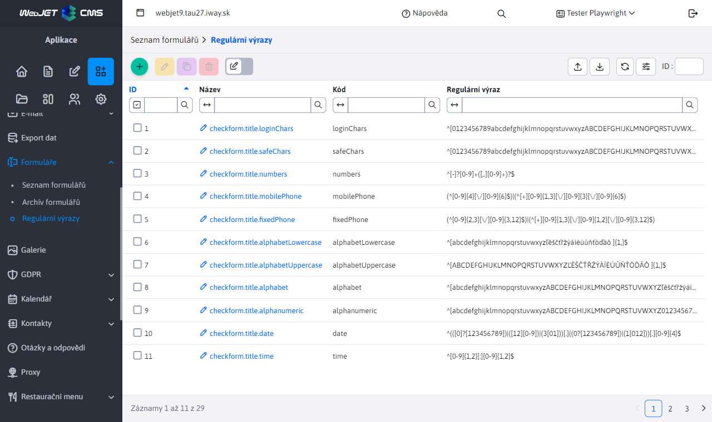
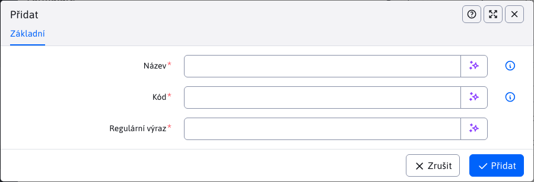

# Regulární výrazy

Aplikace Formuláře obsahuje uzel Regulární výrazy, pomocí kterého lze definovat pravidla pro kontrolu vyplnění polí. Pravidla se definují pomocí regulárního výrazu.

Editor obsahuje následující pole.

- Název - Název, nebo lépe překladový klíč, pravidla. Název by měl být stručný a pro uživatele srozumitelný (např. alespoň 8 znaků).
- Kód - Kódové označení, může obsahovat pouze písmena bez mezer. V kódu HTML se používá jako třída CSS na vstupním poli.
- Regulární výraz - [Regulární výraz](https://www.w3schools.com/jsref/jsref_obj_regexp.asp) Pravidla.

