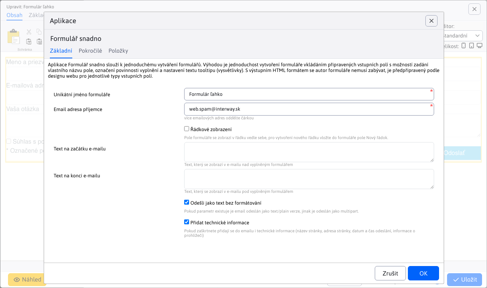
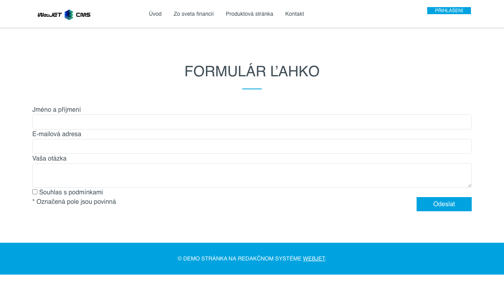
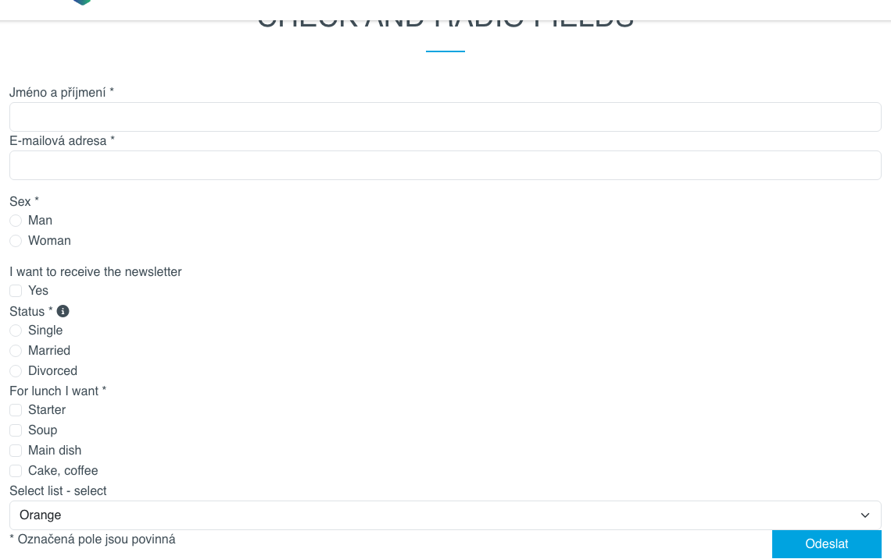

# Formulář snadno

Aplikace formulářů se snadno používá pro jednoduché vytváření formulářů. Výhodou je jednoduchost vytvoření formuláře pouhým vložením připravených vstupních polí s možností zadání jiného názvu pole, vyznačením povinnosti vyplnění a nastavením textu vysvětlivky (`tooltip`). Autor formuláře se nemusí zabývat výstupním formátem HTML, ten je připraven podle návrhu webu pro jednotlivé typy vstupních polí.

## Základní

Pro formulář je třeba nastavit následující hodnoty.

- Jedinečný název formuláře - zadaný název formuláře by měl být jedinečný pro celý web, formulář bude pod tímto názvem uložen v aplikaci Formuláře.
- E-mailová adresa příjemce - čárkou oddělený seznam e-mailových adres, na které má být odeslán vyplněný formulář.
- Řádkové zobrazení - pole formuláře se zobrazují v řádku vedle sebe (jinak je každé pole na novém řádku). Chcete-li vytvořit nový řádek, vložte do formuláře pole Nový řádek.
- Text na začátku e-mailu - text, který se přidá do e-mailu před pole formuláře.
- Text na konci e-mailu - text, který se přidá do e-mailu za pole formuláře.
- Odeslat e-mail jako neformátovaný text - pokud je zaškrtnuto, e-mail se odešle jako neformátovaná textová verze (ve formátu název pole: hodnota), jinak se odešle jako formátovaný text HTML tak, jak je zobrazen na webové stránce.
- Přidat technické informace - pokud je zaškrtnuto, budou do e-mailu přidány také technické informace (název stránky, adresa stránky, datum a čas odeslání, informace o prohlížeči).



Ve výchozím nastavení jsou pole formuláře zobrazena pod sebou:



Výběrem možnosti Řádkové zobrazení lze pole zobrazit vedle sebe v řádku. Chcete-li vytvořit nový řádek, vložte pole do formuláře **Nová linie**:


## Pokročilé

Karta Pokročilé obsahuje pokročilá nastavení pro nastavení, která nejsou nutná.

- Šifrovací klíč - pokud chcete hodnoty formuláře šifrovat, můžete zadat šifrovací klíč.
- Příjemce kopie e-mailu - čárkou oddělený seznam e-mailových adres, na které má být odeslána kopie e-mailu.
- Neviditelní příjemci - čárkou oddělený seznam e-mailových adres, na které má být odeslána skrytá kopie e-mailu.
- Předmět - předmět e-mailu. Pokud není vyplněn automaticky, použije se podle webové stránky.
- Přesměrování po vyplnění - url adresa, na kterou má být formulář po uložení přesměrován. Pokud není zadána, dojde k přesměrování na původní stránku.
- Přesměrování po chybě - url adresa, na kterou se přesměruje, pokud se formulář nepodaří odeslat. Pokud není zadána, použije se stejná hodnota, jakou by měla mít. **Přesměrování po dokončení**.
- Metoda přesměrování - typ přesměrování po zpracování formuláře.
  - Pokud hodnota není zadána, formulář se zpracuje a poté se provede přesměrování na zadanou stránku s nastaveným parametrem stavu odeslání (např. formSend=true).
  - Hodnota `forward` znamená, že se provede interní přesměrování na cílovou stránku. Cílová stránka pak může přistupovat ke stejným parametrům jako formulář a provést další akci. Protože se jedná o interní přesměrování, hodnota zůstane v adresním řádku prohlížeče. `/formmail.do`.
  - Hodnota `addParams` provede přesměrování na cílovou stránku s přidáním jednotlivých parametrů do adresy URL. V tomto případě prohlížeč provede přesměrování a adresa cílové stránky zůstane v adresním řádku. Protože se však parametry přidávají do adresy URL, je jejich počet omezen délkou adresy URL, která je ve výchozím nastavení 2048 znaků.
- ID dokumentu stránky s e-mailovou verzí - ID dokumentu stránky s e-mailovou verzí. Systém potřebuje stránku, aby mohl vygenerovat e-mailovou verzi. Pokud je uvedena hodnota none, určení webové stránky pro e-mail se nepoužije. Pokud není hodnota zadána vůbec, použije se hodnota určená parametrem `useFormDocId`. Tato hodnota je užitečná, pokud máte jeden kontaktní formulář vložený na všech stránkách, např. v zápatí. Při generování e-mailu se jako kód použije kód samotné stránky, ale formulář se v ní nenachází. Tímto způsobem můžete říci, aby se pro e-mail použila jiná stránka.
- ID dokumentu oznámení pro uživatele - pokud je nastaveno na hodnotu docId nějaké webové stránky, pak se po úspěšném uložení formuláře zobrazí e-mail návštěvníka (z pole s názvem `email / e-mail`) poslal e-mail s textem webové stránky. Může se jednat o poděkování za vyplnění formuláře nebo o další pokyny, jak postupovat. Hodnotu z formuláře vložíte do stránky jako výraz `!field-name!`, což je hodnota v `name` atribut pole formuláře.
- Interceptor před odesláním e-mailu - hodnotou je název třídy, která **musí implementovat rozhraní `AfterSendInterceptor`**. Po odeslání e-mailu se provede kód této třídy.


## Položky

Na kartě Položky můžete přidat nové pole formuláře, přesunout pořadí polí (přetažením) a odstranit pole formuláře kliknutím na ikonu odstranění.


Chcete-li přidat pole formuláře (položku), klikněte na tlačítko Nová položka, které se zobrazí pod seznamem existujících polí. Ve výběrovém poli Typ pole si můžete vybrat z definovaných formulářových polí. Většina polí umožňuje zadat následující pole:
- Název - představuje název pole formuláře (zobrazovaný název), pokud je ponechán prázdný, použije se název z nabídky Výběr typu pole. U informačních polí (štítků) zadejte text, který chcete zobrazit.
- Hodnota - předvyplněná hodnota, která se zobrazí v poli po jeho načtení.
- Zástupný text - pro standardní textová pole představuje hodnotu zástupného textu (`placeholder`), který se zobrazí, když je pole prázdné.
- Povinné pole - zaškrtnutím políčka se pole označí jako povinné pro odeslání formuláře.
- Tooltip - pokud zadáte hodnotu, zobrazí se vedle názvu pole informační bublina (vysvětlivka) s textem zadaným do tohoto pole. Způsob zobrazení závisí na návrhu webové stránky (obvykle vyžaduje podporu [FontAwesome](https://fontawesome.com) pro zobrazení ikony).

**Poznámka:** pokud se nachází v terénu **Hodnota** prázdný text a text je zadán do pole **Reprezentativní text**, takže při zobrazení formuláře na webové stránce se název pole nezobrazuje samostatně, ale pouze jako zástupný text. To umožňuje vytvořit menší formulář z hlediska jeho prostoru na webové stránce.

Pro **skupiny polí (např. skupina polí s výběrem nebo zaškrtávacích polí).** je v poli Hodnota definován seznam možností. Jako oddělovač možností se hledá znak `|`, pokud není nalezen, hledá se znak `,`, pokud není nalezen, použije se mezera. Můžete tedy zadat např. `Slobodný,Ženatý,Rozvedený`, nebo pokud potřebujete v možnosti zadat čárku, použijte oddělovač. `|` Stejně jako `Predjedlo|Polievku|Hlavné jedlo|Koláč, kávu` (možnost `Koláč, káva` bude jedna položka).

Pro **Výběrový seznam - vyberte** je také možné zadat odlišný text pro zobrazené informace a vybranou hodnotu. Zobrazený text a hodnota jsou odděleny znakem `:`. Příklad: `Pomaranč:orange,Jablko:apple` vytiskne výběrové pole (select) s textovými hodnotami Orange nebo Apple, ale při výběru se hodnota uloží do formuláře. `orange` nebo `apple`.



## Informace pro webdesignéra

Kód HTML pro zobrazení polí a formuláře je definován v části Nastavení - Upravit text. Textové klíče mají předponu `components.formsimple.`.


Základní kód formuláře je v klíčích:
- `components.formsimple.form.start` - Kód HTML pro začátek formuláře (úvodní značka formuláře)
- `components.formsimple.form.end` - Kód HTML pro konec formuláře (uzavírací značka formuláře)
- `components.formsimple.requiredLabelAdd` - text, který má být přidán do textu prvku label pro požadované pole (obvykle znak \*).
- `components.formsimple.tooltipCode` - Kód HTML pro generování ${tooltip} Náhrady
- `components.formsimple.techinfo` - Kód HTML pro generování technických informací v e-mailu

Jednotlivé položky definujete pomocí klíčů:
- `components.formsimple.label.NAZOV` - název položky (obvykle hodnota prvku label).
- `components.formsimple.input.NAZOV` - Kód HTML položky
- `components.formsimple.hide.NAZOV` - seznam polí, která se v administraci pro tuto položku nezobrazí (možné hodnoty: label,required,tooltip,placeholder).
- `components.formsimple.firstTimeHeading.NAZOV` - název nad polem, zobrazuje se pouze tehdy, když je pole s tímto názvem uvedeno jako první (používá se pro výběrová a zaškrtávací pole).

Příklad:

```
//najjednoduchsi typ pola
components.formsimple.label.meno=Meno
components.formsimple.input.meno=<div class="form-group"><label for="${id}">${label}${tooltip}</label> <input class="${classes}form-control" data-name="${labelSanitized}" id="${id}" name="${id}" placeholder="${placeholder}" type="text" maxlength="20" />${cs-error}</div>

//pole, ktoremu sa nezobrazi moznost zadat ze sa jedna o povinne pole (moznost .hide)
components.formsimple.label.popiska=Popiska (info text)
components.formsimple.input.popiska=<div class="form-group"><label for="${id}">${label}${tooltip}</label></div>
components.formsimple.hide.popiska=required

//ukazka pouzitia nadpisu nad vyberovym polom, hodnota .firstTimeHeading sa zobrazi len pred prvym polom
components.formsimple.label.radio=Výberové pole
components.formsimple.input.radio=<div class="form-check"><input class="${classes}form-check-input" data-name="${labelSanitized}" id="${id}" name="${id}" type="radio" value="${value}"/> <label for="${id}" class="form-check-label">${value}${tooltip}</label> ${cs-error}</div>
components.formsimple.firstTimeHeading.radio=<div class="form-group mt-3 mb-0"><label class="first-time">${label}</label></div>
components.formsimple.hide.radio=placeholder

//ukazka pouzitia ${iterable} pre vypis zoznamu vyberovych poli. Z pola Hodnota sa vytvori zoznam, ako oddelovac sa hlada znak | ak sa nenajde pouzije sa , a ak sa ani ta nenajde pouzije sa ako oddelovac medzera
//v kluci components.formsimple.iterable.radiogroup sa definuje HTML kod opakovaneho zaznamu, ten sa vlozi na miesto ${iterable}
components.formsimple.label.radiogroup=Skupina výberových polí
components.formsimple.input.radiogroup=<div class="form-group"><label for="${id}">${label}${tooltip}</label>${iterable} ${cs-error}</div>
components.formsimple.iterable.radiogroup=<div class="form-check"><input class="${classes}form-check-input" data-name="${labelSanitized}" id="${id}-${counter}" name="${id}" placeholder="${placeholder}" type="radio" value="${value}"/> <label for="${id}-${counter}" class="form-check-label">${value}</label></div>
components.formsimple.hide.radiogroup=placeholder

//ukazka pouzitie ${iterable} pre vypis SELECT pola
components.formsimple.label.select=Výberový zoznam - select
components.formsimple.input.select=<div class="form-group"><label for="${id}">${label}${tooltip}</label><select name="${id}" id="${id}" class="form-control form-select">${iterable} </select>${cs-error}</div>
components.formsimple.iterable.select=<option value="${value}">${value-label}</option>

//example of wysiwyg/cleditor - it must contains class ending formsimple-wysiwyg to render cleditor on page
components.formsimple.label.wysiwyg=Formátované textové pole
components.formsimple.input.wysiwyg=<div class="form-group"><label for="${id}">${label}${tooltip}</label> <textarea class="${classes}form-control formsimple-wysiwyg" data-name="${labelSanitized}" id="${id}" name="${id}" placeholder="${placeholder}">${value}</textarea>${cs-error}</div>
components.formsimple.hide.wysiwyg=placeholder
```

V kódu lze použít následující značky, které budou nahrazeny při zobrazení formuláře:
- `${formname}` - název formuláře bez mezer, diakritiky, malá písmena, používaný pro formulářový prvek v atributu name (pro použití ve standardním validačním mechanismu by měl stále začínat formMail).
- `${savedb}` - stejnou hodnotu jako `formname`, který se pro přehlednost používá v adrese URL odesílaného formuláře.
- `${id}` - ID prvku vygenerované z jeho názvu (pole Value v administraci), bez mezer, diakritiky a malých písmen.
- `${label}` - text pro prvek label, hodnota z pole name v administraci
- `${labelSanitized}` - text pro prvek label, hodnota z pole name v administraci, upravené speciální znaky pro použití v atributu HTML
- `${value}` - text z pole hodnoty v administraci
- `${placeholder}` - zástupný text, který se zobrazí, když je pole prázdné.
- `${classes}` - další styly CSS, aktuální `required` pokud je zaškrtnuto pole Povinné v administraci
- `${tooltip}` - Kód HTML pro nápovědu, hodnota z pole Tooltip v administraci
- `${cs-error}` - vygenerovaný kód HTML pro chybovou zprávu
- `${iterable}` - na zadané místo se vloží opakující se seznam polí (např. skupina výběrových polí), přičemž kód, který se má opakovat, je definován klíčem. `components.formsimple.iterable.MENO_POLA`
- `${counter}` - pořadové číslo opakujícího se záznamu, je nutné nastavit jedinečné číslo. `id` a `for` atribut
- `${value-label}` - textovou hodnotu (popisek) pro opakující se záznam, pokud obsahuje jinou hodnotu pro `value` a pro `label` (např. v `option` tag). Uživatel zadává možné hodnoty jako `label:value`, tj. jako např. `Pomaranč:orange,Jablko:apple` zobrazit možnosti.
- `{enumeration-options|ID_CISELNIKA|MENO_VALUE|MENO_LABEL}` - odkaz pro získání seznamu `option` hodnoty z aplikace dialeru. Zadává se ID číselníku, název sloupce pro hodnotu a název sloupce pro text.

Při zobrazení do e-mailu je hodnota pole tooltip nahrazena prázdným znakem (aby se tooltip v e-mailu zbytečně nezalamoval).
