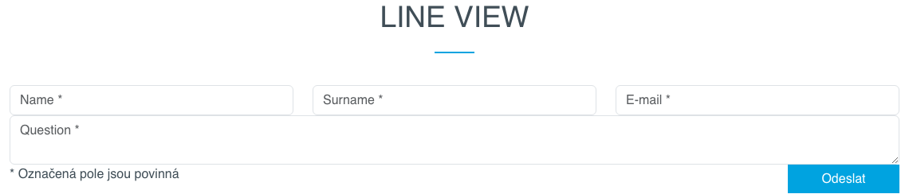
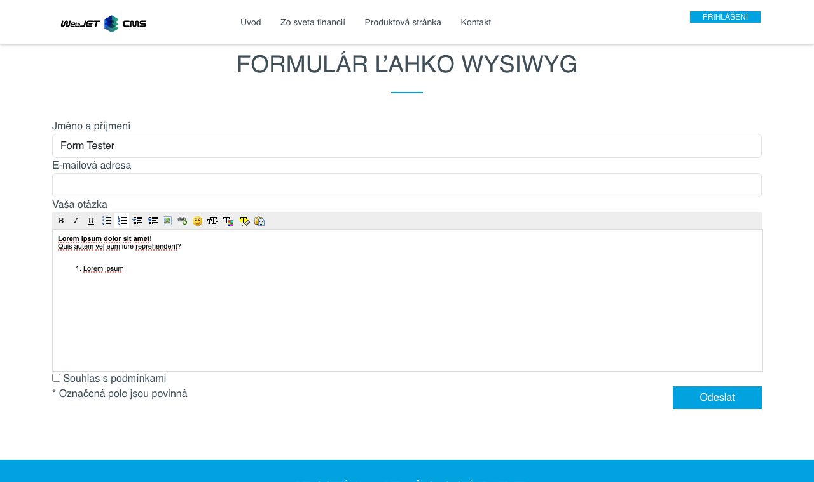

# Formulář snadno

Aplikace formulář snadno slouží ke snadné tvorbě formulářů. Výhoda je v jednoduchosti vytvoření formuláře jednoduchým vkládáním připravených vstupních polí s možností zadání jiného názvu pole, označení povinnosti vyplnění a nastavení textu vysvětlivky (`tooltip`). S výstupním HTML formátem se autor formuláře nemusí zabývat, je připraven podle designu webu pro jednotlivé typy vstupních polí.

## Základní

Formuláři je třeba nastavit následující hodnoty.

- Unikátní jméno formuláře – zadané jméno formuláře by mělo být unikátní pro celý web, pod tímto jménem se formulář uloží do aplikace Formuláře.
- Email adresa příjemce - seznam email adres oddělených čárkami na které má být zaslán vyplněný formulář.
- Řádkové zobrazení - pole formuláře se zobrazí v řádku vedle sebe (jinak je každé pole na novém řádku). Pro vytvoření nového řádku vložte do formuláře pole Nový řádek.
- Text na začátku e-mailu - text, který se přidá do emailu před pole formuláře.
- Text na konci e-mailu - text, který se přidá do emailu za pole formuláře.
- Odeslat email jako text bez formátování - pokud zaškrtnete je email odeslán jako neformátovaná text verze (ve formátu jméno pole: hodnota), jinak je odeslán jako formátovaný HTML text v podobě jak je zobrazen na web stránce.
- Přidat technické informace - pokud zaškrtnete přidají se do emailu i technické informace (název stránky, adresa stránky, datum a čas odeslání, informace o prohlížeči).


Standardně se pole formuláře zobrazují pod sebou:


Po zvolení možnosti Řádkové zobrazení se pole mohou zobrazovat v řádku vedle sebe. Pro vytvoření nového řádku vložte do formuláře pole **Nový řádek**:



## Pokročilé

Záložka pokročilé obsahuje pokročilá nastavení nastavení, která nejsou povinná.

- Šifrovací klíč - pokud chcete hodnoty formuláře zašifrovat, můžete zadat šifrovací klíč.
- Příjemce kopie emailu - seznam email adres oddělených čárkami na které má být zaslána kopie emailu.
- Neviditelní příjemci - seznam email adres oddělených čárkami na které má být zaslána skrytá kopie emailu.
- Předmět emailu - předmět emailu. Není-li vyplněno automaticky se použije podle web stránky.
- Přesměrování po vyplnění - url adresa, na kterou se má provést přesměrování po uložení formuláře. Není-li zadáno, přesměruje se na původní stránku.
- Přesměrování po chybě - url adresa, na kterou se má provést přesměrování, pokud se formulář nepodaří odeslat. Pokud není zadáno, použije se stejná hodnota jako má **Přesměrování po vyplnění**.
- Způsob přesměrování - typ přesměrování po zpracování formuláře.
  - Pokud není hodnota zadaná tak se formulář zpracuje a následně se provede přesměrování na zadanou stránku s nastaveným parametrem stavu odeslání (např. formSend=true).
  - Hodnota `forward` znamená, že na cílovou stránku se provede interní přesměrování. Cílová stránka má tak přístup k identickým parametrům jako formulář a může provést dodatečnou akci. Jelikož se jedná o interní přesměrování v adresním řádku prohlížeče zůstane hodnota `/formmail.do`.
  - Hodnota `addParams` provede přesměrování na cílovou stránku s přidáním jednotlivých parametrů do URL. V takovém případě přesměrování provede prohlížeč a v adresním řádku zůstane adresa cílové stránky. Jelikož ale parametry jsou přidány do URL adresy je limitován jejich počet délkou URL což je standardně 2048 znaků.
- Doc id stránky s verzí pro email - doc ID stránky s verzí pro email. Stránku systém potřebuje k tomu, aby uměl vygenerovat emailovou podobu. Pokud je zadaná hodnota none nepoužije se určení web stránky pro email. Pokud hodnota není zadaná vůbec použije se hodnota zadaná parametrem `useFormDocId`. Hodnota je užitečná v tom případě, pokud na všech stránkách máte jeden kontaktní formulář vkládaný např. v patičce. Při generování emailu se jako kód použije kód samotné stránky, ve které se ale formulář nenachází. Takto lze říci, aby pro email použil jinou stránku.
- Doc id notifikace pro uživatele - je-li nastaveno na hodnotu docId některé web stránky, tak po úspěšném uložení formuláře je na email návštěvníka (z pole s názvem `email / e-mail`) zaslaný email s textem dané web stránky. Může se jednat například o poděkování za vyplnění formuláře, nebo další instrukce postupu. Hodnotu z formuláře do stránky vložíte jako výraz `!field-name!`, což je hodnota v `name` atribute formulářového pole.
- Interceptor před odesláním emailu - hodnota je název třídy, která **musí implementovat interface `AfterSendInterceptor`**. Po odeslání emailu se provede kód z této třídy.


## Položky

V kartě položky můžete přidat nové pole formuláře, přesouvat pořadí polí (pomocí drag & drop) a mazat pole formuláře kliknutím na ikonu mazání.


Pole (položku) formuláře přidáte kliknutím na tlačítko Nová položka, která je zobrazena pod seznamem existujících polí. Ve výběrovém poli Typ pole si můžete vybrat z definovaných polí formuláře. Většina polí umožňuje zadat následující pole:
- Název - představuje jméno pole formuláře (zobrazený název), pokud ponecháte prázdné použije se název z výběrového menu Typ pole. Pro informační pole (popisky) zadejte text, který chcete zobrazit.
- Hodnota - před vyplněná hodnota, která se zobrazí v poli při jeho načtení.
- Zástupný text - pro standardní textová pole reprezentuje hodnotu zástupného textu (`placeholder`), který se zobrazí, když je pole prázdné.
- Povinné pole - zaškrtnutím se pole označí jako povinné pro odeslání formuláře.
- Tooltip - pokud zadáte hodnotu zobrazí se při názvu pole informační bublina (vysvětlivka) s textem zadaným v tomto poli. Způsob zobrazení záleží na designu web stránky (typicky vyžaduje podporu [FontAwesome](https://fontawesome.com) pro zobrazení ikony).

**Poznámka:** pokud je v poli **Hodnota** prázdný text a je zadán text v poli **Zástupný text**, tak se při zobrazení formuláře na web stránce nezobrazí název pole samostatně ale jen jako zástupný text. Umožňuje to vytvořit menší formulář z pohledu jeho prostoru na webové stránce.

Pro **skupiny polí (např. Skupina výběrových nebo zaškrtávacích polí)** se v poli Hodnota definuje seznam možností. Jako rozdělovač možností se hledá znak `|`, pokud se nenajde hledá se znak `,`, pokud se nenajde použije se mezera. Můžete tedy zadat např. `Slobodný,Ženatý,Rozvedený`, nebo pokud v možnosti potřebujete zadat čárku tak použijte oddělovač `|` jak `Predjedlo|Polievku|Hlavné jedlo|Koláč, kávu` (možnost `Koláč, káva` bude jedna položka).

Pro **Výběrový seznam - select** je možné zadat i rozdílný text pro zobrazenou informaci a zvolenou hodnotu. Zobrazený text a hodnota se odděluje znakem `:`. Příklad: `Pomaranč:orange,Jablko:apple` vypíše výběrové pole (select) s textovými hodnotami Pomeranč nebo Jablko, ale při výběru se ve formuláři uloží hodnota `orange` nebo `apple`.


## Informace pro web designéra

HTML kód zobrazení polí a formuláře se definuje v Nastavení-Editace textů. Textové klíče mají prefix `components.formsimple.`.



Základní kód formuláře je v klíčích:
- `components.formsimple.form.start` - HTML kód začátku formuláře (otevírací form tag)
- `components.formsimple.form.end` - HTML kód konce formuláře (zavírací form tag)
- `components.formsimple.requiredLabelAdd` - text, který se přidá k textu label elementu pro povinné pole (typicky znak \*)
- `components.formsimple.tooltipCode` - HTML kód pro generování ${tooltip} náhrady
- `components.formsimple.techinfo` - HTML kód pro generování technických informací do emailu

Jednotlivé položky definujete přes klíče:
- `components.formsimple.label.NAZOV` - název položky (typicky hodnota label elementu)
- `components.formsimple.input.NAZOV` - HTML kód položky
- `components.formsimple.hide.NAZOV` - seznam polí, která se pro tuto položku v administraci nezobrazí (možné hodnoty: label, required, tooltip, placeholder)
- `components.formsimple.firstTimeHeading.NAZOV` - nadpis nad polem, zobrazí se pouze při prvním výpisu pole s tímto názvem (používá se pro výběrová a zaškrtávací pole)

Příklad:

```
//najjednoduchsi typ pola
components.formsimple.label.meno=Meno
components.formsimple.input.meno=<div class="form-group"><label for="${id}">${label}${tooltip}</label> <input class="${classes}form-control" data-name="${labelSanitized}" id="${id}" name="${id}" placeholder="${placeholder}" type="text" maxlength="20" />${cs-error}</div>

//pole, ktoremu sa nezobrazi moznost zadat ze sa jedna o povinne pole (moznost .hide)
components.formsimple.label.popiska=Popiska (info text)
components.formsimple.input.popiska=<div class="form-group"><label for="${id}">${label}${tooltip}</label></div>
components.formsimple.hide.popiska=required

//ukazka pouzitia nadpisu nad vyberovym polom, hodnota .firstTimeHeading sa zobrazi len pred prvym polom
components.formsimple.label.radio=Výberové pole
components.formsimple.input.radio=<div class="form-check"><input class="${classes}form-check-input" data-name="${labelSanitized}" id="${id}" name="${id}" type="radio" value="${value}"/> <label for="${id}" class="form-check-label">${value}${tooltip}</label> ${cs-error}</div>
components.formsimple.firstTimeHeading.radio=<div class="form-group mt-3 mb-0"><label class="first-time">${label}</label></div>
components.formsimple.hide.radio=placeholder

//ukazka pouzitia ${iterable} pre vypis zoznamu vyberovych poli. Z pola Hodnota sa vytvori zoznam, ako oddelovac sa hlada znak | ak sa nenajde pouzije sa , a ak sa ani ta nenajde pouzije sa ako oddelovac medzera
//v kluci components.formsimple.iterable.radiogroup sa definuje HTML kod opakovaneho zaznamu, ten sa vlozi na miesto ${iterable}
components.formsimple.label.radiogroup=Skupina výberových polí
components.formsimple.input.radiogroup=<div class="form-group"><label for="${id}">${label}${tooltip}</label>${iterable} ${cs-error}</div>
components.formsimple.iterable.radiogroup=<div class="form-check"><input class="${classes}form-check-input" data-name="${labelSanitized}" id="${id}-${counter}" name="${id}" placeholder="${placeholder}" type="radio" value="${value}"/> <label for="${id}-${counter}" class="form-check-label">${value}</label></div>
components.formsimple.hide.radiogroup=placeholder

//ukazka pouzitie ${iterable} pre vypis SELECT pola
components.formsimple.label.select=Výberový zoznam - select
components.formsimple.input.select=<div class="form-group"><label for="${id}">${label}${tooltip}</label><select name="${id}" id="${id}" class="form-control form-select">${iterable} </select>${cs-error}</div>
components.formsimple.iterable.select=<option value="${value}">${value-label}</option>

//example of wysiwyg/cleditor - it must contains class ending formsimple-wysiwyg to render cleditor on page
components.formsimple.label.wysiwyg=Formátované textové pole
components.formsimple.input.wysiwyg=<div class="form-group"><label for="${id}">${label}${tooltip}</label> <textarea class="${classes}form-control formsimple-wysiwyg" data-name="${labelSanitized}" id="${id}" name="${id}" placeholder="${placeholder}">${value}</textarea>${cs-error}</div>
components.formsimple.hide.wysiwyg=placeholder
```

V kódu lze použít následující značky, které se při zobrazení formuláře nahradí:
- `${formname}` - jméno formuláře bez mezer, diakritiky, malými písmeny, používá se pro form element do atributu name (to by mělo ještě začínat výrazem formMail pro použití ve standardním validačním mechanismu)
- `${savedb}` - stejná hodnota jako `formname`, používá se pro přehlednost v URL odeslání formuláře
- `${id}` - ID elementu generované z jeho názvu (pole Hodnota v administraci), bez mezer, diakritiky, malými písmeny
- `${label}` - text pro label element, hodnota z pole název v administraci
- `${labelSanitized}` - text pro label element, hodnota z pole název v administraci, upravené speciální znaky aby jej bylo možné použít v HTML atributu
- `${value}` - text z pole hodnota v administraci
- `${placeholder}` - zástupný text, zobrazí se když má pole prázdnou hodnotu
- `${classes}` - dodatečné CSS styly, aktuální `required` pokud je zaškrtnuto Povinné pole v administraci
- `${tooltip}` - HTML kód pro tooltip, hodnota z pole Tooltip v administraci
- `${cs-error}` - generovaný HTML kód pro chybovou hlášku
- `${iterable}` - na uvedené místo se vloží opakující seznam polí (např. skupina výběrových polí), přičemž kód, který se opakuje je definován klíčem `components.formsimple.iterable.MENO_POLA`
- `${counter}` - pořadové číslo pro opakující záznam, je potřebný k nastavení unikátního `id` a `for` atributu
- `${value-label}` - textová hodnota (label) pro opakující záznam, pokud obsahuje jinou hodnotu pro `value` a pro `label` (např v `option` tagu). Uživatel zadává možné hodnoty jako `label:value`, tedy jako např. `Pomaranč:orange,Jablko:apple` pro zobrazení uvedených možností.
- `{enumeration-options|ID_CISELNIKA|MENO_VALUE|MENO_LABEL}` - napojení získání seznamu `option` hodnot z aplikace číselník. Zadáno je ID číselníku, název sloupce pro hodnotu a název sloupce pro text.

V zobrazení do emailu se hodnota pole tooltip nahrazuje za prázdný znak (aby v emailu nebyl zbytečně nefunkční tooltip).
