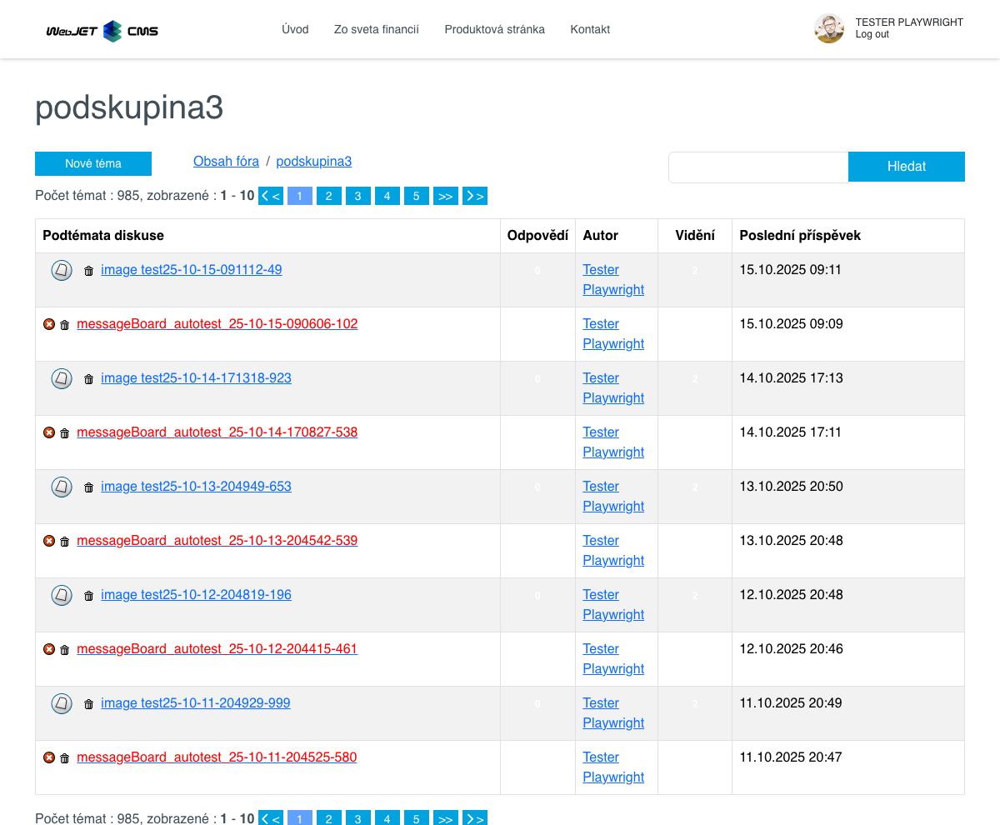

# Fórum/Diskuse

Aplikace Fórum/Diskuse, která umožňuje do stránky vložit diskusi, má následující možnosti zobrazení:
- Diskusní fórum - jednoduchá diskuse pod článkem.
- Nástěnka diskusí - vícetémová diskuse (`Message board`), kde se diskuse dělí na skupiny a pod-témata, které budou obsahovat jednotlivé příspěvky. Pod-témata může přidávat také uživatel.

## Diskusní fórum

"Diskusní fórum" je typ jednoduché diskuse.


Nastavení aplikace se skládá ze dvou karet **Parametry aplikace** a **Seznam diskusí**


### Karta - Parametry aplikace

Karta parametry aplikace obsahuje několik dodatečných parametrů a omezení :
- **Zvolte komponentu** - výběr mezi "Diskusním fórem" a "Nástěnkou diskusí" (výběr typu diskuse).
- **Uspořádat podle času příspěvku** - sestupné nebo vzestupné uspořádání.
- **Způsob zobrazení textu stránky**
  - Vložený rámec (`iframe`) - při zobrazení kompletního výpisu diskuse, se obsah původní stránky zobrazí do rámce.
  - Zobrazí se perex - při zobrazení kompletního výpisu diskuse, se zobrazí pouze perex původní stránky.
  - Nezobrazí se vůbec - zobrazí se pouze výpis diskuse.
  - Normálně - při zobrazení kompletního výpisu diskuse, se zobrazí i kompletní znění původní stránky
  - Celé fórum, včetně textů – do stránky se vloží kompletní výpis celé diskuse.
- **Stránkovat diskusi** - při povolení stránkovat diskusi se objeví ještě dodatečný parametr **Počet příspěvků na stránce**, který určí, jak se bude stránkovat a jeho přednastavená hodnota je 10.
- **Odeslat notifikaci autorovi stránky při přidání příspěvku do diskuse** - pokud je možnost zvolena, autor stránky kde se daná diskuse nachází bude e-mailem informován o každém přidaném příspěvku do diskuse (výjimka je pouze v případě, že samotný autor stránky přidal příspěvek).

!>**Upozornění:** chcete-li aby **každý** autor stránky s diskusí dostával notifikaci, můžete to nastavit konfigurační proměnnou `forumAlwaysNotifyPageAuthor`, kterou nastavíte na hodnotu `true`. Nastavíte-li ji na hodnotu `false`, bude to záležet na nastavení jednotlivých diskusi. **Totéž platí i pro Nástěnku diskusí**

Chcete-li aby vždy autor stránky s diskusí dostával notifikaci, můžete nastavit konfigurační proměnnou `forumAlwaysNotifyPageAuthor` na hodnotu `true`.

### Karta - Seznam diskusí

Karta seznam diskusí je vnořená stránka se seznamem všech diskusí (Diskusní fórum i Nástěnka diskusí). O seznamu diskusí se dozvíte více zde [Seznam diskusí](forum-list.md).

## Nástěnka diskusí

"Nástěnka diskusí", též označovaná jako `Message board`, je typ vícetémové diskuse. Do stránky lze vložit jako aplikaci. Diskuse se dělí na skupiny (sekce) a na pod-témata. Pro každou pod-téma se eviduje počet přidaných příspěvků, počet vidění a datum přidání posledního příspěvku, které jsou zobrazeny pod názvem tématu.



Návštěvník tedy může vytvořit nové téma a následně do tématu se přidávají diskusní příspěvky. Vytváří se tak určitá stromová struktura diskusních příspěvků.


Nastavení aplikace se skládá ze dvou karet **Parametry aplikace**, **Skupiny** a **Seznam diskusí**.


!>**Upozornění:** aplikace diskuse ve formátu **Nástěnka diskusí** (nebo **Message Board**) se musí vložit již do vytvořené stránky.

### Karta - Parametry aplikace

Karta parametry aplikace obsahuje několik dodatečných parametrů:
- **Zvolte komponentu** - výběr mezi "Diskusním fórem" a "Nástěnkou diskusí" (výběr typu diskuse).
- **Směr uspořádání** - sestupné nebo vzestupné uspořádání.
- **Řazení témat** a to
  - Podle posledního příspěvku.
  - Podle data vytvoření tématu.
- **Počet příspěvků na stránce** - zadejte počet příspěvků, které se zobrazí na jedné stránce. Přednastavená hodnota je 10.
- **Počet zobrazených čísel stránek** - určuje počet přímých číselných odkazů na stránky ze stránkovaného seznamu. Přednastavená hodnota je 10.
- **Zapnout čas. limit na mazání příspěvků** - zapněte jej, chcete-li umožnit mazání příspěvků jen dokud neuplyne časový limit. Na vymazání příspěvku má právo pouze jeho autor.
- **Časový limit (min)** - uveďte číselnou hodnotu v min. Přednastavená hodnota je 30 minut.
- **Odeslat notifikaci autorovi stránky při přidání příspěvku do diskuse** - pokud je možnost zvolena, autor stránky kde se daná diskuse nachází bude e-mailem informován o každém přidaném příspěvku do diskuse (výjimka je pouze v případě, že samotný autor stránky přidal příspěvek).

!>**Upozornění:** pokud chcete, aby vždy autor stránky s diskusí dostával notifikaci, můžete nastavit konfigurační proměnnou `forumAlwaysNotifyPageAuthor` na hodnotu `true`.

### Karta - Skupiny

Karta **Skupiny** se zobrazuje pouze v případě zvolení komponenty **vícetémová diskuse (Message Board)**. Nabízí možnost zadefinovat strukturu vícetémové diskuse pomocí skupin a podskupin.

Přednastavená struktura (pokud ve složce není jiná diskuse) je:

```txt
Skupina1
 podskupina1
Skupina2
 podskupina1
 podskupina2
 podskupina3
```

!>**Upozornění:** podskupiny musí začínat mezerou.

Samozřejmě tuto strukturu můžete změnit. Po uložení se automaticky potřebná struktura vytvoří ve složce stránky, do které byla aplikace vložena.

### Karta - Seznam diskusí

Karta seznam diskusí je vnořená stránka se seznamem všech diskusí (Diskusní fórum i Nástěnka diskusí). O seznamu diskusí se dozvíte více zde [Seznam diskusí](forum-list.md).
