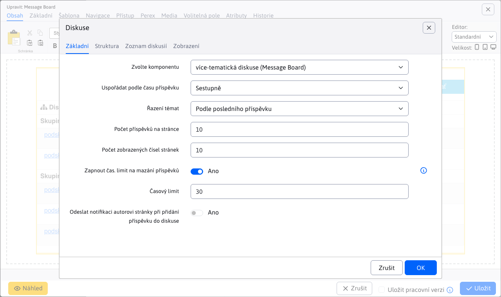

# Fórum/Diskuze

Aplikace Fórum/Diskuze, která umožňuje vložit na stránku diskuzi, má následující možnosti zobrazení:
- Diskusní fórum - jednoduchá diskuse pod článkem
- Diskusní fórum - diskuse na více témat (`Message board`), kde je diskuse rozdělena do skupin a podtémat, která budou obsahovat jednotlivé příspěvky. Dílčí témata může přidávat i uživatel.

## Diskusní fórum

"Diskusní fórum" je druh jednoduché diskuse.

Nastavení aplikace se skládá ze dvou karet **Parametry aplikace** a **Seznam diskusí**

### Parametry aplikace

Karta **Parametry aplikace** obsahuje několik dalších parametrů a omezení :
- **Výběr součásti**, výběrem mezi "Diskusní fórum" a "Diskusní fórum" (výběrem typu diskuse).
- **Uspořádat podle času odeslání**, sestupné nebo vzestupné uspořádání.
- **Způsob zobrazení textu stránky**
  - Vestavěný rámec (`iframe`) - při zobrazení kompletního výpisu diskuse se v rámečku zobrazí obsah původní stránky.
  - Zobrazení perexu - při zobrazení celého výpisu diskuse se zobrazí pouze perex původní stránky.
  - Nezobrazuje se vůbec - zobrazí se pouze výpis z diskuse.
  - Normální - když se zobrazí celý výpis diskuse, zobrazí se také celý text původní stránky.
  - Celé fórum včetně textů - kompletní výpis celé diskuse bude vložen na stránku.
- **Stránkování diskuse**, když povolíte stránkování diskuse, objeví se další parametr. **Počet příspěvků na stránce**, která určuje způsob stránkování a její výchozí hodnota je 10.
- **Odeslání oznámení autorovi stránky, když je do diskuse přidán příspěvek.** Pokud je tato možnost vybrána, autor stránky, na které se diskuse nachází, bude informován e-mailem o každém příspěvku přidaném do diskuse (jedinou výjimkou je, pokud příspěvek přidal autor stránky).

**Varování:** pokud chcete **každý** autor diskusní stránky obdrží oznámení, můžete to nastavit pomocí konfigurační proměnné. `forumAlwaysNotifyPageAuthor`, kterou nastavíte na hodnotu `true`. Pokud ji nastavíte na `false`, bude záležet na nastavení každé diskuse. **Totéž platí pro diskusní fórum**

### Seznam diskusí

Karta **Seznam diskusí** je vnořená stránka se seznamem všech diskusí (Diskusní fórum a Diskusní fórum). Více informací o seznamu diskusí najdete zde [Seznam diskusí](forum-list.md).

## Diskusní fórum

"Diskusní fórum", označované také jako `Message board`, je typem diskuse o více tématech. Lze ji vložit jako aplikaci do stránky. Diskuze je rozdělena do skupin (sekcí) a podtémat. U každého podtématu se zaznamenává počet přidaných příspěvků, počet zobrazení a datum přidání posledního příspěvku, které se zobrazují pod názvem tématu.

Návštěvník tak může vytvořit nové téma a k němu se pak přidávají diskusní příspěvky. Vzniká tak jakási stromová struktura diskusních příspěvků.

Nastavení aplikace se skládá ze dvou karet **Parametry aplikace** a **Seznam diskusí**.

### Parametry aplikace

Karta **Parametry aplikace** obsahuje několik dalších parametrů:
- **Výběr součásti**, výběrem mezi "Diskusní fórum" a "Diskusní fórum" (výběrem typu diskuse).
- **Směr uspořádání**, sestupné nebo vzestupné uspořádání.
- **Řazení témat** konkrétně
  - Podle posledního příspěvku.
  - Podle data vytvoření tématu.
- **Počet příspěvků na stránce**, zadejte počet příspěvků, které se zobrazí na jedné stránce. Výchozí hodnota je 10.
- **Počet zobrazených čísel stránek**, určuje počet přímých číselných odkazů na stránky ze stránkovaného seznamu. Výchozí hodnota je 10.
- **Zapněte čas. omezení mazání příspěvků**, zapněte ji, pokud chcete povolit mazání příspěvků pouze do vypršení časového limitu. Právo odstranit příspěvek má pouze autor.
- **Časový limit (min)**, uveďte číselnou hodnotu v min. Přednastavená hodnota je 30 minut.
- **Odeslání oznámení autorovi stránky, když je do diskuse přidán příspěvek.** Pokud je tato možnost vybrána, autor stránky, na které se diskuse nachází, bude informován e-mailem o každém příspěvku přidaném do diskuse (jedinou výjimkou je, pokud příspěvek přidal autor stránky).

**Varování:** pokud chcete **každý** autor diskusní stránky obdrží oznámení, můžete to nastavit pomocí konfigurační proměnné. `forumAlwaysNotifyPageAuthor`, kterou nastavíte na hodnotu `true`. Pokud ji nastavíte na `false`, bude záležet na nastavení každé diskuse. **Totéž platí pro diskusní fórum.**

### Seznam diskusí

Záložka Seznam diskusí je vnořená stránka se seznamem všech diskusí (diskusní fórum i diskusní fórum). Více informací o záložce Seznam diskuzí naleznete zde [Seznam diskusí](forum-list.md).
