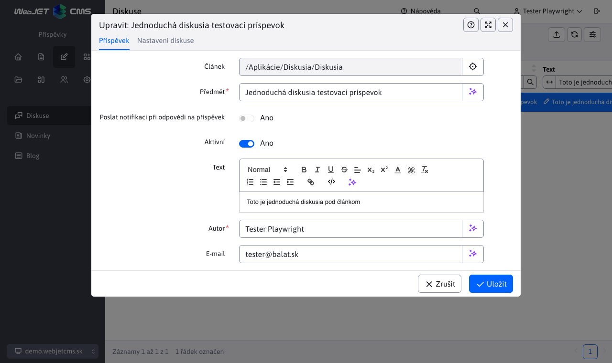
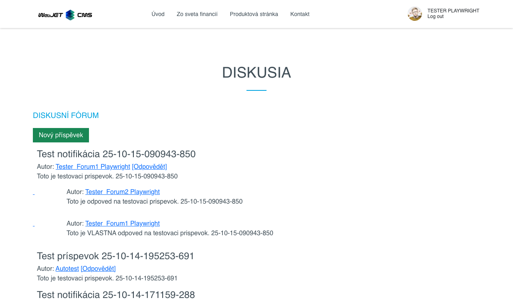

# Seznam diskusí

Seznam diskusí se nachází v sekci Příspěvky. Obsahuje seznam všech příspěvků, které patří pod **Diskusní fórum** a **Nástěnku diskusí**.


## Editace příspěvku

K editaci příspěvku slouží tlačítko , které vyvolá editor a je aktivní pouze pokud je označen alespoň jeden příspěvek. Editor může být vyvolán i kliknutí na hodnotu sloupce **Titulek** v tabulce.



Editace příspěvku se nachází v kartě editor **Příspěvek** a obsahuje pole:
- **Článek** - web stránka, ke které je diskuse připojena
- **Titulek** - předmět/název příspěvku
- **Poslat notifikaci při odpovědi na příspěvek** - můžete nastavit zaslání notifikačního emailu
- **Aktivní** - můžete nastavit aktivitu příspěvku
- **Text** - samotný text příspěvku
- **Autor** - jméno autora příspěvku
- **E-mail** - email adresa autora příspěvku, posílá se na něj notifikace v případě zvolené možnosti odpovědi na příspěvek

## Nastavení diskuze/fóra

Nastavení vlastností pro celé fórum/diskusi (všechny příspěvky na jedné web stránce) se nachází v kartě **Nastavení diskuze**. Ta se dělí na 3 sekce.


### Sekce - Základní údaje

Obsahuje základní údaje o diskusním fóru v polích:
- **Stav diskusního fóra** - informuje o aktivitě diskuse. V případě, že je přesáhnuto některé z omezení, nebo je manuálně vypnuta aktivita, bude stav diskusního fóra: "uzavřeno" (více v [Sekce - Platnost](#sekce-platnost))
- **Typ fóra** - má hodnotu "jednoduchá diskuse pod článkem" nebo "viactemová diskuse (`Message Board`)"
- **Oznámení - podtémy mohou vytvářet pouze administrátoři** - toto pole se zobrazí pouze v případě "viactémové diskuse". Pokud je tato možnost zvolena, oznámení/pod-témata budou moci vytvářet pouze administrátoři (více v [Sekce - Přístupová práva](#sekce-přístupová-práva))
- **Potvrzování příspěvků** - pokud označíte tuto možnost, tak při každém přidání nového příspěvku, se na uvedenou adresu odešle mail s textem příspěvku a odkazem na tuto tabulku, ve které se příspěvek automatický vy-filtrujeme
- **Žádost o potvrzení poslat na e-mail** - pole obsahující email kam se žádosti o potvrzení odešlou. Samotné pole se zobrazí pouze v případě, je-li možnost **Potvrzování příspěvků** vybrána. V takovém případě bude editor vyžadovat zadání tohoto emailu.
- **Notifikaci poslat na e-mail** - toto pole má stejnou úlohu jako pole obsahuje emailovou adresu, na kterou se odešle email vždy, když jakýkoli příspěvek přibude do diskusního fóra.

### Sekce - Přístupová práva

Sekce obsahuje nastavení přístupových práv. Přesnější výběr **Skupiny uživatelů, kteří mohou přidat nový příspěvek (je-li prázdné mohou i neregistrovaní)**. Vybrány mohou být všechny skupiny, žádná skupina nebo jejich kombinace.

!>**Upozornění:** v případě fóra typu "viactemová diskuse", máte možnost zvolit i **Skupiny administrátorů**. Pokud jste v sekci **Základní údaje** zvolili možnost **Oznámení - podtémy mohou vytvářet pouze administrátoři**, tak výběrem těchto skupin administrátorů určitě, kdo bude moci vytvářet pod-témata.

### Sekce - Platnost

Sekce obsahuje pole:
- **Aktivní** - můžete nastavit aktivitu diskusního fóra. Ta je podmíněna i následujícími datovými a hodinovými omezeními.
- **Datum platnosti (od)** - nastavte datum a čas, odkdy má být fórum aktivní.
- **Datum platnosti (do)** - nastavte datum a čas, konce platnosti fóra.
- **Počet hodin od posledního příspěvku, pro uzavření diskuse** - pokud nastavíte hodnotu větší než 0, bude se omezení aktivní.

## Zobrazení příspěvku

K zobrazení příspěvku slouží tlačítko  nebo přímo kliknutí na hodnotu sloupce **Článek** v tabulce.

Tlačítko je aktivní pouze pokud je označen alespoň jeden příspěvek a funguje v závislosti na typu diskuse pod kterou patří příspěvek.

**Diskusní fórum**

V případě že příspěvek patří pod Diskusní fórum, stisk ikony  nebo odkazu ve sloupci **Článek** má stejný výsledek. Budete přesměrováni na web stránku, kde budete vidět všechny příspěvky, ne jen ten přes který jste se tam dostali. To znamená, že konkrétní příspěvek nebude filtrován.



**Nástěnka diskusí**

V případě že příspěvek spadá pod "Nástěnku diskusí", také označovanou jako `Message board`, funkce se bude lišit v závislosti co stisknete.

- Pokud využijete odkaz ve sloupci **Článek** budete přesměrováni na hlavní stránku dané vícetémové diskuse, kde uvidíte seznam všech témat diskuse. Odtud se umíte přesměrovat přímo na dané téma kliknutím na její název.


- Pokud využijete tlačítko  budete přesměrováni přímo na téma diskuse, kde bude seznam příspěvků. Opět, konkrétní příspěvek nebude filtrován ale uvidíte celý seznam.


## Akce nad fóry a příspěvky

Tato kapitola rozebírá možné akce, které můžete provést nad příspěvkem fóra nebo nad celým fórem.

Třeba si uvědomit, že **jednotlivé akce se navzájem neovlivňují**. V praxi to znamená, že již vymazaný příspěvek může být i zamítnut a také uzamčen. Nebo jakákoli kombinace těchto akcí.

### Mazání a obnovení příspěvku

K vymazání příspěvku slouží tlačítko  a je aktivní pouze pokud je označen alespoň jeden příspěvek. Mazání má dva režimy:
- Označeno jako smazané - příspěvek nebude vymazán z databáze, pouze označen jako vymazán a stále bude v tabulce dostupný. Takový příspěvek může být znovu obnoven a to tlačítkem obnovení .
- Reálné smazání z databáze - příspěvek bude vymazán z databáze a již nikdy nebude přístupný.

To, který mód mazání se na pozadí použije závisí na nastavené konfigurační proměnné `forumReallyDeleteMessages`. Pokud je tato konfigurační proměnná nastavena na hodnotu `true` provede se i smazání záznamu z databáze.

!>**Upozornění:**

- Akce mazání i akce obnovení jsou rekurzivní akce. To znamená, že není vymazán/obnoven pouze samotný příspěvek, ale celá větev pod ním, takže i všechny odpovědi na tento příspěvek a odpovědi na odpovědi.
- Vymazané příspěvky se v diskusi dále nezobrazují a po obnovení se opět zobrazí is nahranými soubory.

### Mazání a obnovení fóra

Rozhodnete-li se vymazat celé fórum, budou s ním vymazány i všechny příspěvky, které pod něj patří. Celé fórum je návštěvníkům skryto a nelze se na něj vrátit ani pomocí zapamatované url adresy.

Pokud se rozhodnete obnovit celé fórum, budou s ním obnoveny i všechny příspěvky. Fórum bude návštěvníkům opět přístupné i se všemi příspěvky a nahranými soubory.

### Schválení a zamítnutí příspěvku

Ke schválení příspěvku slouží tlačítko  a pro zamítnutí příspěvku slouží tlačítko . Obě tato tlačítka jsou aktivní pouze v případě, že je označen alespoň jeden příspěvek. Tyto akce nejsou limitovány a příspěvek lze kdykoli schválit nebo zamítnout.

!>**Upozornění:**

- Akce schválení i akce zamítnutí jsou rekurzivní akce. To znamená, že není schválen/zamítnut pouze samotný příspěvek ale celá větev pod ním, takže i všechny odpovědi na tento příspěvek a odpovědi na odpovědi.
- Zamítnuté příspěvky se ve fóru dále nezobrazují a po jejich schválení se ve fóru opět objeví is nahranými soubory.

### Schválení a zamítnutí fóra

Rozhodnete-li se zamítnout celé fórum, budou s ním zamítnuty i všechny příspěvky, které pod něj patří. Celé fórum je uživatelem skryto a nelze se na něj vrátit ani pomocí zapamatované url adresy.

Pokud se rozhodnete schválit celé fórum, budou s ním schváleny i všechny příspěvky. Fórum bude uživatelům opět přístupné i se všemi příspěvky a nahranými soubory.

### Uzamčení a odemčení příspěvku

Pro uzamčení příspěvku je třeba nastavit hodnotu pole **Aktivní** na `false` (nezvolit možnost). Pole se nachází v editoru příspěvku, přesněji v kartě **Základní**. Při výběru možnosti **Aktivní** (nastavení hodnoty na `true`) se příspěvek fóra odemkne.


!>**Upozornění**

- akce uzamčení (nastavení příspěvku jako aktivní) a akce uzamčení (nastavení fóra jako neaktivní) jsou rekurzivní akce. To znamená, že není uzamčen/odemčen pouze samotný příspěvek ale celá větev pod ním, takže i všechny odpovědi na tento příspěvek a odpovědi na odpovědi ...
- uzamčené příspěvky se v diskusi dále zobrazují as nahranými soubory ale nelze na nich odpovědět, citovat je, vymazávat nebo nahrávat k nim soubory po odemknutí se všechny funkce uživatelům opět povolí

### Uzamčení a odemčení fóra

Uzamčení celého fóra se provádí nastavením hodnoty pole **Aktivní** na `false` (nezvolení možnosti). Pole se nachází v editoru příspěvku, přesněji v kartě **Nastavení diskuze** a v sekcí **Platnost**. Při výběru možnosti **Aktivní** (nastavení hodnoty na `true`) se celé fórum odemkne.


Pokud se rozhodnete uzamknout celé fórum, nebo se uzamkne po uplynutí doby platnosti, fórum je dále zobrazeno návštěvníkům, ale nelze jej jakkoli upravovat. To znamená, že návštěvníci nemohou přidávat/mazat příspěvky ani nahrávat soubory. Fórum je označeno červeně as ikonou indikující uzamčení fóra.

Pokud se rozhodnete odemknout celé fórum nebo nastane doba platnosti, celé fórum bude odemčeno a opět bude možné upravovat i všechny příspěvky v tomto fóru (všechny příspěvky budou zachovány i nahrané soubory a všechny možnosti budou opět uživatelům povoleny).

## Stav diskuse

Tabulka obsahuje speciální sloupec **Stav**, který obsahuje ikony indikující stav dané diskuse.


Každý záznam (nezáležíc na stavu) obsahuje ikonu "oka", na kterou lze kliknout a má stejnou funkcí jako tlačítko oka  na zobrazení příspěvku (více v sekci [Zobrazení příspěvku](#zobrazení-příspěvku)).

Zbývající stavové ikon již mají také význam. Seznam těchto ikon i jejich popis najdeme v při filtrování nad sloupcem **Stav**.


Z tohoto seznamu ještě ikona reprezentující Smazaný příspěvek funguje jako tlačítko (jako v případě ikony oka) a má stejnou funkcionalitu, jako odpovídající tlačítko pro obnovení příspěvku (více v sekci [Mazání a obnovení příspěvku](#mazání-a-obnovení-příspěvku)).

Jak bylo zmíněno s sekcí [Akce nad fóry a příspěvky](#akce-nad-fóry-a-příspěvky), jednotlivé stav se navzájem neovlivňují a proto může být příspěvek uzamčen a současně vymazán nebo neschválen a současně uzamčen. Takovou kombinaci stavů můžete vidět na následujícím obrázku.


## Práce s fórem

V této sekci si rozeberu uživatelskou práci s fórem v závislosti na jeho typu. Nebo jinak řečeno možnosti uživatele při práci s fórem a příspěvky/odpověďmi.

Bližší informace o tom, jak se fórum chová v jednotlivých stavech (samotné fórum a příspěvky, nikoli možnosti uživatele ve fóru) jsou v sekci [Akce nad fóry a příspěvky](#akce-nad-fóry-a-příspěvky).

### Jednoduchá diskuse

Pokud jde o fórum typu jednoduchá diskuse, návštěvník má pouze 2 možnosti:
- přidání nového příspěvku
- odpověď na stávající příspěvek

Běžný návštěvník nevidí příspěvky, které jsou buď vymazány nebo neschváleny (ani odpovědi na tyto příspěvky). Uzamčené příspěvky však vidí.


**Přidání nového příspěvku**

Přidávat nový příspěvek může v jednoduché diskusi kdokoli. Pokud se jedná o přihlášeného uživatele, jeho jméno a e-mail se do formuláře nastaví automaticky. V případě nepřihlášeného uživatele, bude fórum vyžadovat zadání alespoň jména (e-mail není povinen). Nově přidaný příspěvek se automaticky uloží na vrchu seznamu (nebo na jeho konci - může to záviset na nastaveném směru pořadí).

Platí, že přidávání nového příspěvku je možné pouze pokud **fórum není uzamčeno**, takže je aktivní. V opačném případě návštěvník uvidí všechny příspěvky i odpovědi, ale nedokáže přidávat nové příspěvky.


**Odpověď na stávající příspěvek**

Při odpovědi na stávající příspěvek platí stejné pravidlo o uživateli jako při přidávání nového příspěvku. Odpovědět lze pouze na příspěvek (množství není limitováno) ale nelze odpovědět na odpověď.

Platí, že možnost odpovědět na příspěvky GLOBÁLNĚ je dostupná pouze pokud **fórum není uzamčeno**, takže je aktivní. V uzamčeném fóru se kromě přidávání nového příspěvku nedá ani odpovídat na příspěvky, takže je pouze ke čtení.

Platí, že možnost odpovědět na jednotlivé příspěvky (LOKÁLNÍ) je dostupné pouze pokud **příspěvek není uzamčen**, takže aktivní. Pokud jsou pouze některé příspěvky uzamčeny, jsou viditelné is jejich odpověďmi, ale další odpovědi na takový příspěvek nelze přidat.

### Vícetémová diskuse (Message Board)

Pokud jde o fórum typu vícetémová diskuse, návštěvník má následující možnosti:
- vytvoření nového tématu
- odpověď na příspěvek
- odpověď na odpověď
- přiložení souboru k odpovědi/citaci
- vymazání odpovědi

Běžný návštěvník nevidí příspěvky, které jsou buď vymazány nebo neschváleny (ani odpovědi na tyto příspěvky). Uzamčené příspěvky však vidí.


**Odpovídání na příspěvek**

Odpověď na příspěvek má stejná pravidla, jako to bylo popsáno při odpovědi na příspěvek u jednoduché diskuse.

Stejně jako u jednoduché diskuze platí, že přidávání nového příspěvku (odpovědi) je možné pouze pokud **fórum není uzamčeno**, takže je aktivní. V opačném případě uživatel uvidí všechny příspěvky i odpovědi, ale nedokáže přidávat nové příspěvky (odpovědi).

**Odpověď na odpovědi (Citace)**

Pokud jsme přímo v nějaké diskusi, tak reagování na téma diskuse nazýváme odpověď (jak to je zmíněno nahoře). Odpovídáme-li však již na odpovědi, nazýváme to **citování**. Citovat lze všechny příspěvky a dokonce i jiné citace. V praxi to může vypadat nějak takto:

```
príspevok
|_odpoveď 1, na príspevok
| |_odpoveď (citácia) 1, na odpoveď 1
| |_odpoveď (citácia) 2, na odpoveď 1
|   |_odpoveď (citácia) 1, na citáciu 2
|_odpoveď 2, na príspevok
```

Vzniká nám strom odpovědí a citací na odpovědi či citací na jiné citace. Takový strom může mít několik úrovní (není to omezeno).

Platí, že možnost citovat odpovědi GLOBÁLNĚ je dostupná pouze pokud **fórum není uzamčeno**, takže je aktivní. Uzamčené fórum je pouze ke čtení.

Platí, že možnost citovat odpovědi LOKÁLNĚ je dostupná pouze pokud **odpověď (aka příspěvek) na příspěvek není uzamčena**, takže odpověď je aktivní. Pokud jsou pouze některé odpovědi uzamčeny, jsou viditelné is jejich citacemi, ale další citace na takové odpovědi nelze přidat.

Pokud nejsou všechny podmínky splněny, příslušné tlačítko pro provedení akce se nezobrazí.

**Přiložení souboru k odpovědi/citaci**

Soubory lze přiložit jak k odpovědi, tak ik citaci.

Platí že:
- přiložit soubor/y může **pouze přihlášený uživatel**
- uživatel musí patřit do skupiny, která má povoleno přiložení souboru
- uživatel smí přiložit soubor **pouze k vlastním odpovědím/citacím**
- přiložených může být neomezený počet souborů
- soubor musí splňovat nastavené limity i typ
- **Upozornění:** v případě uzamčeného celého fóra nebo pouze některých odpovědí/citací platí stejná logika jako v případě odpovědi na příspěvek nebo citací.

Pokud nejsou všechny podmínky splněny, příslušné tlačítko pro provedení akce se nezobrazí.

To, kdo může nahrávat soubory, jaké soubory a jaké velikosti se nastavuje ve web stránce s diskusním fórem nastavením parametru `fileUploadDir-ID_SKUPINY=/files/cesta/k/priecinku/` jak je to zobrazeno na obrázku níže.


**Vymazání odpovědi/citace**

Fórum poskytuje možnost vymazat jak odpověď, tak citaci. Bližší informace k samotné akci jsou v sekci [Mazání a obnovení příspěvku](#mazání-a-obnovení-příspěvku).

Platí že:
- vymazat odpověď/citaci může **pouze přihlášený uživatel**
- uživatel smí vymazat pouze ty příspěvky, které sám vytvořil

Pokud nejsou všechny podmínky splněny, příslušné tlačítko pro provedení akce se nezobrazí.

### Pohled Administrátora vs pohled uživatele

Platí, že administrátor může při práci s fórem cokoli a to bez omezení. To znamená:
- vidí všechna fóra a to i ta vymazaná a neschválená (běžný uživatel je nevidí)
- v jednoduché diskusi může přidávat příspěvky i odpověď na příspěvky neomezeně (uživatel je limitován stavem fóra nebo příspěvku)
- ve vícetémové diskusí může odpovědět/citovat/nahrávat/vymazávat neomezeně (uživatel je limitován stavem fóra, odpovědí/citací atd...)

Jediná limitace Administrátora je fakt, že ve vícetémové diskusi nevidí vymazané/neschválené odpovědi/citace (aka příspěvky). Důvod je, aby mu tyto příspěvky nezavazovaly při čtení diskuse.

Administrátor má stále možnost takové příspěvky upravit. Více o těchto úpravách se dočtete v sekci [Akce nad fóry a příspěvky](#akce-nad-fóry-a-příspěvky).
