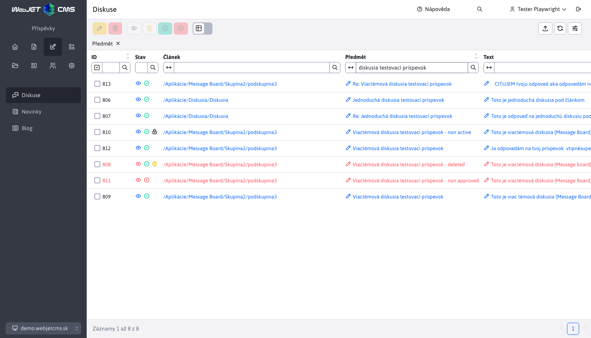
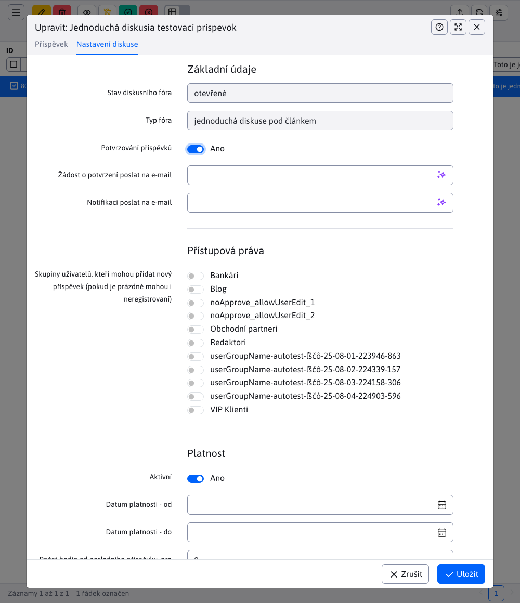
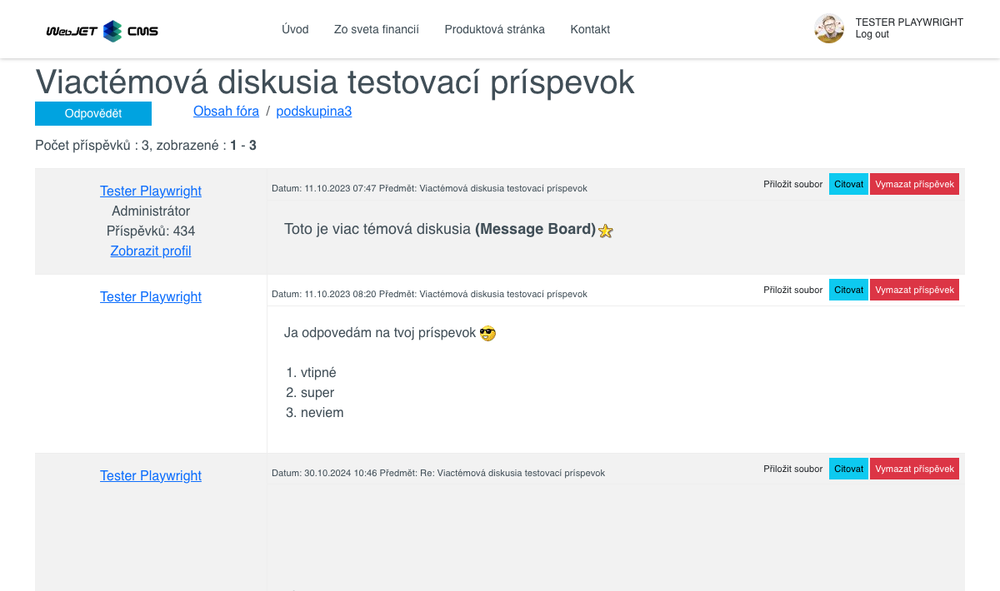
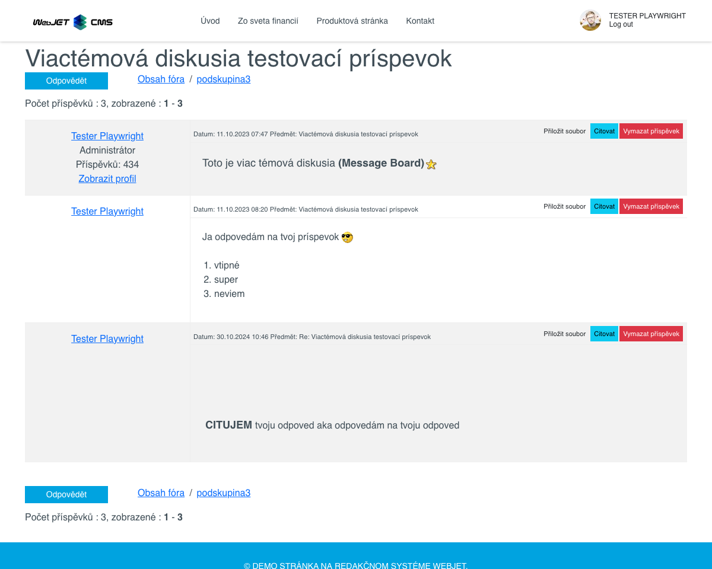

# Seznam diskusí

Seznam diskusí naleznete v sekci Příspěvky. Obsahuje seznam všech příspěvků, které spadají do kategorie **Diskusní fórum** a **Diskusní fórum**.



## Úprava příspěvku

Pomocí tlačítka upravte příspěvek který vyvolá editor a je aktivní pouze v případě, že je vybrán alespoň jeden příspěvek. Editor lze vyvolat také kliknutím na hodnotu sloupce. **Titulek** v tabulce.


Úpravy příspěvku naleznete na kartě Editor. **Základní** a obsahuje pole:
- **Článek**, webová stránka, na kterou se diskuse odkazuje.
- **Titulek**, předmět/název příspěvku
- **Odeslání oznámení při odpovědi na příspěvek**, můžete nastavit odesílání upozornění e-mailem
- **Aktivní**, můžete nastavit aktivitu příspěvku
- **Text**, samotný text článku
- **Autor**, jméno autora příspěvku
- **E-mail**, e-mailová adresa autora příspěvku, na kterou je zasláno oznámení, pokud je vybrána možnost odpovědět na příspěvek.

## Úpravy fóra

Úprava celého fóra se nachází na kartě Editor. **Nastavení**. Otevření samotného editoru je popsáno v předchozí části (úprava příspěvku). To znamená, že každý příspěvek ve fóru sdílí stejné nastavení pro celé fórum na této kartě.

Samotná karta **Nastavení** obsahuje parametry diskusního fóra a je rozdělena do 3 sekcí.



### Sekce - Základní údaje

Obsahuje základní informace o diskusním fóru v polích:
- **Stav diskusního fóra**, informuje o aktivitě diskuse. Pokud dojde k překročení některého z limitů nebo k ručnímu zakázání aktivity, bude stav diskuze "uzavřen", více in [Sekce - Stav diskuse](#stav-diskuse)
- **Typ fóra**, stojí za "jednoduchou diskuzi pod článkem" nebo "diskuzi o více tématech (`Message Board`)"
- **Oznámení - podtémata mohou vytvářet pouze správci**, toto pole se zobrazí pouze v případě "diskuse s více tématy". Pokud je tato možnost zaškrtnuta, budou moci vytvářet oznámení/podtémata pouze správci, více viz. [Sekce - Zobrazení příspěvku](#zobrazit-příspěvek)
- **Ověřování příspěvků** Pokud tuto možnost zaškrtnete, při každém přidání nového příspěvku bude na zadanou adresu odeslán e-mail s textem příspěvku a odkazem na tuto tabulku, ve které bude příspěvek automaticky filtrován.
- **Odeslání žádosti o potvrzení na e-mail**, pole obsahující e-mail, na který budou zasílány žádosti o potvrzení. Samotné pole se zobrazí pouze v případě, že je vybrána možnost **Ověřování příspěvků** Vybráno. V tomto případě bude editor vyžadovat zadání tohoto e-mailu.
- **Odeslání oznámení na e-mail**, toto pole má stejnou úlohu jako pole obsahující e-mailovou adresu, na kterou je zasílán e-mail vždy, když je do diskusního fóra přidán nějaký příspěvek.

### Sekce - Přístupová práva

Sekce obsahuje nastavení přístupových práv. Konkrétně se jedná o výběr **Skupiny uživatelů, kteří mohou přidat nový příspěvek (pokud je prázdný, mohou ho přidat i neregistrovaní uživatelé)**. Lze vybrat všechny skupiny, žádnou skupinu nebo kombinaci skupin.

**Varování:** v případě diskusního fóra s více tématy máte také možnost vybrat si **Skupiny správců**. Pokud se nacházíte v sekci **Základní údaje** zvolili možnost **Oznámení - podtémata mohou vytvářet pouze správci**, takže výběrem těchto skupin správců pro jistotu, kteří budou moci vytvářet dílčí témata.

### Oddíl - Platnost

Sekce obsahuje pole:
- **Aktivní**, můžete nastavit aktivitu diskusního fóra. I ta podléhá následujícím datovým a časovým omezením.
- **Datum platnosti (od)**, nastavte datum a čas, od kterého má být fórum aktivní.
- **Datum platnosti (do)**, nastavte datum a čas vypršení platnosti fóra.
- **Počet hodin od posledního příspěvku pro uzavření diskuse**, pokud nastavíte hodnotu vyšší než 0, bude omezení aktivní.

## Zobrazení příspěvků

Pro zobrazení příspěvku použijte tlačítko  nebo přímo kliknutím na hodnotu sloupce **Článek** v tabulce.

Tlačítko je aktivní pouze v případě, že je označen alespoň jeden příspěvek, a funguje v závislosti na typu diskuse, do které příspěvek patří.

**Diskusní fórum**

Pokud příspěvek patří do diskusního fóra, stisknutím ikony  nebo odkaz ve sloupci **Článek** má stejný výsledek. Budete přesměrováni do diskusního fóra, kde uvidíte všechny příspěvky, nejen ten, který vás tam dostal. To znamená, že konkrétní příspěvek nebude filtrován.


**Diskusní fórum**

Pokud příspěvek patří do "Diskusního fóra", označovaného také jako `Message board`, funkce se liší podle toho, co stisknete.

- Pokud použijete řádek ve sloupci **Článek**, budete přesměrováni na hlavní stránku daného typu diskuse s více tématy, kde se zobrazí seznam všech diskusních témat. Odtud můžete přejít přímo k tématu kliknutím na jeho název.



- Pokud použijete tlačítko , budete přesměrováni přímo do diskusního tématu, kde bude seznam příspěvků. Opět se nebude filtrovat konkrétní příspěvek, ale zobrazí se celý seznam.



## Akce nad fóry a příspěvky

V této kapitole jsou popsány možné akce, které můžete provést nad příspěvkem ve fóru nebo nad celým fórem.

Je třeba mít na paměti, že **jednotlivé akce se navzájem neovlivňují**. V praxi to znamená, že příspěvek, který již byl smazán, může být také odmítnut a uzamčen. Nebo jakákoli kombinace těchto akcí.

### Odstranění a obnovení příspěvku

Tlačítko pro odstranění příspěvku  a je aktivní, pouze pokud je označen alespoň jeden příspěvek. Odstranění má dva režimy:
- Označeno jako smazané - příspěvek nebude z databáze smazán, pouze označen jako smazaný a bude stále k dispozici v tabulce. Takový příspěvek lze znovu obnovit kliknutím na tlačítko obnovit. .
- Skutečné odstranění z databáze - příspěvek bude z databáze odstraněn a nebude již nikdy přístupný.

Který režim mazání na pozadí se použije, závisí na nastavené konfigurační proměnné `forumReallyDeleteMessages`. Pokud je tato konfigurační proměnná nastavena na `true` se také provede vymazání záznamu z databáze.

**Varování:**

- akce odstranění i akce obnovení jsou rekurzivní akce. To znamená, že se odstraní/obnoví nejen samotný příspěvek, ale i celá větev pod ním, takže všechny odpovědi na tento příspěvek a odpovědi na odpovědi ...
- Smazané příspěvky se již v diskusi nezobrazují a po obnovení se znovu objeví spolu s nahranými soubory.

### Odstranění a obnovení fóra

Pokud se rozhodnete smazat celé fórum, budou s ním smazány i všechny příspěvky pod ním. Celé fórum se před uživatelem skryje a není možné se na něj vrátit, a to ani pomocí zapamatované url adresy.

Pokud se rozhodnete obnovit celé fórum, budou s ním obnoveny i všechny příspěvky. Fórum bude uživatelům opět přístupné se všemi příspěvky a nahranými soubory.

### Schválení a zamítnutí příspěvku

Tlačítkem schválíte příspěvek  a tlačítko pro odmítnutí příspěvku . Obě tato tlačítka jsou aktivní pouze v případě, že je vybrán alespoň jeden příspěvek. Tyto akce nejsou nijak omezeny a příspěvek lze kdykoli schválit nebo zamítnout.

**Varování:**

- jak akce schválit, tak akce zamítnout jsou rekurzivní akce. To znamená, že se neschvaluje/neschvaluje pouze samotný příspěvek, ale celá větev pod ním, takže všechny odpovědi na tento příspěvek a odpovědi na odpovědi ...
- Odmítnuté příspěvky se již ve fóru nezobrazují a po jejich schválení se ve fóru znovu objeví s nahranými soubory.

### Schválení a zamítnutí fóra

Pokud se rozhodnete odmítnout celé fórum, budou spolu s ním odmítnuty i všechny příspěvky pod ním. Celé fórum je uživateli skryto a není možné se na něj vrátit, a to ani pomocí zapamatované url adresy.

Pokud se rozhodnete schválit celé fórum, budou s ním schváleny i všechny příspěvky. Fórum bude opět přístupné uživatelům se všemi příspěvky a nahrávkami.

### Uzamčení a odemčení příspěvku

Chcete-li zamknout příspěvek, musíte nastavit hodnotu pole **Aktivní** na adrese `false` (nevybírejte žádnou možnost). Pole se nachází v editoru příspěvků, přesněji na kartě **Základní**. Při výběru možnosti **Aktivní** (nastavení hodnoty na `true`), příspěvek ve fóru bude odemčen.

**Varování:**

- Akce uzamčení (nastavení příspěvku jako aktivního) a akce uzamčení (nastavení fóra jako neaktivního) jsou rekurzivní akce. To znamená, že je uzamčen/odemčen nejen samotný příspěvek, ale i celá větev pod ním, tedy i všechny odpovědi na tento příspěvek a odpovědi na odpovědi ...
- uzamčené příspěvky se nadále zobrazují v diskusi a na nahrané soubory nelze po odemčení odpovídat, citovat je, mazat ani nahrávat, ale všechny funkce jsou uživatelům opět povoleny.

### Zamknutí a odemknutí fóra

Uzamčení celého fóra se provádí nastavením hodnoty pole **Aktivní** na adrese `false` (bez výběru možnosti). Pole se nachází v editoru příspěvků, přesněji na kartě **Nastavení** a v části **Platnost**. Při výběru možnosti **Aktivní** (nastavení hodnoty na `true`), celé fórum je odemčeno.

Pokud se rozhodnete celé fórum uzamknout, nebo pokud se fórum uzamkne po uplynutí doby platnosti, uživatelé si jej mohou stále prohlížet, ale nemohou jej nijak upravovat. To znamená, že uživatelé nemohou přidávat/mazat příspěvky ani nahrávat soubory. Fórum je označeno červenou ikonou, která znamená, že je fórum uzamčeno.

Pokud se rozhodnete odemknout celé fórum nebo dojde k vypršení platnosti, celé fórum bude odemčeno a bude možné jej opět upravovat, stejně jako všechny příspěvky v tomto fóru (všechny příspěvky budou zachovány, dokonce i nahrané soubory, a všechny možnosti budou pro uživatele opět povoleny).

## Stav diskuse

Tabulka obsahuje zvláštní sloupec **Stav**, který obsahuje ikony označující stav diskuse (viditelné v okně [Zobrazení příspěvků](#seznam-diskusí)). Každý záznam (bez ohledu na stav) obsahuje klikatelnou ikonu "oka", která má stejnou funkci jako tlačítko oka.  pro zobrazení příspěvku (více v [Zobrazení příspěvků](#zobrazit-příspěvek)).

Zbývající stavové ikony již mají také svůj význam. Seznam těchto ikon a jejich popis naleznete ve filtrování nad sloupcem **Stav**.


Z tohoto seznamu ikona představující smazaný příspěvek stále funguje jako tlačítko (stejně jako v případě ikony oka) a má stejnou funkci jako odpovídající tlačítko pro obnovení příspěvku (více v části [Odstranění a obnovení příspěvku](#odstranění-a-obnovení-příspěvku)).

Jak bylo uvedeno u oddílů [Akce nad fóry a příspěvky](#akce-nad-fóry-a-příspěvky), jednotlivé stavy se navzájem neovlivňují, a proto může být příspěvek současně uzamčen a smazán nebo neschválen a uzamčen. Tuto kombinaci stavů můžete vidět na následujícím obrázku.


## Spolupráce s fórem

V této části rozdělím práci uživatelů s fórem podle jeho typu. Nebo jinak řečeno, možnosti uživatele při práci s fórem a příspěvky/odpověďmi.

Další informace o tom, jak se fórum chová v jednotlivých stavech (samotné fórum a příspěvky, nikoli možnosti uživatele ve fóru), najdete na stránce. [Akce nad fóry a příspěvky](#akce-nad-fóry-a-příspěvky).

### Jednoduchá diskuse

Pro jednoduché diskusní fórum má uživatel pouze 2 možnosti, a to :
- přidání nového příspěvku
- odpovědět na existující příspěvek

Běžní uživatelé nevidí příspěvky, které byly smazány nebo neschváleny (ani odpovědi na tyto příspěvky). Zamčené příspěvky však vidět mohou.

**Přidání nového příspěvku**

Každý může přidat nový příspěvek v jednoduché diskusi. Pokud se jedná o přihlášeného uživatele, jeho jméno a e-mail se ve formuláři nastaví automaticky. V případě nepřihlášeného uživatele bude fórum vyžadovat alespoň jméno (e-mail je nepovinný). Nově přidaný příspěvek se automaticky uloží na začátek seznamu (nebo na konec seznamu - to může záviset na nastaveném směru řazení).

Platí, že přidání nového příspěvku je možné pouze v případě, že **fórum není uzamčeno** takže je aktivní. Jinak uživatel uvidí všechny příspěvky a odpovědi, ale nebude moci přidávat nové příspěvky.


**Odpovědět na existující příspěvek**

Při odpovídání na existující příspěvek platí stejná pravidla o uživateli jako při přidávání nového příspěvku. Můžete pouze odpovědět na příspěvek (množství není omezeno), ale nemůžete odpovědět na odpověď.

Možnost odpovídat na příspěvky GLOBÁLNĚ je k dispozici pouze v případě, že. **fórum není uzamčeno** takže je aktivní. Na příspěvky v zamčeném fóru nelze odpovídat, kromě přidání nového příspěvku, takže je pouze pro čtení.

Možnost odpovídat na jednotlivé příspěvky (LOCAL) je k dispozici pouze v případě, že. **příspěvek není uzamčen** tak aktivní. Pokud jsou uzamčeny pouze některé příspěvky, jsou viditelné i s odpověďmi, ale k takovému příspěvku nelze přidávat další odpovědi.

### Diskuze o více tématech (Fórum)

Pro diskusní fórum s více tématy má uživatel 4 možnosti, a to :
- odpovídání na příspěvek
- odpověď na odpověď
- přiložení souboru k odpovědi/citaci
- smazání odpovědi

Běžní uživatelé nevidí příspěvky, které byly smazány nebo neschváleny (ani odpovědi na tyto příspěvky). Zamčené příspěvky však vidět mohou.

**Odpověď na příspěvek**

Odpovídání na příspěvek má stejná pravidla, jaká jsou popsána pro odpovídání na příspěvek v jednoduché diskusi.

Stejně jako v případě jednoduché diskuse je přidání nového příspěvku (odpovědi) možné pouze tehdy, pokud. **fórum není uzamčeno** takže je aktivní. Jinak uživatel uvidí všechny příspěvky a odpovědi, ale nebude moci přidávat nové příspěvky (odpovědi).

**Odpovědi na odpovědi (Citace)**

Pokud jsme přímo v diskusi, reakce na téma diskuse se nazývá odpověď (jak je uvedeno výše). Pokud však již odpovídáme na odpovědi, nazýváme ji **Citace**. Můžete citovat všechny příspěvky a dokonce i další citace. V praxi to může vypadat asi takto:

```
príspevok
|_odpoveď 1, na príspevok
| |_odpoveď (citácia) 1, na odpoveď 1
| |_odpoveď (citácia) 2, na odpoveď 1
|   |_odpoveď (citácia) 1, na citáciu 2
|_odpoveď 2, na príspevok
```

Získáme strom odpovědí a citací na odpovědi nebo citací na jiné citace. Takový strom může mít několik úrovní (není omezen).

Možnost uvádět odpovědi GLOBÁLNĚ je k dispozici pouze v případě, že. **fórum není uzamčeno** takže je aktivní. Uzamčené fórum je pouze pro čtení. Možnost citovat odpovědi MÍSTNĚ je k dispozici pouze v případě, že **odpověď (alias příspěvek) na příspěvek není uzamčena.**, takže odpověď je aktivní. Pokud jsou uzamčeny pouze některé odpovědi, jsou viditelné i s citacemi, ale k takovým odpovědím nelze přidávat další citace.

Pokud nejsou splněny všechny podmínky, příslušné tlačítko pro provedení akce se nezobrazí.

**Připojení souboru k odpovědi/citaci**

Soubory lze připojit k odpovědi i k citátu.

Je pravda, že:
- přiložit soubor(y) lze **pouze přihlášený uživatel**
- uživatel musí patřit do skupiny, která smí připojit soubor.
- uživatel může připojit soubor **pouze na vaše vlastní odpovědi/citace**
- lze připojit neomezený počet souborů
- soubor musí splňovat nastavené limity a typ
- **!!** pokud je uzamčeno celé fórum nebo jen některé odpovědi/citace, platí stejná logika jako v případě odpovědi na příspěvek nebo citace.

Pokud nejsou splněny všechny podmínky, příslušné tlačítko pro provedení akce se nezobrazí.

Kdo může nahrávat soubory, jaké soubory a jakou velikost lze nastavit na webové stránce diskusního fóra, jak ukazuje obrázek níže.


**Odstranění odpovědi/citace**

Fórum nabízí možnost smazat odpověď i citaci. Další informace o samotné události naleznete na stránce [Odstranění a obnovení příspěvku](#odstranění-a-obnovení-příspěvku).

Je pravda, že:
- smazat odpověď/citaci může **pouze přihlášený uživatel**
- uživatel může mazat pouze příspěvky, které sám vytvořil.

Pokud nejsou splněny všechny podmínky, příslušné tlačítko pro provedení akce se nezobrazí.

### Zobrazení správce vs. zobrazení uživatele

Je pravda, že správce může při práci s fórem dělat cokoli bez omezení. To znamená:
- vidí všechna fóra, dokonce i smazaná a neschválená (pro běžné uživatele neviditelná).
- v jednoduché diskusi může přidávat příspěvky a odpovídat na příspěvky bez omezení (uživatel je omezen stavem fóra nebo příspěvku).
- ve vícetématické diskusi může neomezeně odpovídat/citovat/nahrávat/mazat (uživatel je omezen stavem fóra, odpověďmi/citacemi atd...).

Jediným omezením administrátora je skutečnost, že nevidí smazané/neschválené odpovědi/citace (neboli příspěvky) ve více-tématické diskusi. Důvodem je, aby mu tyto příspěvky nepřekážely při čtení diskuse. Správce má stále možnost takové příspěvky upravovat. Více informací o těchto úpravách si můžete přečíst v [Akce nad fóry a příspěvky](#akce-nad-fóry-a-příspěvky).
