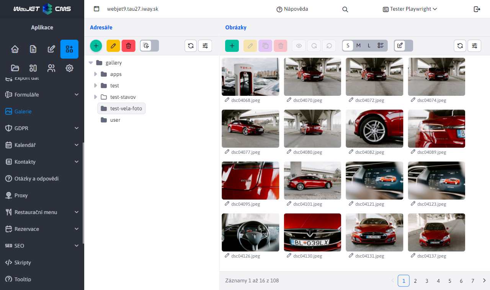
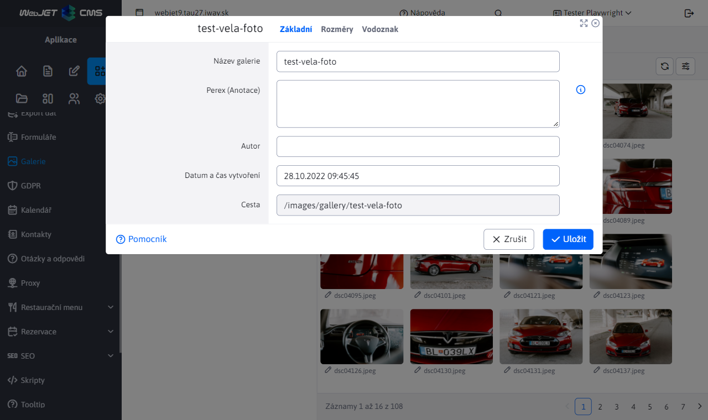
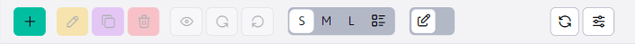
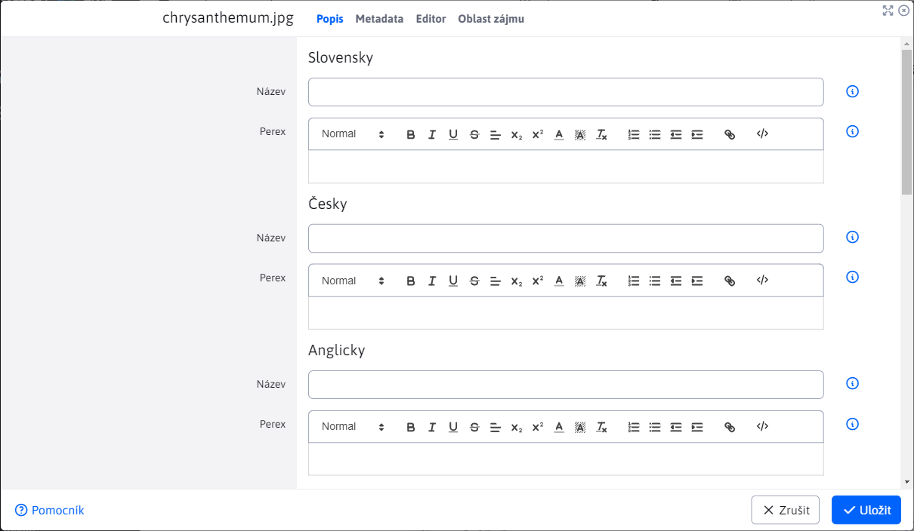
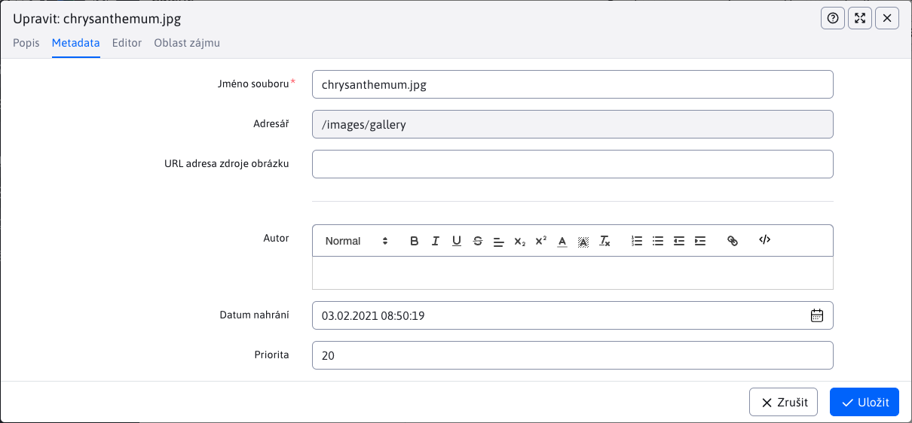
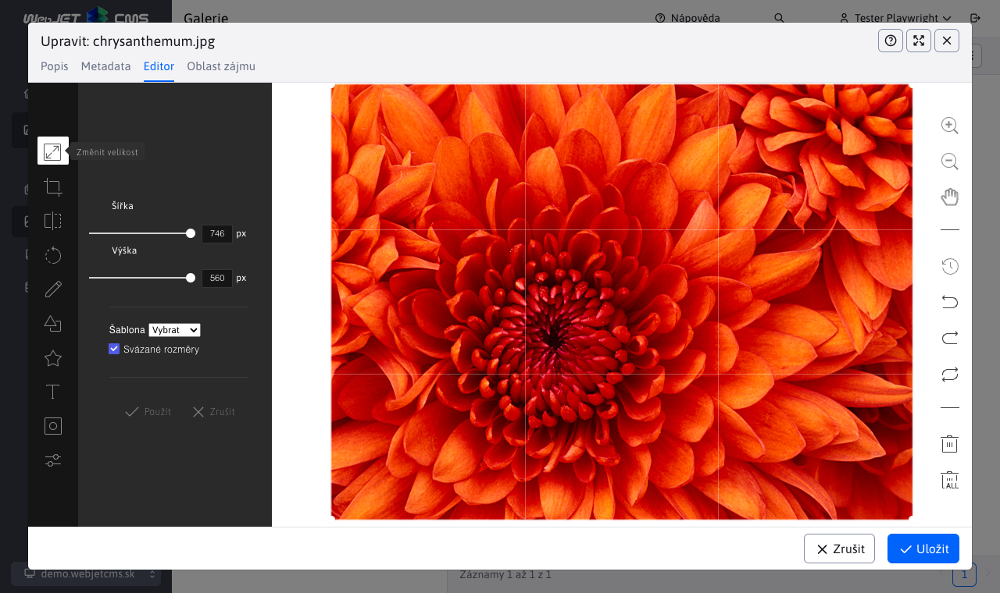
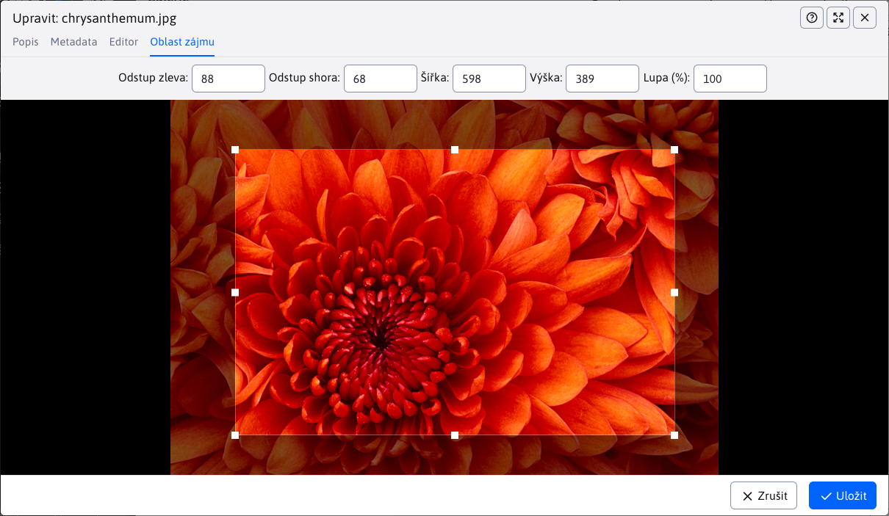
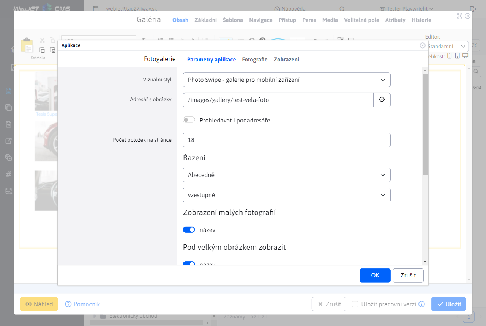
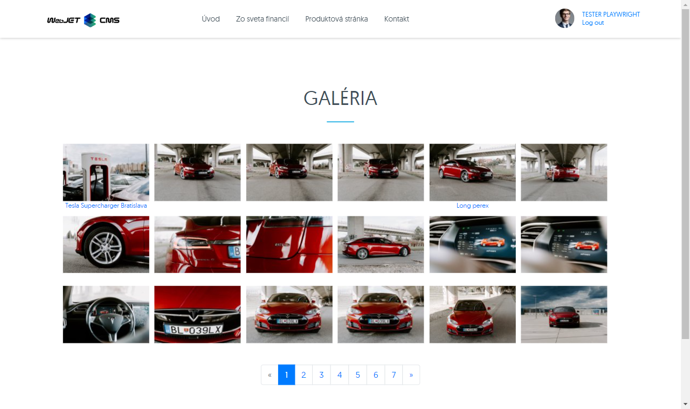

# Galerie

Aplikace galerie umožňuje jednoduchým způsobem vytvářet galerii fotografií. Obrázky z digitálního fotoaparátu stačí nahrát do galerie. WebJET fotografie automaticky zmenší na požadovaný formát. Podporovány jsou formáty `JPG`, `JPEG`, `GIF`, `PNG` a `WebP`. Z každé fotky se vytvářejí 3 kopie:

- Náhledový obrázek - fotka v malém rozlišení, cca 160x120 bodů, používá se v seznamu obrázků
- Obrázek v běžném rozlišení – fotka v rozlišení pro běžný monitor, tedy cca 600x400 bodů – tato fotka se zobrazí po kliknutí na náhledový obrázek
- Originál fotka – primárně slouží jako kopie nahrané fotky pro možnost přegenerování rozměrů menších obrázků. Dle nastavení galerie ale lze originál fotku stáhnout pro získání nejkvalitnější verze.

Rozměry náhledového obrázku a obrázku v běžném rozlišení lze nastavovat ve vlastnostech složky a případně kdykoli změnit (obrázky se automaticky vygenerují z originální fotky).

## Práce s aplikací galerie

Administrace galerie je podobně jako web stránky rozdělena na dva sloupce. V prvním je struktura složek a ve druhém se zobrazují samotné fotografie. Ikony pro přidání, editaci, mazání atd. se vztahují k příslušnému sloupci.



Ve stromové struktuře lze [vyhledávat](../../webpages/README.md#vyhledávání-ve-stromové-struktuře) podobně jako ve web stránkách. Vyhledávají se jen složky uložené v databázi, tedy ty s plnou ikonou<i class="ti ti-folder-filled" role="presentation"></i> .

### Správa struktury

Ve sloupci složky lze procházet a přidat/editovat/smazat složku stromové struktury galerie. Více se dočtete v části [Správa struktury](structure.md).



### Správa fotografií

Nové fotografie do galerie nahrajete kliknutím na ikonu Přidat ve sloupci Obrázky (více obrázků vyberete podržením klávesy CTRL) nebo přímo přetažením z vašeho počítače.

Nástrojová lišta obsahuje ikony `SML` pro nastavení velikosti zobrazených fotografií (jejich velikost se mění pouze pro zobrazení v administraci), případně poslední možnost zobrazí obrázky ve standardní tabulce, kde můžete např. využít funkci Editace buňky.



Klepnutím na fotografii ji označíte, následně můžete zvolit funkci kliknutím na nástrojovou lištu (upravit, smazat, zobrazit, otočit...). Pro rychlé zobrazení editoru můžete kliknout přímo na název souboru.

Editor obsahuje následující karty:

**Popis**

Krátký a dlouhý popis fotografie v různých jazykových mutacích.

Tyto popisy jsou důležité pro mezinárodní uživatele. Krátký popis poskytuje rychlý náhled na obsah fotografie, zatímco dlouhý popis poskytuje detailnější informace. Popisy se automaticky zobrazují podle zvoleného jazyka stránky.



**Metadata**

Obsahuje doplňkové údaje:

- **Jméno souboru**: Unikátní název souboru fotografie, který umožňuje její identifikaci v systému.
- **Složka**: Cesta nebo umístění v rámci úložiště, kde je fotografie uložena. Pomáhá organizovat a vyhledávat fotografie.
- **Autor**: Jméno nebo pseudonym osoby, která fotografii pořídila.
- **Datum nahrání**: Datum a čas, kdy byla fotografie nahrána do systému. Pomáhá sledovat chronologii a umožňuje vyhledávat fotografie podle času jejich nahrání.
- **Priorita**: Úroveň důležitosti nebo preference, která může být použita pro uspořádání fotografií v galerii. Nižší priorita znamená, že fotografie bude zobrazena na přednějších místech.
- **URL adresa zdroje obrázku**: URL adresa odkud jsme získali daný obrázek.



**Editor obrázků**

Obsahuje editor obrázků kde jednoduše můžete fotku otočit, oříznout, upravit velikost, doplnit text a použít různé efekty, více info [v části Editor obrázků](../../image-editor/README.md)



**Oblast zájmu**

Nastavuje [oblast zájmu](../../../frontend/thumb-servlet/interest-point.md) na fotografii pro zobrazení např. v seznamu novinek a podobně.

Používá se, pokud potřebujeme mít původní fotografii, ale z ní zobrazovat jen určitý výřez - neuděláme oříznutí fotografie, ale jen nastavíme oblast zájmu.



## Vložení aplikace do web stránky

Vkládání galerie do stránky je také velmi jednoduché. Vyberete si aplikaci galerie. V kartě "Parametry aplikace" stačí zadat adresář ve kterém se obrázky galerie nacházejí, možnost prohledávání podadresářů, počet obrázků na stránce atd.



Máte možnost vybrat vizuální styl galerie:

- `Photo Swipe` - ​​responzivní galerie s možností posouvání fotek prstem, kompatibilní s mobilními zařízeními.
- `PrettyPhoto` - ​​starší verze zobrazení, posouvání fotek je řešeno kliknutím na ikonu šipky vlevo/vpravo.

Karta "Fotografie" slouží pro vložení dalších fotek do galerie nebo vytvoření nové složky.

Ke každé fotografii je v administraci možné nastavit název a perex (dlouhý popis/anotace). Název může zobrazovat u obrázku v seznamu a perex při zobrazení velkého obrázku (po kliknutí na obrázek v seznamu).

Výsledná galerie na web stránce může vypadat následovně:



## Přesunutí obrázku

Změnou hodnoty **Složka** v kartě **Metadata** nastane změna uložení v rámci úložiště. Složku můžete změnit při editaci i při duplikování obrázku. Cílovou složku si můžete vybrat přes výběrové okno, nebo můžete zadat přímo cestu. Cesta musí **vždy** začínat na `/images/gallery`. Tato funkcionalita je užitečná při přesouvání, protože galerie nepodporuje akci `drag&drop`.

Pokud zadaná složka ještě neexistuje, automaticky se vytvoří. Podle nejbližší rodičovské složky se nastaví vlastnosti vytvořené složky. Funguje to také pro několik úrovní současně, takže se může automaticky vytvořit celý strom vnoření.

## Možné konfigurační proměnné

- `imageMagickDir` - ​​Je-li nastaveno použije se pro změnu velikosti obrázků `ImageMagick`. Systém nejprve hledá příkaz `magick` (verze 7), pokud neexistuje, použije se `convert` (verze 6) (výchozí hodnota: `/usr/bin`).
- `galleryWatermarkSaturation` - ​​Nastavuje transparentnost vodoznaku ve výsledném obrázku. Číslo 0-100, 0 znamená úplnou průsvitnost, 100 neprůsvitnost. (výchozí hodnota: 70).
- `galleryWatermarkGravity` - ​​Pozice vodoznaku ve výsledném obrázku. Možnosti podle světových stran v angličtině: `NorthWest, North, NorthEast, West, Center, East, SouthWest, South, SouthEast` (výchozí hodnota: `Center`).
- `galleryEnableWatermarking` - ​​Vypne / zapne vodoznak pro obrázky. Vodoznak může výrazně zpomalovat velké importy obrázků kvůli rekurzivnímu hledání nastavení vodoznaku. (výchozí hodnota: `true`).
- `galleryEnableExifDate` - ​​Při nahrání fotky se získá jako její datum datum vytvoření z `exif` informace, pro vypnutí je třeba nastavit tuto proměnnou na false (výchozí hodnota: `true`).
- `galleryStripExif` - ​​Pokud je nastaveno na `true` tak se z fotky odstraňují `exif` informace, primárně se jedná o její otočení pro korektní zobrazení zmenšení (výchozí hodnota: `true`).
- `galleryImageQuality` - ​​Parametr kvality obrázků pro konverzi přes `ImageMagick`, zapisuje se ve formátu `šírka_px:kvalita;šírka_px:kvalita`, tedy např. `0:30;100:50;400:70`, použije se nejlepší nebo koncový interval (výchozí hodnota:).
- `galleryVideoMode` - ​​Nastavení režimu konverze videa pro foto galerii, možné hodnoty: `all`=vygeneruje se malé i velké video, `big`=vygeneruje se jen velké video, `small`=vygeneruje se jen malé video (výchozí hodnota: `big`).
- `thumbServletCacheDir` - ​​Cesta k adresáři pro cache `/thumb` obrázků, pro server s vysokým množstvím obrázků doporučujeme přesunout na jiné místo než /WEB-INF/ kvůli rychlosti startu aplikačního serveru (výchozí hodnota: `/WEB-INF/imgcache/`).
- `defaultVideoWidth` - ​​Přednastavená šířka videa (výchozí hodnota: `854`).
- `defaultVideoHeight` - ​​Přednastavená výška videa (výchozí hodnota: `480`).
- `defaultVideoBitrate` - ​​Přednastavený `bitrate` videa (výchozí hodnota: `2048`).
- `galleryConvertCmykToRgb` - ​​Pokud je nastaveno na `true` tak se zjišťuje, zda je fotka v `CMYK` a pokud ano, konvertuje se do RGB (výchozí hodnota: `false`).
- `galleryConvertCmykToRgbInputProfilePath` - ​​Cesta (RealPath) ke vstupnímu `ICC` profilu na disku (výchozí hodnota:).
- `galleryConvertCmykToRgbOutputProfilePath` - ​​Cesta (RealPath) k výstupnímu `ICC` profilu na disku (výchozí hodnota:).
- `galleryUseFastLoading` - ​​Je-li nastaveno na `true` použije se pro výpis galerie zjednodušený test souborů, zrychluje zobrazení na síťových file systémech (výchozí hodnota: `false`).
- `galleryCacheResultMinutes` - ​​Počet minut během kterých se cachuje seznam obrázků v galerii, změna se detekuje podle změny data adresáře (dostupné pouze na OS Linux) (výchozí hodnota: 0).
- `imageAlwaysCreateGalleryBean` - ​​Pokud je zapnuto na `true` bude se záznam v `gallery` DB tabulce vytvářet i pro obrázky mimo foto galerie (výchozí hodnota: false).
- `galleryUploadDirVirtualPath` - ​​pokud je nastaveno na `true` použije se URL adresa web stránky jako adresář pro upload souborů (normálně se používá pouze struktura adresářů bez názvu web stránky) (výchozí hodnota: false).
- `wjImageViewer` - ​​Konfigurace typu zobrazení náhledu obrázku vloženého do stránky, může být `wjimageviewer` nebo `photoswipe` (výchozí hodnota: photoswipe).
- `galleryWatermarkApplyOnUpload` - ​​Slouží k automatickému aplikování vodoznaku při nahrání obrázků do galerie (výchozí hodnota: false).
- `galleryWatermarkApplyOnUploadDir` - ​​Adresář kde jsou umístěny obrázky pro automatický vodotisk při nahrání. Název obrázku musí být `default.png`, u multidomain je možnost mít pro každou doménu jiný, v obličeji `doména.png` (např. `www.interway.sk.png`) (výchozí hodnota: `/templates/{INSTALL_NAME}/assets/watermark/`).
- `galleryWatermarkApplyOnUploadExceptions` - ​​Seznam názvů cest pro které se nebude aplikovat vodoznak při nahrání souboru do WebJETu (výchozí hodnota: `logo,nowatermark,system,funkcionari`).
- `galleryWatermarkSvgSizePercent` - ​​Výše ​​v procentech kterou bude zabírat SVG vodoznak z výšky obrázku (výchozí hodnota: 5).
- `galleryWatermarkSvgMinHeight` - ​​Minimální výška SVG vodoznaku v bodech (výchozí hodnota: 30).

### Vlastní parametry ImageMagick

Při operacích s obrázky přes `ImageMagick` (změna velikosti, oříznutí, otočení) lze nastavit vlastní parametry pomocí konfiguračních proměnných. Parametry se zapisují ve formátu příkazové řádky. `-strip -interlace Plane -quality 85`.

Hodnota konfigurační proměnné může obsahovat **dva řádky** oddělené novým řádkem:

- **Řádek 1** - parametry vložené **před operaci** (za vstupní soubor). `-filter Lanczos`
- **Řádek 2** - parametry vložené **za operaci** (před výstupní soubor). `-define png:compression-level=9`

Je-li zadán pouze jeden řádek (bez nového řádku), všechny parametry se vloží před operaci.

Příklad výsledného příkazu u dvou řádků:

```sh
magick vstup.png -filter Lanczos -strip -resize 640x427! -interlace Plane -sampling-factor 4:2:0 vystup.png
            ↑ riadok 1 (pred operáciou)                   ↑ riadok 2 (za operáciou)
```

- `imageMagickCustomParams` - ​​Základní vlastní parametry pro všechny `ImageMagick` operace. Použijí se pokud není nastaven specifičtější parametr pro danou operaci nebo formát (výchozí hodnota: `-filter Lanczos` řádek 1, `-interlace Plane -sampling-factor 4:2:0 -unsharp 2x0.5+0.5+0` řádek 2).
- `imageMagickCustomParams_resize` - ​​Vlastní parametry pro operaci změny velikosti (výchozí hodnota: ).
- `imageMagickCustomParams_crop` - ​​Vlastní parametry pro operaci oříznutí (výchozí hodnota: ).
- `imageMagickCustomParams_rotate` - ​​Vlastní parametry pro operaci otočení (výchozí hodnota: ).
- `imageMagickCustomParams_jpg` - ​​Vlastní parametry pro formát `JPG` (výchozí hodnota: `-define jpeg:optimize-coding=true` na řádku 2).
- `imageMagickCustomParams_png` - ​​Vlastní parametry pro formát `PNG` (výchozí hodnota: `-define png:compression-level=9 -define png:compression-strategy=1` na řádku 2).
- `imageMagickCustomParams_webp` - ​​Vlastní parametry pro formát WebP (výchozí hodnota: `-quality 80 -define webp:method=6 -define webp:auto-filter=true -define webp:sns-strength=50` na řádku 2).

**Pořadí vyhledávání parametrů:**

Systém hledá nastavení v následujícím pořadí podle specifičnosti (na příkladu operace `resize` pro formát `jpg`):

1. `imageMagickCustomParams_resize_jpg` - ​​nejspecifičtěji, pro konkrétní operaci a formát
2. Pokud není nastavena, hledá se `imageMagickCustomParams_resize` (parametry pro operaci) + `imageMagickCustomParams_jpg` (parametry pro formát) - tyto se **kombinují** (spojí) řádek po řádku
3. Pokud není nastavena ani pro operaci, použije se `imageMagickCustomParams` (základní parametry) + `imageMagickCustomParams_jpg` (parametry pro formát)

Při kombinování parametrů se řádky kombinují samostatně - řádek 1 základních parametrů se spojí s řádkem 1 formátových parametrů a rovněž řádek 2.

Pokud vlastní parametry obsahují nastavení `compression-level` nebo `quality`, automaticky se odstraní případný existující parametr `-quality` z příkazu, aby nedošlo ke konfliktu.

Pokud potřebujete mít hodnotu na prvním řádku prázdnou zadejte výraz `---`, ten je zpracován jako prázdná hodnota (nelze zadat prázdnou hodnotu na prvním řádku, protože při uložení a čtení hodnot z databáze se na začátku a konci odříznou bílé znaky).

### Zmenšení rozměrů originál obrázku

Pokud vám originál obrázek zabírá na disku hodně místa, je možné nastavit jeho zmenšení při nahrání pomocí konfiguračních proměnných:

- `metadataRemoverCommand` - ​​pokud je nastaveno aktivuje se odstraňování metadat z nahraných souborů, nebo se použije `imageMagick` ke zmenšení velikosti - nastavte na `/usr/bin/convert`.
- `metadataRemoverParams` - ​​parametry, pro zmenšení obrázku přes `imageMagick` nastavte na `{filePath} -resize 1920x1080 {filePath}`. Rozměr nastavte podle potřeby.
- `metadataRemoverExtensions` - ​​přípony, pro které se použije, pro obrázky nastavte na `jpg,jpeg,png,gif`.
- `metadataRemoveMinFileSize` - ​​minimální velikost souboru v bajtech, pod kterou se odstraňování metadat přeskočí. Pokud je hodnota `0` nebo není nastavena, kontrola se neprovede a metadata se odstraňují vždy.

Vyžadován je nástroj `ImageMagick` na serveru.