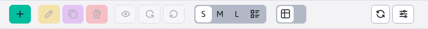
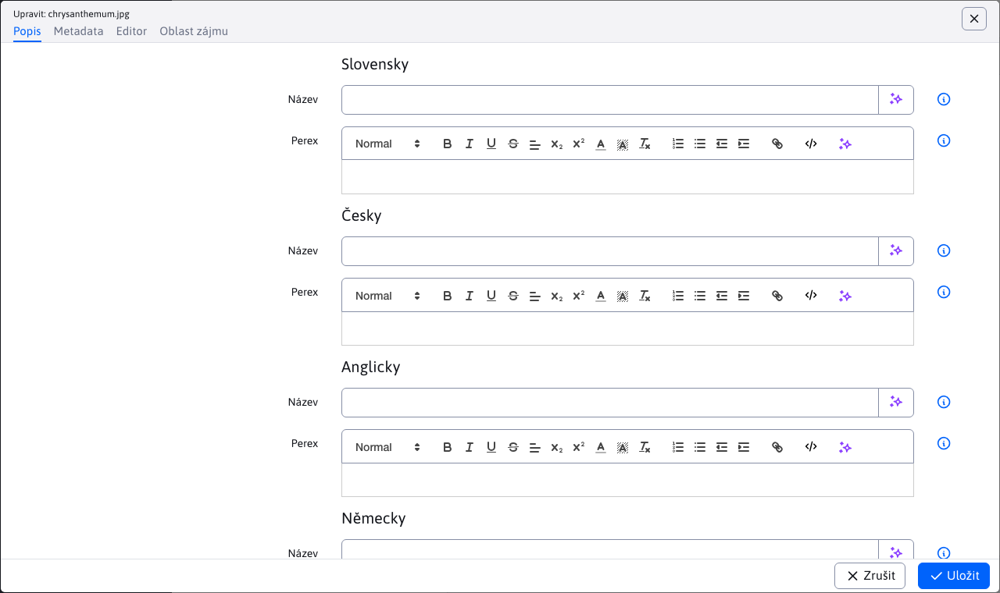
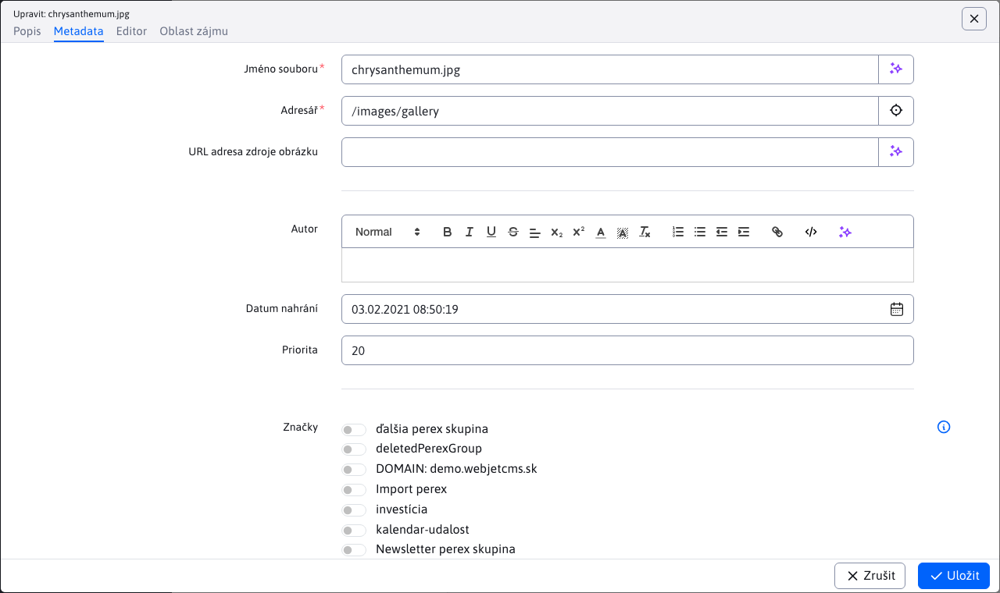

# Galerie

Aplikace galerie umožňuje jednoduchým způsobem vytvářet galerii fotografií. Obrázky z digitálního fotoaparátu stačí nahrát do galerie. WebJET fotografie automaticky zmenší na požadovaný formát. Z každé fotky se vytvářejí 3 kopie:
- Náhledový obrázek - fotka v malém rozlišení, cca 160x120 bodů, používá se v seznamu obrázků
- Obrázek v běžném rozlišení - fotka v rozlišení pro běžný monitor, tedy cca 600x400 bodů - tato fotka se zobrazí po kliknutí na náhledový obrázek
- Originál fotka – primárně slouží jako kopie nahrané fotky pro možnost přegenerování rozměrů menších obrázků. Dle nastavení galerie ale lze originál fotku stáhnout pro získání nejkvalitnější verze.

Rozměry náhledového obrázku a obrázku v běžném rozlišení lze nastavovat ve vlastnostech složky a případně kdykoli změnit (obrázky se automaticky vygenerují z originální fotky).

## Práce s aplikací galerie

Administrace galerie je podobně jako web stránky rozdělena na dva sloupce. V prvním je struktura složek a ve druhém se zobrazují samotné fotografie. Ikony pro přidání, editaci, mazání atd. se vztahují k příslušnému sloupci.

Ve stromové struktuře je možné [vyhledávat](../../webpages/README.md#vyhledávání-ve-stromové-struktuře) podobně jako ve web stránkách. Vyhledávají se jen složky uložené v databázi, tedy ty s plnou ikonou <i class="ti ti-folder-filled" role="presentation" ></i>.

### Správa struktury

Ve sloupci složky lze procházet a přidat/editovat/smazat složku stromové struktury galerie.

Kromě jiných obsahuje nastavení složky tato pole:
- Název galerie - název galerie, při vytváření se podle tohoto názvu vytvoří složku. Pro již vytvořenou galerii pokud název změníte soubory zůstanou v původní složce, tento název je pouze "virtuální".
- Způsob změny velikosti
  - Zobrazení na míru - velikost obrázku je nastavena tak, aby rozměr nepřekračoval nastavenou velikost
  - Oříznout na míru - obrázek je oříznut tak, aby vyplňoval zadané rozměry, přičemž pokud se neshoduje poměr stran je oříznut.
  - Přesný rozměr - velikost obrázku je nastavena přesně podle složky, přičemž pokud je poměr stran rozdílný dojde k deformaci obrázku.
  - Přesná šířka - velikost obrázku použije zadanou šířku a výšku vypočítá podle poměru stran. Výška ale může být větší než zadaný rozměr.
  - Přesná výška - velikost obrázku použije zadanou výšku a šířku vypočítá podle poměru stran. Šířka ale může být větší než zadaný rozměr.
  - Negenerovat zmenšeniny - galerie použije jen originální obrázek a nebude generovat náhledové obrázky. Náhledové obrázky je následně možné generovat dle potřeby s využitím `/thumb` prefixu.

V kartě vodoznak je možné nastavit vkládání značky/loga do obrázku ve formě vodoznaku. Je možné použít i vektorový SVG obrázek, jehož rozměr se přizpůsobuje rozměru generovaného obrázku podle nastavení v konf. proměnné `galleryWatermarkSvgSizePercent` a `galleryWatermarkSvgMinHeight`.

Ve stromové struktuře se zobrazí složky:
- z `/images/gallery`.
- z `/images/{PRIECINOK}/gallery` přičemž `{PRIECINOK}` je libovolná složka. Pokud z nějakého důvodu potřebujete oddělit galerii pro nějaký projekt/mikro-stránku.
- z databázové tabulce `gallery_dimension` existuje záznam s nastavením rozměrů galerie pro cestu ve sloupci `image_path` (která ale začíná na /images).

Při používání doménových aliasů (nastavená konf. proměnná `multiDomainAlias:www.domena.com=ALIAS`) se ve výchozím nastavení zobrazí/otevře složka `/images/ALIAS/gallery`. Kvůli zpětné kompatibilitě se zobrazí i jiné složky galerie (např. `/images/gallery`), nezobrazí se ale takové, které jménem složky obsahují doménový alias jiné domény.

Složky mají následující ikony:
- <i class="ti ti-folder-filled" role="presentation" ></i> plná ikonka složky = standardní složka, má nastavené rozměry galerie
- <i class="ti ti-folder" role="presentation" ></i> prázdná ikonka složky = složka nemá nastavené rozměry galerie, typicky se jedná o `{PRIECINOK}`, viz výše.

### Správa fotografií

Nové fotografie do galerie nahrajete kliknutím na ikonu Přidat ve sloupci Obrázky (více obrázků vyberete podržením klávesy CTRL) nebo přímo přetažením z vašeho počítače.

Nástrojová lišta obsahuje ikony `SML` pro nastavení velikosti zobrazených fotografií (jejich velikost se mění jen pro zobrazení v administraci), případně poslední možnost zobrazí obrázky ve standardní tabulce, kde můžete např. využít funkci Editace buňky.

Klepnutím na fotografii ji označíte, následně můžete zvolit funkci kliknutím na nástrojovou lištu (upravit, smazat, zobrazit, otočit...). Pro rychlé zobrazení editoru můžete kliknout přímo na název souboru.

Editor obsahuje následující karty:

**Popis**

Krátký a dlouhý popis fotografie v různých jazycích.

Tyto popisy jsou důležité pro mezinárodní uživatele. Krátký popis poskytuje rychlý náhled na obsah fotografie, zatímco dlouhý popis poskytuje detailnější informace. Popisy se automaticky zobrazují podle zvoleného jazyka stránky.

**Metadata**

Obsahuje doplňkové údaje:
- **Jméno souboru**: Unikátní název souboru fotografie, který umožňuje její identifikaci v systému.
- **Složka**: Cesta nebo umístění v rámci úložiště, kde je fotografie uložena. Pomáhá organizovat a vyhledávat fotografie.
- **Autor**: Jméno nebo pseudonym osoby, která fotografii pořídila.
- **Datum nahrání**: Datum a čas, kdy byla fotografie nahrána do systému. Pomáhá sledovat chronologii a umožňuje vyhledávat fotografie podle času jejich nahrání.
- **Priorita**: Úroveň důležitosti nebo preference, která může být použita pro uspořádání fotografií v galerii. Nižší priorita znamená, že fotografie bude zobrazena na přednějších místech.
- **URL adresa zdroje obrázku**: URL adresa odkud jsme získali daný obrázek.

**Editor obrázků**

Obsahuje editor obrázků, kde jednoduše můžete fotku otočit, oříznout, upravit velikost, doplnit text a použít různé efekty, více info [v části Editor obrázků](../../image-editor/README.md)

**Oblast zájmu**

Nastavuje [oblast zájmu](../../../frontend/thumb-servlet/interest-point.md) na fotografii pro zobrazení např. v seznamu novinek a podobně.

Používá se, pokud potřebujeme mít původní fotografii, ale z ní zobrazovat jen určitý výřez - neuděláme oříznutí fotografie, ale jen nastavíme oblast zájmu.

## Vložení aplikace do web stránky

Vkládání galerie do stránky je také velmi jednoduché. Vyberete si aplikaci galerie. V kartě "Parametry aplikace" stačí zadat adresář ve kterém se obrázky galerie nacházejí, možnost prohledávání podadresářů, počet obrázků na stránce atd.

Máte možnost vybrat vizuální styl galerie:
- `Photo Swipe` - responzivní galerie s možností posouvání fotek prstem, kompatibilní s mobilními zařízeními.
- `PrettyPhoto` - starší verze zobrazení, posouvání fotek je řešeno kliknutím na ikonu šipky vlevo/vpravo.

Karta "Fotografie" slouží pro vložení dalších fotek do galerie nebo vytvoření nové složky.

Ke každé fotografii je v administraci možné nastavit název a perex (dlouhý popis/anotace). Název může zobrazovat u obrázku v seznamu a perex při zobrazení velkého obrázku (po kliknutí na obrázek v seznamu).

Výsledná galerie na web stránce může vypadat následovně:

## Možné konfigurační proměnné

- `imageMagickDir` - Je-li nastaveno použije se pro změnu velikosti obrázků příkaz `convert` z balíku `ImageMagick` (výchozí hodnota: `/usr/bin`).
- `galleryAlwaysUseImageMagick` - pokud je nastaveno na `true`, tak změna velikosti obrázků rozměru \< 500 bodů se také bude provádět voláním externího programu `ImageMagick` (výchozí hodnota: `true`).
- `galleryWatermarkSaturation` - Nastavuje transparentnost vodotisku ve výsledném obrázku. Číslo 0-100, 0 znamená úplnou průsvitnost, 100 neprůsvitnost. (výchozí hodnota: 70).
- `galleryWatermarkGravity` - Pozice vodotisku ve výsledném obrázku. Možnosti podle světových stran v angličtině: `NorthWest, North, NorthEast, West, Center, East, SouthWest, South, SouthEast` (výchozí hodnota: `Center`).
- `galleryEnableWatermarking` - Vypne / zapne vodotisk pro obrázky. Vodoznak může výrazně zpomalovat velké importy obrázků kvůli rekurzivnímu hledání nastavení vodoznaku. (výchozí hodnota: `true`).
- `galleryEnableExifDate` - Při nahrání fotky se získá jako její datum datum pořízení z `exif` informace, pro vypnutí je třeba nastavit tuto proměnnou na false (výchozí hodnota: `true`).
- `galleryStripExif` - Je-li nastaveno na `true` tak se z fotky odstraňují `exif` informace, primárně se jedná o její otočení pro korektní zobrazení zmenšenin (výchozí hodnota: `true`).
- `galleryImageQuality` - Parametr kvality obrázků pro konverzi přes `ImageMagick`, zapisuje se ve formátu `šírka_px:kvalita;šírka_px:kvalita`, tedy např. `0:30;100:50;400:70`, použije se nejlepší nebo koncový interval (výchozí hodnota:).
- `galleryVideoMode` - Nastavení režimu konverze videa pro foto galerii, možné hodnoty: `all`=vygeneruje se malé i velké video, `big`=vygeneruje se jen velké video, `small`=vygeneruje se jen malé video (výchozí hodnota: `big`).
- `thumbServletCacheDir` - Cesta k adresáři pro cache `/thumb` obrázků, pro server s vysokým množstvím obrázků doporučujeme přesunout na jiné místo než /WEB-INF/ kvůli rychlosti startu aplikačního serveru (výchozí hodnota: `/WEB-INF/imgcache/`).
- `defaultVideoWidth` - Přednastavená šířka videa (výchozí hodnota: `854`).
- `defaultVideoHeight` - Přednastavená výška videa (výchozí hodnota: `480`).
- `defaultVideoBitrate` - Přednastavený `bitrate` videa (výchozí hodnota: `2048`).
- `galleryConvertCmykToRgb` - Je-li nastaveno na `true` tak se zjišťuje, zda je fotka v `CMYK` a pokud ano, převede se na RGB (výchozí hodnota: `false`).
- `galleryConvertCmykToRgbInputProfilePath` - Cesta (RealPath) ke vstupnému `ICC` profilu na disku (výchozí hodnota:).
- `galleryConvertCmykToRgbOutputProfilePath` - Cesta (RealPath) k výstupnímu `ICC` profilu na disku (výchozí hodnota:).
- `galleryUseFastLoading` - Je-li nastaveno na `true` použije se pro výpis galerie zjednodušený test souborů, zrychluje zobrazení na síťových file systémech (výchozí hodnota: `false`).
- `galleryCacheResultMinutes` - Počet minut během kterých se cachuje seznam obrázků v galerii, změna se detekuje podle změny data adresáře (dostupné pouze na OS Linux) (výchozí hodnota: 0).
- `imageAlwaysCreateGalleryBean` - Je-li zapnuto na `true` bude se záznam v `gallery` DB tabulce vytvářet také pro obrázky mimo foto galerie (výchozí hodnota: false).
- `galleryUploadDirVirtualPath` - pokud je nastaveno na `true` použije se URL adresa web stránky jako adresář pro upload souborů (normálně se používá pouze struktura adresářů bez názvu web stránky) (výchozí hodnota: false).
- `wjImageViewer` - Konfigurace typu zobrazení náhledu obrázku vloženého do stránky, může být `wjimageviewer` nebo `photoswipe` (výchozí hodnota: photoswipe).
- `galleryWatermarkApplyOnUpload` - Slouží k automatickému aplikování vodoznaku při nahrání obrázků do galerie (výchozí hodnota: false).
- `galleryWatermarkApplyOnUploadDir` - Adresář kde jsou umístěny obrázky pro automatický vodotisk při nahrání. Název obrázku musí být `default.png`, u multidomain je možnost mít pro každou doménu jiný, v obličeji `doména.png` (Např. `www.interway.sk.png`) (výchozí hodnota: `/templates/{INSTALL_NAME}/assets/watermark/`).
- `galleryWatermarkApplyOnUploadExceptions` - Seznam názvů cest pro které se nebude aplikovat vodoznak při nahrání souboru do WebJETu (výchozí hodnota: `logo,nowatermark,system,funkcionari`).
- `galleryWatermarkSvgSizePercent` - Výše v procentech kterou bude zabírat SVG vodoznak z výšky obrázku (výchozí hodnota: 5).
- `galleryWatermarkSvgMinHeight` - Minimální výška SVG vodoznaku v bodech (výchozí hodnota: 30).
