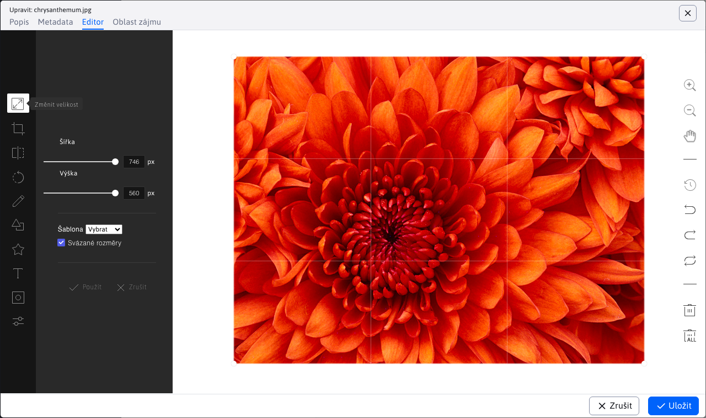
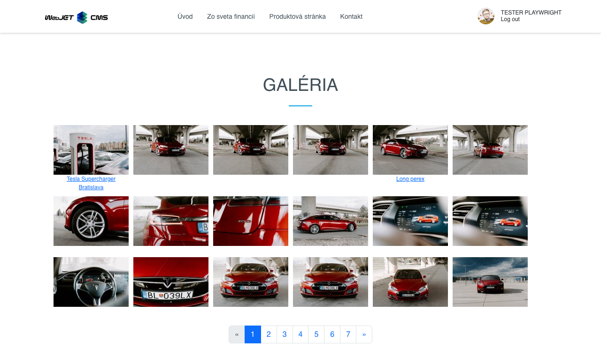

# Galerie

Aplikace galerie umožňuje snadné vytvoření galerie fotografií. Stačí do galerie nahrát obrázky z digitálního fotoaparátu. WebJET automaticky zmenší fotografie na požadovaný formát. Z každé fotografie se vytvoří 3 kopie:
- Náhledový obrázek - fotografie s malým rozlišením, přibližně 160x120 pixelů, používaná v seznamu obrázků.
- Obrázek v normálním rozlišení - fotografie v rozlišení pro běžný monitor, tj. cca 600x400 pixelů - tato fotografie se zobrazí po kliknutí na náhled obrázku.
- Původní fotografie - slouží především jako kopie nahrané fotografie pro možnost změny velikosti menších obrázků. V závislosti na nastavení galerie je však možné stáhnout originální fotografii a získat tak její nejkvalitnější verzi.

Rozměry miniatury a obrázku v normálním rozlišení lze nastavit ve vlastnostech složky a případně je kdykoli změnit (obrázky se automaticky generují z původní fotografie).

## Práce s aplikací galerie

Administrace galerie je rozdělena do dvou sloupců, stejně jako webové stránky. V prvním je struktura složek a ve druhém se zobrazují samotné fotografie. Ikony pro přidávání, úpravy, mazání atd. odkazují na příslušný sloupec.

Ve stromové struktuře je možné [Vyhledávání](../../webpages/README.md#vyhledávání-ve-stromové-struktuře) podobně jako na webových stránkách. Prohledávají se pouze složky uložené v databázi, tj. ty, které mají plnou ikonu. <i class="ti ti-folder-filled" role="presentation" ></i>.

### Správa struktury

Ve sloupci složek můžete procházet a přidávat/upravovat/mazat složky stromové struktury galerie.

Nastavení složky obsahuje mimo jiné tato pole:
- Název galerie - název galerie, při vytváření bude vytvořena složka s tímto názvem. U již vytvořené galerie, pokud změníte název, zůstanou soubory v původní složce, tento název je pouze "virtuální".
- Způsob změny velikosti
  - Přizpůsobené zobrazení - velikost obrázku je nastavena tak, aby rozměr nepřesáhl nastavenou velikost.
  - Oříznout na míru - obrázek je oříznut tak, aby vyplnil zadané rozměry, a pokud poměr stran neodpovídá, je oříznut.
  - Přesná velikost - velikost obrázku je nastavena přesně podle složky, pokud je poměr stran jiný, obrázek bude deformován.
  - Přesná šířka - velikost obrázku použije zadanou šířku a výšku vypočítá podle poměru stran. Výška však může být větší než zadaný rozměr.
  - Přesná výška - velikost obrázku použije zadanou výšku a šířku vypočítá podle poměru stran. Šířka však může být větší než zadaný rozměr.
  - Nevytvářet náhledy - galerie použije pouze původní obrázek a nevytvoří náhledy. Miniatury lze pak generovat podle potřeby pomocí příkazu `/thumb` předpona.

Na kartě Vodoznak můžete nastavit značku/logo, které se vloží do obrázku jako vodoznak. Je také možné použít vektorový obrázek SVG, jehož velikost se přizpůsobí velikosti generovaného obrázku podle nastavení v proměnné conf. `galleryWatermarkSvgSizePercent` a `galleryWatermarkSvgMinHeight`.

Složky se zobrazí ve stromové struktuře:
- z `/images/gallery`.
- z `/images/{PRIECINOK}/gallery` užívání `{PRIECINOK}` je jakákoli složka. Pokud z nějakého důvodu potřebujete oddělit galerii pro projekt/mikrostránku.
- z databázové tabulky `gallery_dimension` ve sloupci je položka s nastavením rozměru galerie pro cestu. `image_path` (ale to začíná na /images).

Při použití doménových aliasů (sada konf. proměnných `multiDomainAlias:www.domena.com=ALIAS`), složka se zobrazí/otevře ve výchozím nastavení. `/images/ALIAS/gallery`. Kvůli zpětné kompatibilitě mohou být ostatní složky galerie (např. `/images/gallery`), ale ty, které obsahují v názvu složky doménový alias jiné domény, se nezobrazí.

Složky mají následující ikony:
- <i class="ti ti-folder-filled" role="presentation" ></i> ikona plné složky = standardní složka, má nastavené rozměry galerie
- <i class="ti ti-folder" role="presentation" ></i> prázdná ikona složky = složka nemá nastavené rozměry galerie, obvykle je to `{PRIECINOK}`, viz výše.

### Správa fotografií

Nové fotografie do galerie nahrajete kliknutím na ikonu Přidat ve sloupci Obrázky (pro výběr více obrázků podržte klávesu CTRL) nebo je můžete přetáhnout přímo z počítače.

Panel nástrojů obsahuje ikony `SML` upravit velikost zobrazených fotografií (jejich velikost se mění pouze pro zobrazení v administraci), nebo poslední možnost zobrazí obrázky ve standardní tabulce, kde můžete použít funkci Upravit buňku.

Kliknutím na fotografii ji vyberete a poté můžete vybrat funkci kliknutím na panel nástrojů (upravit, odstranit, zobrazit, otočit...). Pro rychlé zobrazení editoru můžete kliknout přímo na název souboru.

Editor obsahuje následující karty:

**Popis**

Krátký a dlouhý popis fotografie v různých jazycích.

Tyto popisy jsou důležité pro mezinárodní uživatele. Krátký popis poskytuje rychlý náhled na obsah fotografie, zatímco dlouhý popis poskytuje podrobnější informace. Popisy se automaticky zobrazují podle zvoleného jazyka stránky.

**Metadata**

Obsahuje další údaje:
- **Název souboru**: Jedinečný název souboru fotografie, který umožňuje její identifikaci v systému.
- **Složka**: Cesta nebo umístění v úložišti, kde je fotografie uložena. Pomáhá při organizaci a vyhledávání fotografií.
- **Autor**: Jméno nebo pseudonym osoby, která fotografii pořídila.
- **Datum nahrání**: Datum a čas nahrání fotografie do systému. Pomáhá sledovat chronologii a umožňuje vyhledávat fotografie podle času jejich nahrání.
- **Priorita**: Stupeň důležitosti nebo preference, který lze použít k uspořádání fotografií v galerii. Nižší priorita znamená, že fotografie bude zobrazena na výraznějším místě.
- **Adresa URL zdroje obrázku**: URL, odkud jsme obrázek získali.

**Editor obrázků**

Obsahuje editor obrázků, ve kterém můžete snadno otáčet, ořezávat, měnit velikost, přidávat text a používat různé efekty, více informací [v editoru obrázků](../../image-editor/README.md)

**Oblast zájmu**

Sady [oblast zájmu](../../../frontend/thumb-servlet/interest-point.md) na fotografii pro zobrazení např. v seznamu novinek apod.

Používá se v případech, kdy potřebujeme mít k dispozici původní fotografii, ale zobrazit z ní pouze určitý výřez - fotografii neořezáváme, pouze nastavíme oblast zájmu.

## Vložení aplikace do webové stránky

Vložení galerie do stránky je také velmi snadné. Vyberete aplikaci galerie. Na kartě "Parametry aplikace" stačí zadat adresář, ve kterém jsou obrázky galerie umístěny, možnost procházení podadresářů, počet obrázků na stránce atd.

Máte možnost zvolit si vizuální styl galerie:
- `Photo Swipe` - Responzivní galerie s možností posouvání fotografií prstem, kompatibilní s mobilními zařízeními.
- `PrettyPhoto` - starší verze zobrazení, posouvání fotografií je řešeno kliknutím na ikonu šipky vlevo/vpravo.

Karta "Fotografie" slouží k přidání dalších fotografií do galerie nebo k vytvoření nové složky.

Pro každou fotografii můžete v administraci nastavit název a perex (dlouhý popis/anotaci). Název se může zobrazit, když je obrázek v seznamu, a perex při zobrazení velkého obrázku (po kliknutí na obrázek v seznamu).

Výsledná galerie na webové stránce může vypadat takto:

## Možné konfigurační proměnné

- `imageMagickDir` - Pokud je nastaven, příkaz se použije ke změně velikosti obrázků. `convert` z balíčku `ImageMagick` (výchozí hodnota: `/usr/bin`).
- `galleryAlwaysUseImageMagick` - pokud je nastavena na `true`, změna velikosti obrázků < 500 pixelů se rovněž provede voláním externího programu. `ImageMagick` (výchozí hodnota: `true`).
- `galleryWatermarkSaturation` - Upravuje průhlednost vodoznaku ve výsledném obrázku. Číslo 0-100, 0 znamená plnou průhlednost, 100 znamená neprůhlednost. (výchozí hodnota: 70).
- `galleryWatermarkGravity` - Poloha vodoznaku ve výsledném obrázku. Možnosti podle světových stran v angličtině: `NorthWest, North, NorthEast, West, Center, East, SouthWest, South, SouthEast` (výchozí hodnota: `Center`).
- `galleryEnableWatermarking` - Vypnutí/zapnutí vodoznaku pro obrázky. Vodoznak může výrazně zpomalit import velkých obrázků kvůli rekurzivnímu vyhledávání nastavení vodoznaku. (Výchozí nastavení: `true`).
- `galleryEnableExifDate` - Při nahrávání fotografie je datum jejího vytvoření získáno jako datum z. `exif` pro vypnutí je třeba nastavit tuto proměnnou na hodnotu false (výchozí hodnota: `true`).
- `galleryStripExif` - Pokud je nastavena na `true` aby byly z fotografie odstraněny. `exif` informace, jde především o jeho natočení pro správné zobrazení stupnic (výchozí hodnota: `true`).
- `galleryImageQuality` - Parametr kvality obrazu pro převod prostřednictvím `ImageMagick`, se zapisuje ve formátu `šírka_px:kvalita;šírka_px:kvalita`, např. `0:30;100:50;400:70`, použije se nejlepší nebo koncový interval (výchozí hodnota:).
- `galleryVideoMode` - Nastavení režimu převodu videa pro fotogalerii, možné hodnoty: `all`=budou generována malá i velká videa, `big`=vygeneruje se pouze velké video, `small`=generuje se pouze malé video (výchozí hodnota: `big`).
- `thumbServletCacheDir` - Cesta k adresáři mezipaměti `/thumb` obrazů, u serveru s velkým počtem obrazů doporučujeme z důvodu rychlosti spouštění aplikačního serveru přesunout do jiného umístění než /WEB-INF/ (výchozí: `/WEB-INF/imgcache/`).
- `defaultVideoWidth` - Přednastavená šířka videa (výchozí hodnota: `854`).
- `defaultVideoHeight` - Přednastavená výška videa (výchozí hodnota: `480`).
- `defaultVideoBitrate` - Přednastavení `bitrate` video (výchozí hodnota: `2048`).
- `galleryConvertCmykToRgb` - Pokud je nastavena na `true` aby zjistil, zda je fotografie v `CMYK` a pokud ano, převede se na RGB (výchozí hodnota: `false`).
- `galleryConvertCmykToRgbInputProfilePath` - Cesta (RealPath) ke vstupnímu poplatku `ICC` profil na disku (výchozí hodnota:).
- `galleryConvertCmykToRgbOutputProfilePath` - Cesta (RealPath) k výstupu `ICC` profil na disku (výchozí hodnota:).
- `galleryUseFastLoading` - Pokud je nastavena na `true` se použije pro zjednodušený test výpisu souborů v galerii, urychlí zobrazení na síťových souborových systémech (výchozí hodnota: `false`).
- `galleryCacheResultMinutes` - Počet minut, po které je seznam obrázků v galerii ukládán do mezipaměti, změna je detekována změnou data adresáře (dostupné pouze v OS Linux) (výchozí hodnota: 0).
- `imageAlwaysCreateGalleryBean` - Pokud je zapnutý `true` bude záznamem v `gallery` DB tabulka, která se má vytvořit i pro obrázky mimo fotogalerii (výchozí hodnota: false).
- `galleryUploadDirVirtualPath` - pokud je nastavena na `true` adresa URL webové stránky se použije jako adresář pro nahrávání souborů (obvykle se používá pouze adresářová struktura bez názvu webové stránky) (výchozí hodnota: false).
- `wjImageViewer` - Chcete-li nakonfigurovat typ zobrazení náhledu obrázku vloženého do stránky, můžete. `wjimageviewer` nebo `photoswipe` (výchozí: photoswipe).
- `galleryWatermarkApplyOnUpload` - Slouží k automatickému použití vodoznaků při nahrávání obrázků do galerie (výchozí: false).
- `galleryWatermarkApplyOnUploadDir` - Adresář, do kterého se při nahrávání umisťují obrázky pro automatické označení vodoznakem. Název obrázku musí být `default.png`, s multidoménou je možnost mít pro každou doménu jinou, v tváří v tvář. `doména.png` (např. `www.interway.sk.png`) (výchozí hodnota: `/templates/{INSTALL_NAME}/assets/watermark/`).
- `galleryWatermarkApplyOnUploadExceptions` - Seznam názvů cest, pro které se vodoznak při nahrávání souboru do WebJETu nepoužije (výchozí hodnota: `logo,nowatermark,system,funkcionari`).
- `galleryWatermarkSvgSizePercent` - Výška v procentech, kterou bude vodoznak SVG zabírat z výšky obrázku (výchozí hodnota: 5).
- `galleryWatermarkSvgMinHeight` - Minimální výška vodoznaku SVG v pixelech (výchozí: 30).
