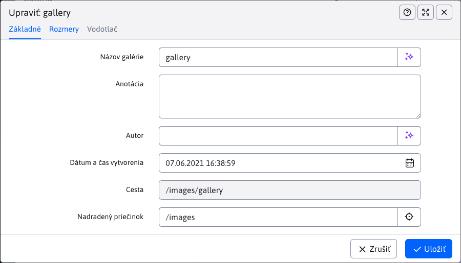
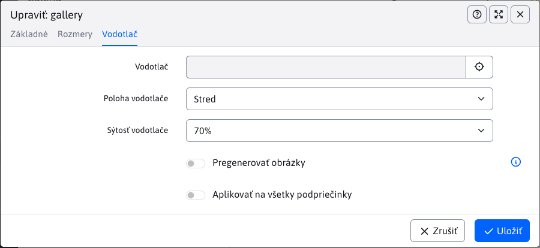

# Správa struktury

V této sekci můžete spravovat strukturu galerie. Můžete vytvářet nové složky, přesouvat, mazat a upravovat existující složky nebo je filtrovat podle názvu.

Ve stromové struktuře se zobrazí složky:

- z `/images/gallery`.
- z `/images/{PRIECINOK}/gallery` přičemž `{PRIECINOK}` je libovolná složka. Pokud z nějakého důvodu potřebujete oddělit galerii pro nějaký projekt/mikro-stránku.
- z databázové tabulky `gallery_dimension` existuje záznam s nastavením rozměrů galerie pro cestu ve sloupci `image_path` (která ale začíná na /images).

Při použití doménových aliasů (nastavená konf. proměnná `multiDomainAlias:www.domena.com=ALIAS`) se ve výchozím nastavení zobrazí/otevře složka `/images/ALIAS/gallery`. Kvůli zpětné kompatibilitě se zobrazí i jiné složky galerie (např. `/images/gallery`), nezobrazí se ale takové, které ve jménu složky obsahují doménový alias jiné domény.

Složky mají následující ikony:

-<i class="ti ti-folder-filled" role="presentation"></i> plná ikonka složky = standardní složka, má nastavené rozměry galerie
-<i class="ti ti-folder" role="presentation"></i> prázdná ikonka složky = složka nemá nastavené rozměry galerie, typicky se jedná o `{PRIECINOK}`, viz výše.

## Karta Základní

Na této kartě můžete upravovat základní informace o složce a to:

- **Název galerie** - název galerie, při vytváření se podle tohoto názvu vytvoří složku. Pro již vytvořenou galerii pokud název změníte soubory zůstanou v původní složce, tento název je pouze "virtuální".
- **Anotace** - krátký sumář/popis galerie
- **Autor**
- **Datum a čas vytvoření** - datum a čas vytvoření galerie, přednastavené je aktuální datum a čas, ale můžete jej změnit
- **Nadřazená složka** - nastavení nadřazené složky (nejvyšší je složka `/images/gallery`, případně `/images/{PRIECINOK}/gallery`)
- **Cesta** - hodnota reprezentuje cestu ke galerii jako kombinaci nadřazených složek a názvu galerie, například `/images/gallery/novy_priecinok`. Tato hodnota se automaticky aktualizuje při změně nadřazené složky. Nelze změnit ručně.
- **Aktualizovat cestu ke galerii ve webových stránkách** - speciální možnost, která se objeví **IBA** v případě úpravy již existující složky, když byla změněna hodnota pole **Nadřazená složka**.

## Karta Rozměry

Karta nabízí možnosti, které se aplikují na obrázky galerie:

- **Způsob změny velikosti**
  - **Zobrazení na míru** - velikost obrázku je nastavena tak, aby rozměr nepřekračoval nastavenou velikost
  - **Oříznout na míru** - obrázek je oříznut tak, aby vyplňoval zadané rozměry, přičemž pokud se neshoduje poměr stran je oříznut.
  - **Přesný rozměr** - velikost obrázku je nastavena přesně podle složky, přičemž pokud je poměr stran rozdílný dojde k deformaci obrázku.
  - **Přesná šířka** - velikost obrázku použije zadanou šířku a výšku vypočítá podle poměru stran. Výška ale může být větší než zadaný rozměr.
  - **Přesná výška** - velikost obrázku použije zadanou výšku a šířku vypočítá podle poměru stran. Šířka ale může být větší než zadaný rozměr.
  - **Negenerovat zmenšeniny** - galerie použije jen originální obrázek a nebude generovat náhledové obrázky. Náhledové obrázky je následně možné generovat podle potřeby s využitím `/thumb` prefixu.
- **Přegenerovat obrázky** - pokud je možnost zvolena, nově vygeneruje velikosti všech obrázků v galerii podle aktuálních nastavení
- **Aplikovat na všechny podsložky** - pokud je možnost zvolena, nastavení se použije i na všechny podřazené složky
- **Velikost malého obrázku** - šířka a výška obrázku
- **Maximální velikost velkého obrázku (pokud nezadáte, ponechá se originál)** - šířka a výška obrázku

## Karta Vodotisk

V kartě vodoznak je možné nastavit vkládání značky/loga do obrázku ve formě vodoznaku. Je možné použít i vektorový SVG obrázek, jehož rozměr se přizpůsobuje rozměru generovaného obrázku podle nastavení v konf. proměnné `galleryWatermarkSvgSizePercent` a `galleryWatermarkSvgMinHeight`.

Více se dočtete v samostatné dokumentaci [Nastavení vodoznaku](watermark.md).

## Přemístění složky Galerie

Složku lze přemístit 2 způsoby:

- **editací** - v editaci složky změnou hodnoty **Nadřazená složka**
- `drag and drop` - ​​přemístění složky ve struktuře

Následky přemístění složky:

- přidání **přesměrování** - automaticky se přidá přesměrování z původní cesty složky na novou cestu
- aktualizace **web stránek** - aktualizování cesty přímo v těle webové stránky. Je to časově nákladná akce
  - při **editaci** se zobrazí možnost **Aktualizovat cestu ke galerii ve webových stránkách** a je-li zvolena, aktualizují se všechny webové stránky, které obsahují cestu k této galerii
  - při **drag and drop** se aktualizují všechny webové stránky automaticky bez možnosti výběru

## Nastavení zobrazení stromové struktury

V případě potřeby můžete ve stromové struktuře klepnutím na ikonu<i class="ti ti-adjustments-horizontal"></i> Nastavení zobrazit dialogové okno nastavení:

- **Jméno složky na disku** - zobrazí jméno složky na disku, které může být odlišné od Názvu galerie zadané v nastavení galerie.
- **Poměr šířky sloupců strom:tabulka** - Nastaví poměr šířky sloupců zobrazené stromové struktury a datatabulky pro lepší využití šířky monitoru. Standardní poměr je 4:8. Upozornění: u některých poměrů a nevhodné velikosti monitoru může dojít k nesprávnému zobrazení nástrojové lišty/tlačítek.
- **Seřadit strom podle** - Výběr parametru adresáře, podle kterého se má strom složek uspořádat. Výběrové pole podporuje následující parametry
  - **Název**
  - **Datum vytvoření**
  - **Naposledy upraveno**
- **Seřadit strom směrem** - Přepínání mezi směrem uspořádání stromu složek. Výběrem možnosti se použije směr **Vzestupně** a nezvolením možnosti se použije směr **Sestupně**.

