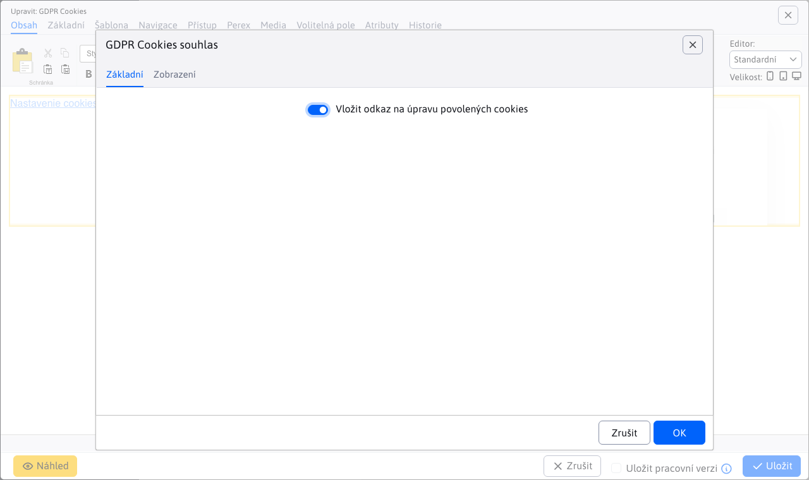

# Cookies souhlas

Vloží do stránky nastavení cookies pro návštěvníka s možností výběru kategorií, které návštěvník může povolit nebo zamítnout. Pro korektní vkládání marketingových skriptů je třeba využít aplikaci Skripty, která je napojena na povolené cookies.

GDPR Cookies poskytují podrobnou kontrolu nad tím, jaké typy cookies mohou být uloženy. Uživatel může konkrétně nastavit, s jakými kategoriemi cookies souhlasí (např. nutné, marketingové cookies).

## Nastavení aplikace

- **Vložit odkaz na úpravu povolených cookies**: Umožňuje přidat odkaz, který uživatelům poskytne možnost upravit své preference pro povolené cookies.

## Zobrazení aplikace

