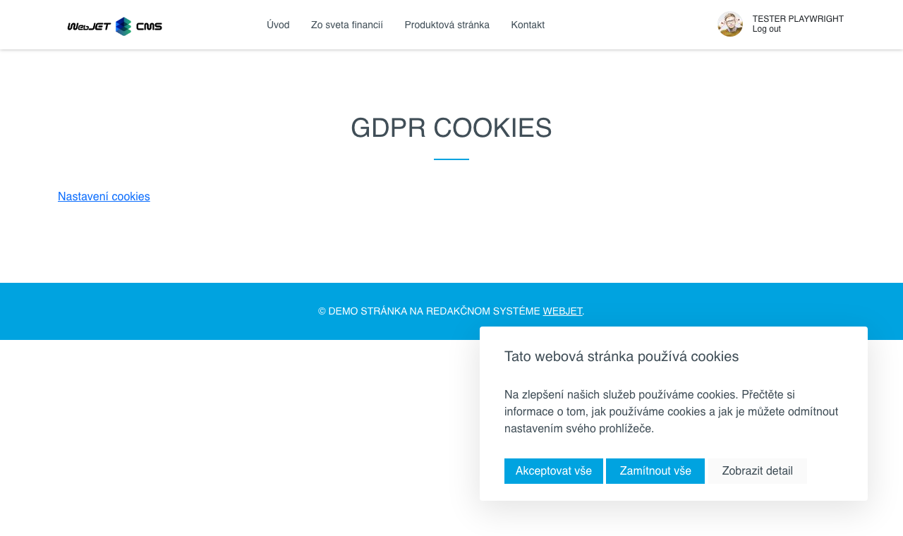

# Souhlas se soubory cookie

Vloží do webu nastavení souborů cookie návštěvníka s výběrem kategorií, které může návštěvník povolit nebo zakázat. Pro správné vložení marketingových skriptů je nutné použít aplikaci Skripty, která je propojena s povolenými soubory cookie.

GDPR Soubory cookie poskytují podrobnou kontrolu nad tím, jaké typy souborů cookie lze ukládat. Uživatel může konkrétně nastavit, se kterými kategoriemi souborů cookie souhlasí (např. nezbytné, marketingové soubory cookie).

## Nastavení aplikace

- **Vložení odkazu pro úpravu povolených souborů cookie**: Umožňuje přidat odkaz, který uživatelům umožní upravit předvolby povolených souborů cookie.

## Zobrazení aplikace

