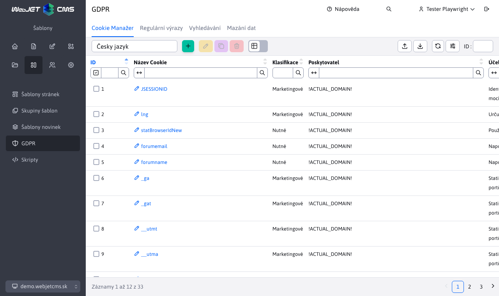
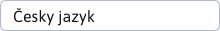
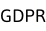

# Správce souborů cookie

Modul GDPR umožňuje spravovat soubory cookie a jejich klasifikace, které se návštěvníkům webu zobrazují v liště souborů cookie. To znamená, že se na liště souborů cookie zobrazí informace o tom, jaké soubory cookie jsou na webu shromažďovány, a návštěvníci mají možnost vypnout shromažďování určitých klasifikací souborů cookie.

V levé horní části stránky jsou tlačítka pro přidání/úpravu/duplikaci/odstranění souborů cookie, export souborů cookie do souboru Excel a import souborů cookie ze souboru Excel.

## Definování souborů cookie v různých jazycích

Při vytváření a úpravách souborů cookie je možné definovat hodnotu textového pole "Účel" v různých jazycích SK/CZ/EN/DE atd. Pokud je soubor cookie vytvořen ve slovenštině, hodnota textového pole "Účel" se ve výchozím nastavení přenese do ostatních jazyků. Pokud se však hodnota textového pole "Účel" po přepnutí do češtiny změní, zůstane tato hodnota definována pouze pro tento jazyk a hodnota textového pole "Účel" v ostatních jazycích nebude ovlivněna. Tímto způsobem lze pro každý jazyk zvlášť definovat jinou hodnotu textového pole "Účel". Jazyk lze změnit pomocí voliče v levém horním rohu stránky vedle jejího názvu.

## Definování souborů cookie v různých doménách

Vytvořený soubor cookie se zobrazí pouze pro doménu, ve které byl vytvořen. Chcete-li vytvořit stejný soubor cookie nebo stejný soubor cookie s různými hodnotami ve více doménách, bude nutné je definovat pro každou doménu zvlášť. Doménu lze změnit pomocí voliče domén umístěného v levém horním rohu stránky.

## Potvrzení shromažďování souborů cookie návštěvníkem webových stránek

Volba návštěvníka webových stránek, zda chce shromažďovat nebo neshromažďovat určité klasifikace souborů cookie, bude dále uložena a spravována modulem Skripty.

