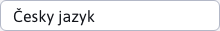
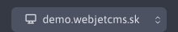

# Cookies manažer

Modul GDPR umožnuje správu cookies a jejich klasifikací, které se zobrazují návštěvníkům webu v cookies liště. Znamená to, že se na cookies liště budou nacházet informace o tom, jaké cookies se na webstránkách sbírají a umožnit návštěvníkům možnost vypnutí sbírání některých klasifikací cookies.

V lehké horní části stránky se nacházejí tlačítka pro přidání/úpravu/duplikování/mazání cookies, export cookies do excel souboru a import cookies z excel souboru.

## Definování cookies v různých jazycích

Při tvorbě a editaci cookies lze zadefinovat hodnotu textového pole "Účel" v různých jazykových mutacích SK/CZ/EN/DE atp. Pokud se cookie vytvoří ve Slovenském jazyce, hodnota pole "Účel" se ve výchozím nastavení přenese i do ostatních jazyků. Ale pokud se hodnota pole "Účel" změní po přepnutí do Českého jazyka, tato hodnota zůstane definována pouze pro daný jazyk a hodnotu pole "Účel" v jiných jazycích to neovlivní. Takto lze definovat odlišnou hodnotu textového pole "Účel" pro každý jazyk zvlášť. Jazyk lze změnit selektorem v levé horní části stránky vedle názvu stránky.

## Definování cookies v různých doménách

Vytvořená cookies se bude zobrazovat pouze pro doménu ve které byla vytvořena. Pro vytvoření stejné cookies nebo stejné s jinými hodnotami ve více doménách bude nutné jejich definování pro každou doménu zvlášť. Doménu lze změnit pomocí doménového selektoru, který se nachází v levém horním rohu stránky.

## Potvrzení sbírání cookies návštěvníkům webové stránky

Zvolený výběr návštěvníka webové stránky o sbírání/nesbírání některých klasifikací cookies bude dále ukládán a správován pomocí modulu Skripty.

