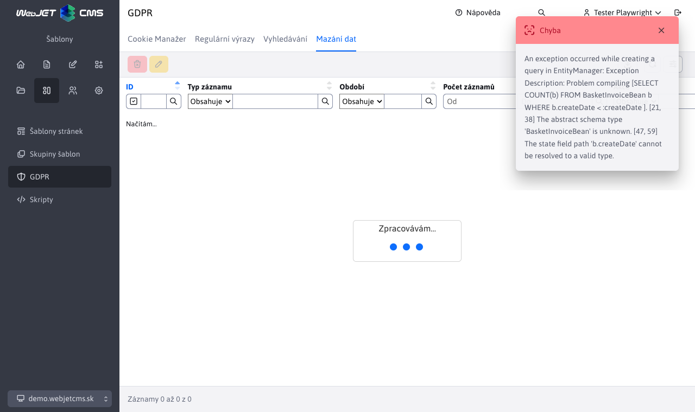
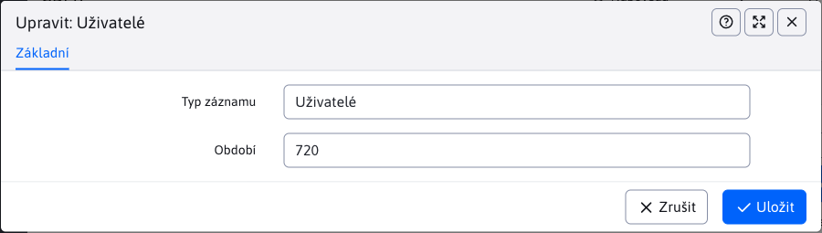

# Mazání dat

Aplikace GDPR obsahuje uzel **Mazání dat**, který slouží k odstraňování starých dat z databáze podle nastavených retenčních období.

Umožňuje trvale smazat:

- **účty neaktivních uživatelů** - uživatele, kteří nebyli přihlášeni za posledních X dnů, ve výchozím nastavení `730` dnů,
- **formuláře** - záznamy starší než X dnů, ve výchozím nastavení `730` dnů,
- **objednávky z elektronického obchodu** - záznamy starší X let, ve výchozím nastavení `10` let,
- **e-maily** - odeslané e-maily z hromadného e-mailingu, ve výchozím nastavení starší `186` dnů,
- **webové stránky a složky v Koši** - stránky a složky webových stránek nacházející se v Koši, ve výchozím nastavení starší `186` dnů podle konfigurační proměnné `gdprDeleteDocAndGroupsAfterDays`.

V datové tabulce není možné vytvářet nové záznamy, jejich počet je fixně dán funkčností WebJET CMS. Při úpravě je možné změnit pouze číselnou hodnotu **Období**, která udává, za jaké období budou dané hodnoty při spuštění mazání smazány. Sloupce **Typ záznamu** a **Akce** jsou pouze informační.

Mazání spustíte výběrem jednoho nebo více řádků a klepnutím na tlačítko **Spustit**. Potvrzovací dialog zobrazí seznam vybraných typů záznamů.

U typu **Webové stránky a složky v Koši** se provede trvalé odstranění z Koše. Mazání zahrnuje staré stránky, staré složky včetně jejich podsložek a stránek a také složky, které po odstranění starých položek zůstanou prázdné. Odstraněné stránky a složky již nebude možné z Koše obnovit.

!> **Upozornění:** mazání stránek a složek z Koše je nevratné. Před spuštěním si ověřte, že zvolené období je správné.

## Automatizovaný úkol

Automatizovaná úloha `sk.iway.iwcm.components.gdpr.GdprDataDeleting` bez parametrů spustí všechny typy mazání včetně stránek a složek v Koši.

Pokud má úloha zpracovat pouze vybrané typy, je možné zadat čárkou oddělený seznam hodnot:

| Hodnota parametru | Typ záznamu |
| --- | --- |
| `sendedEmails` | E-maily |
| `oldFormData` | Formuláře |
| `oldBasketOrders` | Objednávky z elektronického obchodu |
| `unusedUsers` | Účty neaktivních uživatelů |
| `oldDocAndGroups` | Webové stránky a složky v Koši |

## Konfigurační proměnné

| Proměnná | Výchozí hodnota | Popis |
| --- | --- | --- |
| `gdprDeleteUserAfterDays` | `730` | Počet dní neaktivity uživatele před smazáním účtu |
| `gdprDeleteFormDataAfterDays` | `730` | Počet dní pro smazání starých formulářových dat |
| `gdprDeleteUserBasketOrdersAfterYears` | `10` | Počet let pro smazání starých objednávek |
| `gdprDeleteEmailsAfterDays` | `186` | Počet dní pro smazání odeslaných e-mailů |
| `gdprDeleteDocAndGroupsAfterDays` | `186` | Počet dní pro smazání stránek a složek v Koši |

Stránky a složky v Koši se mažou na základě data jejich vytvoření - mažou se ty, které byly vytvořeny před více než nastaveným počtem dní.

Mazání stránek a složek z Koše je dostupné také v aplikaci [Čištění databáze](../../../sysadmin/data-deleting/README.md#databázové-záznamy) v sekci Nastavení.

## Auditování

Všechny činnosti uživatele WebJETu při mazání dat jsou auditovány (typ `GDPR_DELETE_*`) a lze získat informaci o tom, jaké bylo ID operace, kdo, kdy a kolik dat smazal.
