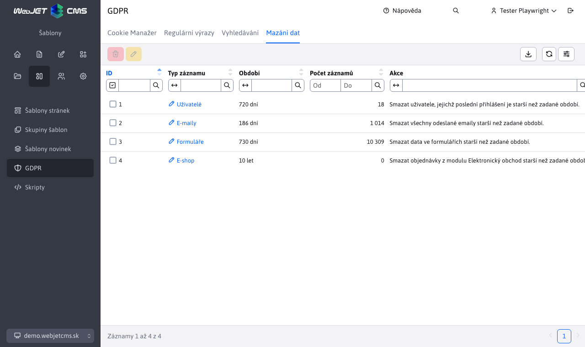

# Mazání dat

Aplikace GDPR obsahuje uzel „Mazání dat“, který slouží k odstraňování starých dat z databáze.

Umožňuje smazat:
- účty **neaktivních uživatelů** (ti, kteří nebyli přihlášeni za posledních X dní, základny nastaveny na 730dnů = 2roky)
- **formuláře** (záznamy starší než X dnů, základny nastavené na 730dní = 2roky
- **objednávky z elektronického obchodu** (záznamy starší než X dnů, základny nastavené na 10 let)
- **emaily** (mazání dat z hromadného e-mailingu, základny nastaveno na 186 dní)

V data tabulce není možné vytvářet nové záznamy, jejich počet je fixně daný funkčností WebJET CMS. Při úpravě lze změnit pouze číselnou hodnotu **Období**, která udává za jaké období budou dané hodnoty při provedení akce **Vymazat data** smazány.

Všechny činnosti uživatele WebJETu při mazání dat jsou auditovány (typ `GDPR_DELETE_*`) a lze získat informaci o tom jaké bylo ID operace, kdo, kdy a kolik dat smazal.
