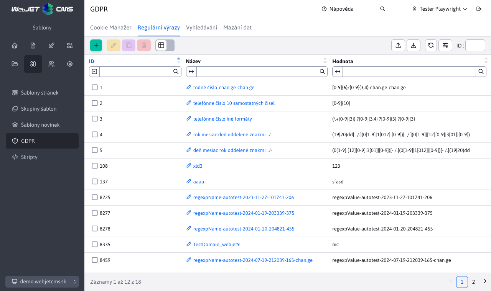
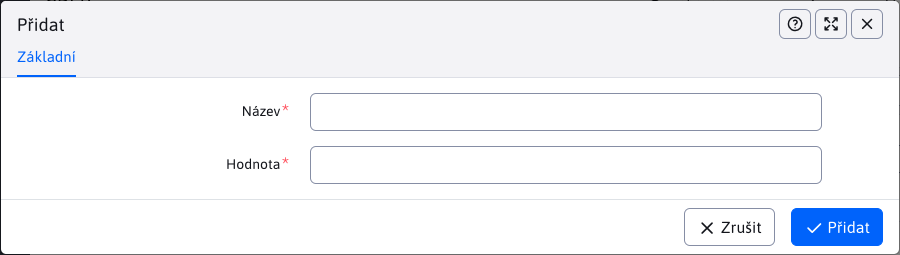

# Správa regulárních výrazů

Modul GDPR obsahuje uzel "Správa regulárních výrazů", který slouží k vytváření a úpravám regulárních výrazů pro určité typy vyhledávaných údajů.

V levém horním rohu je řada tlačítek pro vytváření/úpravu/duplikaci/odstranění regulárních výrazů, export regulárních výrazů do Excelu a jejich import z Excelu.

Při vytváření, úpravě, duplikování regulárního výrazu se v editoru zadává název a hodnota regulárního výrazu.

