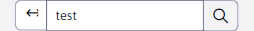

# Vyhledávání

Aplikace GDPR obsahuje uzel „Vyhledávání“, který slouží k vyhledání dat v částech/aplikacích „Formuláře“, „Web stránky“, „Otázky a odpovědi“ a „Fórum/diskuse“.

V levém horním rohu, se nachází pole pro zadání vyhledávaného textu. Po zadání se zobrazí záznamy ze zmíněných aplikací, které obsahují v názvu nebo v hodnotě zadaný výraz.

