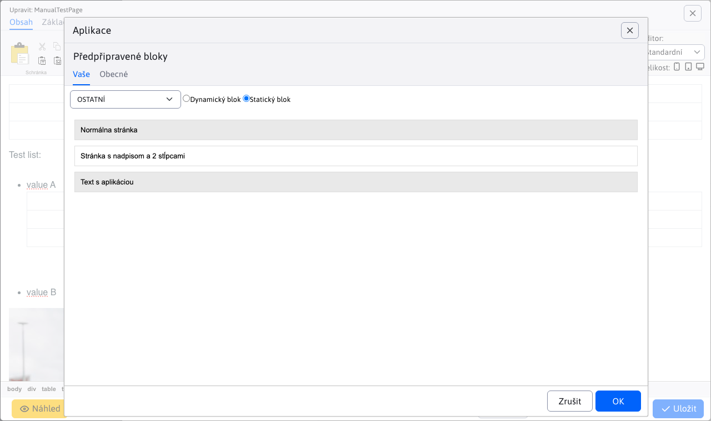
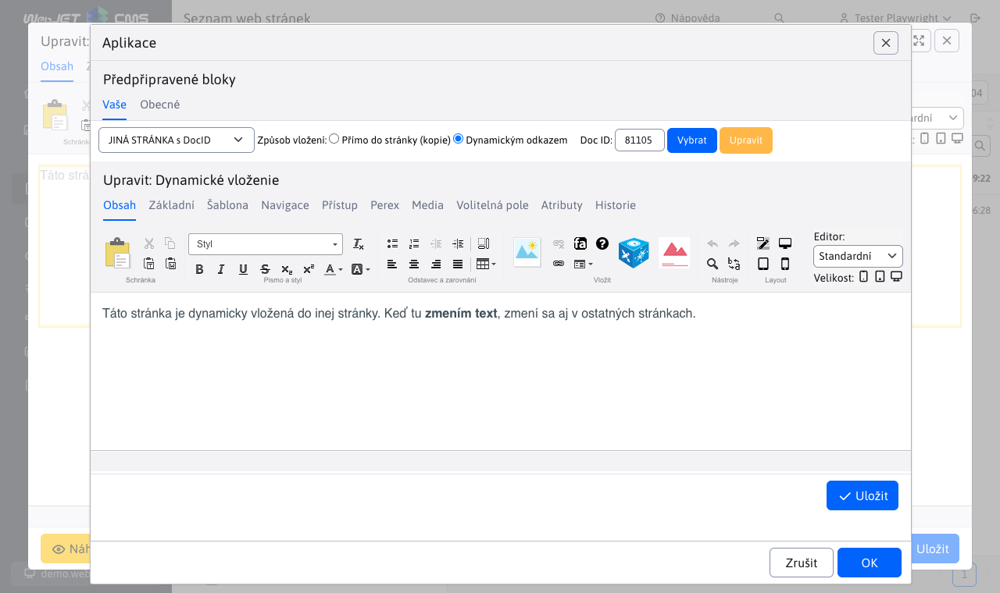
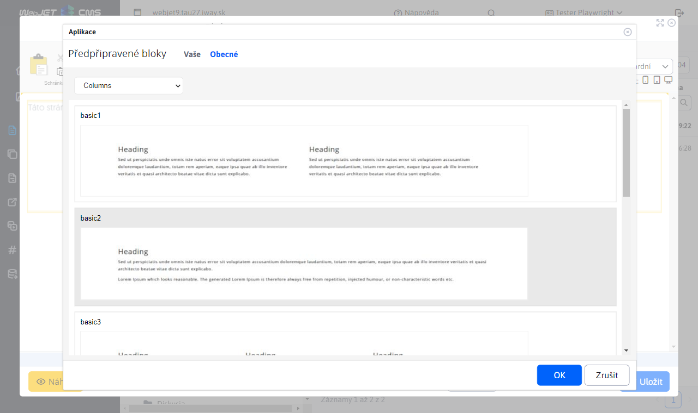
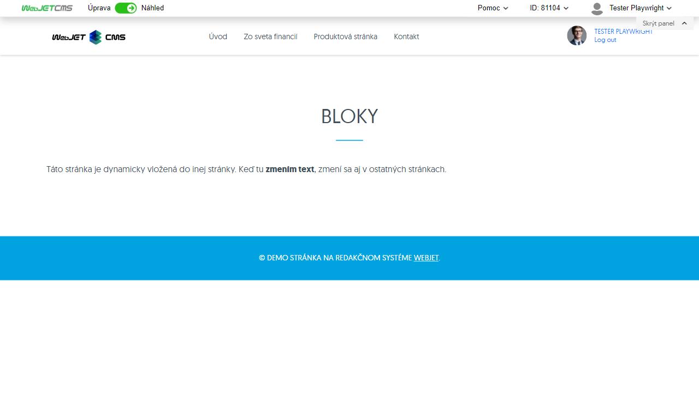

# Předpřipravené bloky

Editor stránky nabízí možnost vkládání přednastavených bloků (`HTML` objektů) na stránku. Např. tabulka, text, kontaktní formulář atp. Umíte vložit i obsah jiné stránky do aktuální stránky (např. opakující se formulář).

Zobrazení bloků provedete kliknutím na ikonu  v editoru stránky, která zobrazí dialogové okno s kategoriemi bloků.

## Karta - Vaše

V záložce **Vaše** se nacházejí stránky generované z adresáře **Systém** -> **Šablony**. Každý adresář v adresáři **Šablony** reprezentuje jeden seznam ve výběrovém poli modulu. Obsah lze vložit dynamicky nebo staticky. Pokud se vloží dynamicky, tak se při pozdější úpravě daného obsahu (jedné stránky) změna projeví na všech místech, kde byl daný obsah vložen dynamicky. Při vložení staticky se obsah duplikuje a vloží jako kopie, která se upravuje vždy už jen na konkrétním místě v dané webové stránce.

Karta Vaše se zobrazí jako zvolená při otevření obsahuje-li složku Systém->Šablony pod složky nebo jsou ve složce více než 2 stránky.

### Nastavení aplikace - OSTATNÍ

Seznam dostupných bloků je čten ze složky Šablony (standardně v podsložce Systém, ID složky se nastavuje v konf. proměnné `tempGroupId`)

- Dynamický blok - HTML kód bloku se vloží dynamickým odkazem, pokud se obsah bloku upraví automaticky se změní ve všech vložených částech
- Statický blok - HTML kód bloku se vloží přímo do stránky jako kopie, změna původního bloku nijak neovlivní vloženou verzi
- Výběr stránky
  - Zobrazuje se seznam dostupných bloků, například. Normální stránka, Stránka s nadpisem a 2 sloupci atp.

### Nastavení aplikace - JINÁ STRÁNKA s `DocID`

Umožňuje vybrat pro vložení libovolnou web stránku

- Způsob vložení
  - Přímo do stránky - vloží se kopie textu vybrané web stránky
  - Dynamickým odkazem - HTML kód bloku se vloží dynamickým odkazem, pokud se obsah bloku upraví automaticky se změní ve všech vložených částech
- `DocID` - výběr ID stránky pro vložení

### Složky

Pokud složka Systém/Šablony ve web stránkách obsahuje podsložky ve výběrovém poli se zobrazí názvy složek, čili kromě Ostatní/Jiná stránka s DocID se ve výběrovém poli zobrazí jednotlivé složky s připravenými bloky.

## Karta - Obecné

V záložce **Obecné** se nacházejí všechny předpřipravené prvky a moduly, které si redaktor nemůže měnit případně přidávat – odebírat. Je to před-připravený seznam obsahující obsahové prvky web stránky, které má redaktor web sídla k dispozici.

### Nastavení aplikace

Zobrazeny jsou bloky připravené designérem web sídla, čtené ze souborů ve složce `/components/INSTALL_NAME/htmlbox/objects` kde `INSTALL_NAME` je jméno instalace (konf. proměnná `installName`). Pokud složka neexistuje, čtou se standardní bloky ze složky `/components/htmlbox/objects`. Ve složce mohou být i podsložky, jednotlivé bloky jsou v `html` souborech. Se stejným názvem je třeba vytvořit také `jpg` soubor s ukázkou bloku.

Standardně jsou dostupné následující skupiny/kategorie bloků:
- `Columns`
- `Contact`
- `Content`
- `Download`
- `Header`

## Zobrazení aplikace

