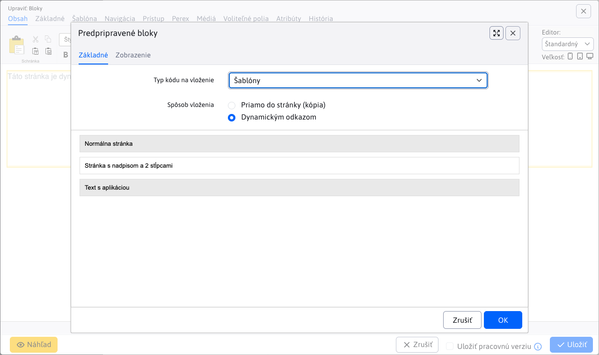
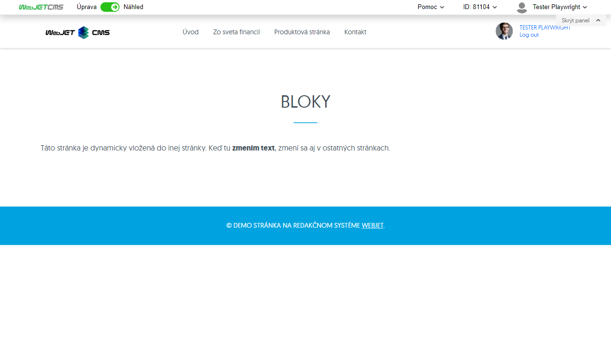

# Předpřipravené bloky

Editor stránky nabízí možnost vkládání přednastavených bloků (```HTML``` objektů) na stránku. Např. tabulka, text, kontaktní formulář atp. Umíte vložit i obsah jiné stránky do aktuální stránky (např. opakující se formulář).

Dostupné bloky zobrazíte kliknutím na ikonu  v editoru stránky, čímž otevřete dialog s kategoriemi bloků, nebo přidáním aplikace **Předpřipravené bloky**.

Typy bloků (HTML objektů), které můžete vložit přes **Typ kódu pro vložení**:

- **Předpřipravený blok**
- **Web stránka**
- **Šablony**

## Předpřipravený blok

Zobrazí se bloky připravené designérem webu. Tyto bloky se načítají ze souborů ve složce `/components/INSTALL_NAME/htmlbox/objects`, kde `INSTALL_NAME` je název vaší instalace (nastavuje se v proměnné `installName`). Pokud tato složka neexistuje, použijí se standardní bloky z `/components/htmlbox/objects`.

Ve složce mohou být také podsložky. Každý blok je uložen v `.html` souboru a pro správné zobrazení je třeba vytvořit i `.jpg` soubor s ukázkou bloku se stejným názvem.

Standardně jsou dostupné tyto skupiny/kategorie bloků:

- `Columns`
- `Contact`
- `Content`
- `Download`
- `Header`


## Web stránka

Tato možnost umožňuje vložit obsah libovolné webové stránky pomocí výběru v poli `Doc ID`.

**Způsob vložení:**

- **Přímo do stránky (kopie):** Vloží se kopie textu vybrané web stránky.
- **Dynamickým odkazem:** HTML kód bloku se vloží jako dynamický odkaz. Pokud se obsah bloku upraví, změna se automaticky projeví ve všech vložených částech.

Obsah aktuálně zvolené web stránky se zobrazuje v náhledu v dolní části okna.


## Šablona

Tato možnost obsahuje stránky generované ze složky **Systém/Šablony** a podsložek první úrovně. Použije se buď složka s ID definovanou v konfigurační proměnné `tempGroupId` nebo existuje-li lokální Systém složky tak v ní se hledá složka s názvem Šablony (název lze změnit v překladovém klíči `config.templates_dir`).

**Způsob vložení:**

- **Přímo do stránky (kopie):** Vloží se kopie textu vybrané web stránky.
- **Dynamickým odkazem:** HTML kód bloku se vloží jako dynamický odkaz. Pokud se obsah bloku upraví, změna se automaticky projeví ve všech vložených částech.



## Statické vs dynamické vložení

**Dynamické vložení:**

Vloží se odkaz na obsah. Při pozdější úpravě obsahu (např. jedné stránky) se změna projeví na všech místech, kde byl obsah vložen dynamicky.

**Statické vložení:**

Obsah se duplikuje a vloží jako kopie. Úpravy se následně týkají jen konkrétního místa v dané webové stránce.

## Zobrazení aplikace

