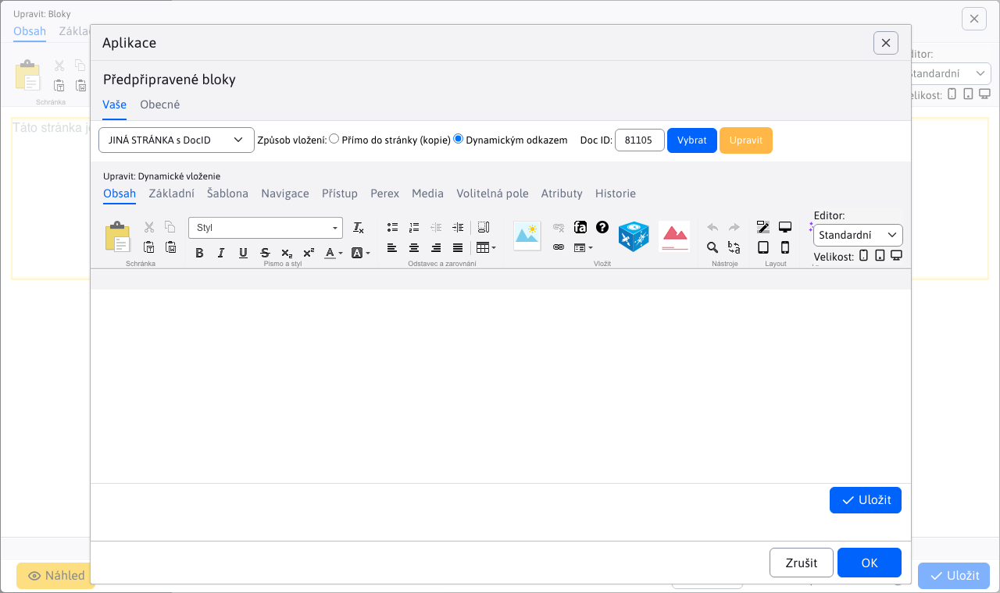
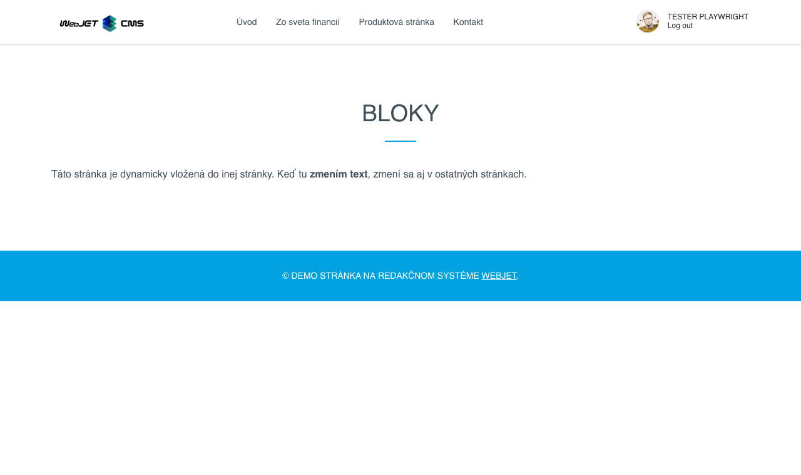

# Předpřipravené bloky

Umožňuje vkládat do stránky předdefinované bloky (objekty HTML). Např. tabulka a text, kontaktní formulář, třísloupcový text. Do aktuální stránky můžete také vložit obsah jiné stránky (např. opakující se formulář).

## Nastavení aplikace

### Váš

V této části můžete nastavit:
- OTHER - seznam dostupných bloků se načítá ze složky Templates (standardně v podsložce System, ID složky je nastaveno v proměnné conf. `tempGroupId`)
  - Dynamický blok - HTML kód bloku je vložen pomocí dynamického odkazu, pokud je obsah bloku změněn, automaticky se změní ve všech vložených částech.
  - Statický blok - HTML kód bloku je vložen přímo do stránky jako kopie, změna původního bloku nemá vliv na vloženou verzi.
  - Výběr stránky
    - Zobrazí se seznam dostupných bloků, např. Normální stránka, Stránka s nadpisem a 2 sloupci atd.
- JINÁ STRÁNKA s DocID - umožňuje vybrat libovolnou webovou stránku pro vložení
  - Způsob vložení
    - Přímo do stránky - vloží se kopie textu vybrané webové stránky.
    - Dynamický odkaz - HTML kód bloku je vložen pomocí dynamického odkazu, pokud je obsah bloku změněn, automaticky se změní ve všech vložených částech.
  - ID dokumentu - výběr ID stránky, která se má vložit

Pokud složka Šablony obsahuje podsložky, zobrazí se ve výběrovém poli jejich názvy, tj. kromě stránky Ostatní/Ostatní ID dokumentu se ve výběrovém poli zobrazí i jednotlivé složky s připravenými bloky.

### Obecné

Zobrazení bloků připravených návrhářem webu, načtených ze souborů ve složce `/components/INSTALL_NAME/htmlbox/objects` Kde: `INSTALL_NAME` je název instalace (konf. proměnná `installName`). Pokud složka neexistuje, načtou se standardní bloky z této složky. `/components/htmlbox/objects`. Ve složce mohou být podsložky, jednotlivé bloky jsou ve složkách. `html` soubory. Se stejným názvem je třeba vytvořit také `jpg` soubor s ukázkovým blokem.

Ve výchozím nastavení jsou k dispozici následující skupiny/kategorie bloků:
- Sloupce
- Kontakt
- Obsah
- Stáhnout
- Záhlaví

## Zobrazení aplikace

