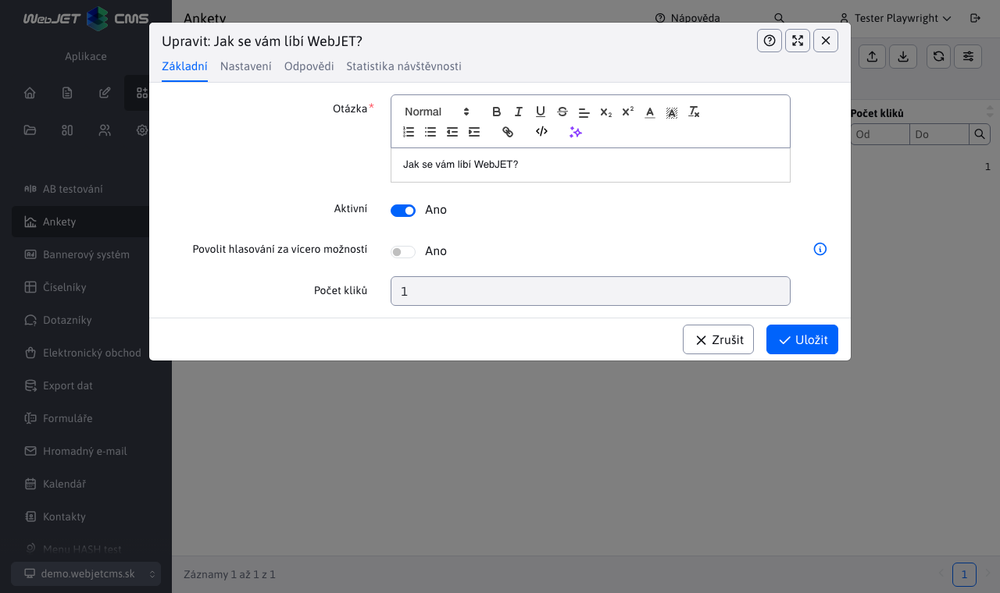
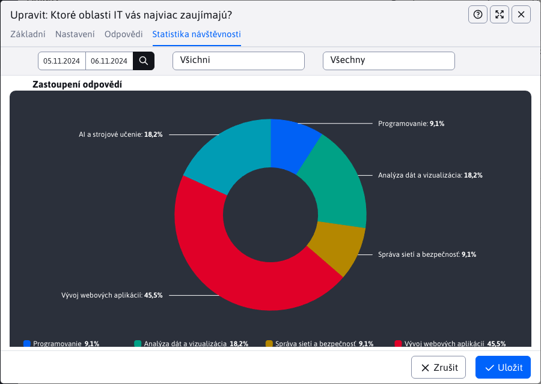

# Průzkum

Aplikace Anketa umožňuje vytvářet/upravovat/duplikovat a mazat ankety.

Doporučujeme jej na webové stránce zobrazit v užším sloupci, např. vpravo:

Editor anket obsahuje 4 karty, které si nyní popíšeme.

## Základní

V kartách **Základní** jsou zde pole:
- Question - představuje otázku v anketě.
- Aktivní - povolí/zakáže zobrazení ankety na webové stránce.
- Povolit hlasování pro více možností - pokud je tato možnost povolena, může návštěvník hlasovat pro více možností na stránce současně (výběrem možností v poli pro výběr a následným odesláním hlasu).
- Počet hlasů - pole zobrazuje aktuální celkový počet hlasujících, je editovatelné v případě, že chcete s anketou manipulovat.

## Nastavení

V kartách **Nastavení** jsou pole:
- Seskupit - ankety můžete roztřídit do skupin (např. hlavní stránka, produkty atd.) a poté na stránce zobrazit anketu z vybrané skupiny. Zadání znaku `*` zobrazit existující skupiny.
- Text po hlasování - text, který se návštěvníkovi zobrazí po úspěšném hlasování v anketě.
- Text, pokud již bylo hlasováno - text, který se návštěvníkovi zobrazí, pokud dojde k chybě při hlasování (např. pokud návštěvník již v anketě hlasoval).
- Počet hodin, po kterých je možné znovu hlasovat - návštěvník nebude moci po zadaný počet hodin znovu hlasovat. U nepřihlášeného návštěvníka jsou informace o hlasování uloženy v souborech cookie. Technicky to znamená, že může hlasovat opakovaně při použití režimu inkognito nebo při použití více prohlížečů.
- Platnost od, Platnost do - datumové omezení pro zobrazení průzkumu na webových stránkách.

## Možné odpovědi

V kartách **Možné odpovědi** je vnořená datová tabulka, ve které můžeme přidávat/upravovat/duplikovat a mazat možné odpovědi pro aktuálně otevřenou anketu (otázku).

Definování odpovědi obsahuje následující pole:
- Odpověď na otázku - možná odpověď na otázku, ze které návštěvník při hlasování vybírá.
- Obrázek - pokud nastavíte odkaz na obrázek, zobrazí se v anketě na webové stránce vedle textu s možností odpovědi.
- Odkaz - pokud nastavíte, aby se odpověď zobrazovala jako odkaz, kliknutím na text odpovědi se návštěvníkovi zobrazí zadaná webová stránka.
- Počet hlasů - pole zobrazuje aktuální počet hlasujících pro danou odpověď, je editovatelné pro případ, že chcete s anketou manipulovat.

Pokud vytvoříte odpovědi hned při vytváření ankety, ale anketu neuložíte, všechny odpovědi na neuložené ankety budou ztraceny.

## Statistiky

Karta **Statistiky** nabízí rychlý přístup ke statistikám daného průzkumu. Kromě tabulky odpovědí jednotlivých uživatelů nabízí také grafy.

Jedná se však pouze o vnořenou verzi samostatné stránky. [Statistiky průzkumu](./inquiry-stat.md). Pokud chcete zobrazit statistiky hlasování na samostatné stránce, stačí vybrat požadované hlasování a stisknout tlačítko . .
