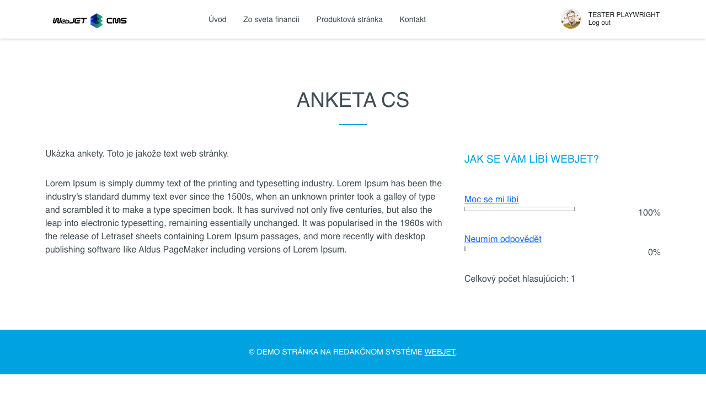
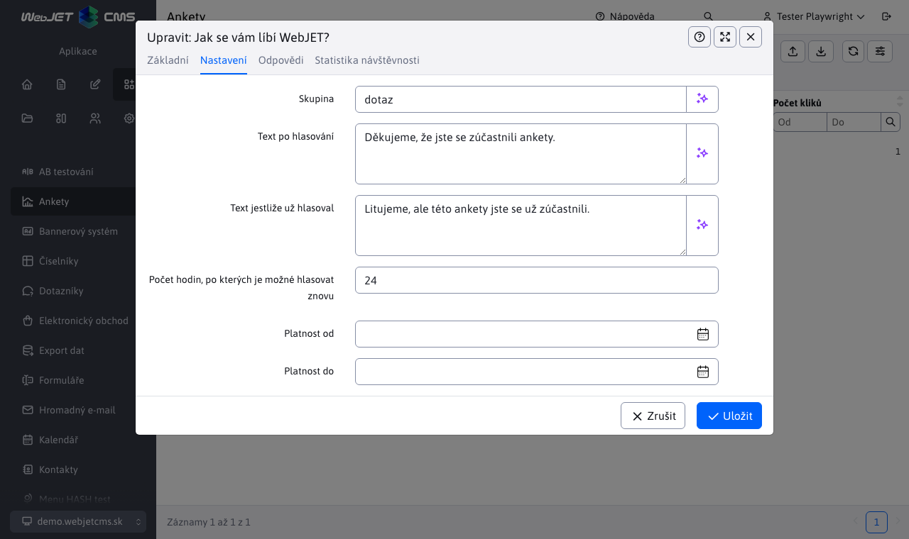
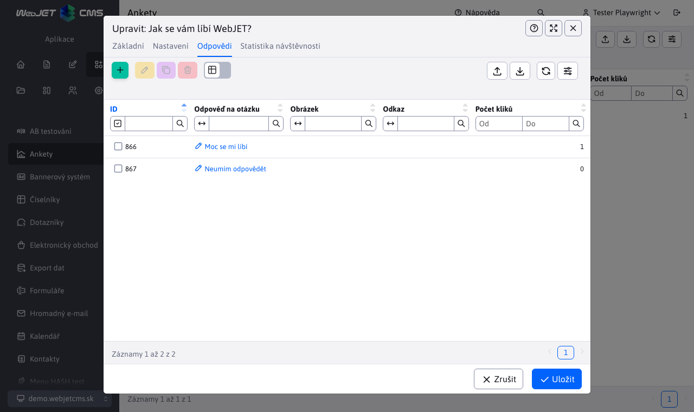

# Anketa

Aplikace Anketa, umožňuje vytváření/upravování/duplikování a mazání anket.

Zobrazení na webové stránce doporučujeme v užším sloupci. v pravém:

Editor ankety obsahuje 4 karty, které si nyní popíšeme.

## Základní

V kartě **Základní** se nacházejí pole:
- Otázka - reprezentuje otázku ankety.
- Aktivní - zapne/vypne zobrazování ankety na web stránce.
- Povolit hlasování za více možností - pokud je zapnuto návštěvník na stránce může hlasovat najednou za více možností (možnosti označí výběrovým polem a následně odešle hlas).
- Počet hlasů - pole zobrazuje aktuálně celkový počet hlasujících, je editovatelné pro případ, že byste chtěli anketu manipulovat.

## Nastavení

V kartě **Nastavení** jsou pole:
- Skupina - ankety můžete řadit do skupin (např. hlavní stránka, produkty atd.) a následně na stránce zobrazovat anketu z vybrané skupiny. Zadejte znak `*` pro zobrazení již existujících skupin.
- Text po hlasování - text, který se zobrazí návštěvníkovi po úspěšném hlasování v anketě.
- Text pokud již hlasoval - text, který se zobrazí návštěvníkovi při chybě hlasování (např. pokud již návštěvník v anketě hlasoval).
- Počet hodin, po kterých lze zahlasovat znovu - zadaný počet hodin nebude návštěvník moci opakovaně hlasovat. Pro nepřihlášeného návštěvníka je informace o hlasování držena v cookies. Technicky to znamená, že může opakovaně hlasovat při použití inkognito režimu prohlížeče, nebo s využitím více prohlížečů.
- Platnost od, Platnost do - datumové omezení zobrazování ankety na web stránce.

## Možné odpovědi

V kartě **Možné odpovědi** je vnořená data tabulku, ve které můžeme přidávat/upravovat/duplikovat a mazat možné odpovědi pro aktuálně otevřenou anketu (otázku).

Definování odpovědi obsahuje následující pole:
- Odpověď na otázku - možná odpověď na otázku, ze které si návštěvník vybírá při hlasování.
- Obrázek - pokud nastavíte odkaz na obrázek zobrazí se v anketě na web stránce vedle textu s možností odpovědi.
- Odkaz - pokud nastavíte možnost odpovědi se zobrazí jako odkaz, kliknutím na text odpovědi se návštěvníkovi zobrazí zadaná web stránka.
- Počet hlasů - pole zobrazuje aktuálně počet hlasujících pro danou odpověď, je editovatelné pro případ, že byste chtěli anketu manipulovat.

Pokud odpovědi budete vytvářet hned při vytváření ankety, ale anketu neuložíte, tak všechny odpovědi na tuto neuloženou anketu se ztratí.

## Statistika

Karta **Statistika** nabízí rychlý přístup ke statistikám dané ankety. Kromě tabulky s odpověďmi jednotlivých uživatelů nabízí také grafy.

Jedná se však pouze o vnořenou verzi samostatně stránky [Statistika ankety](./inquiry-stat.md). Chcete-li si prohlédnout statistiky ankety na samostatné stránce, stačí označit požadovanou anketu a stisknout tlačítko .
