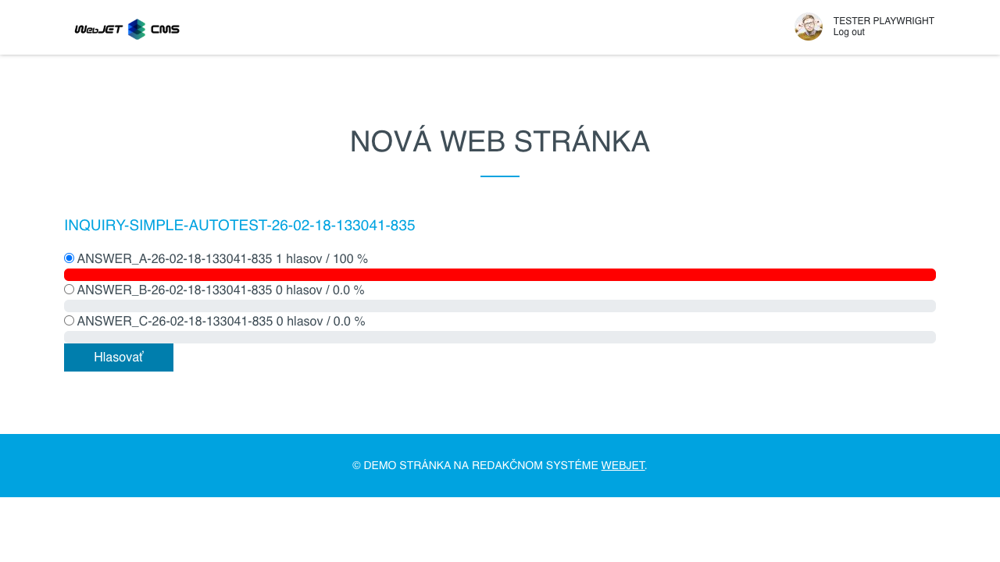
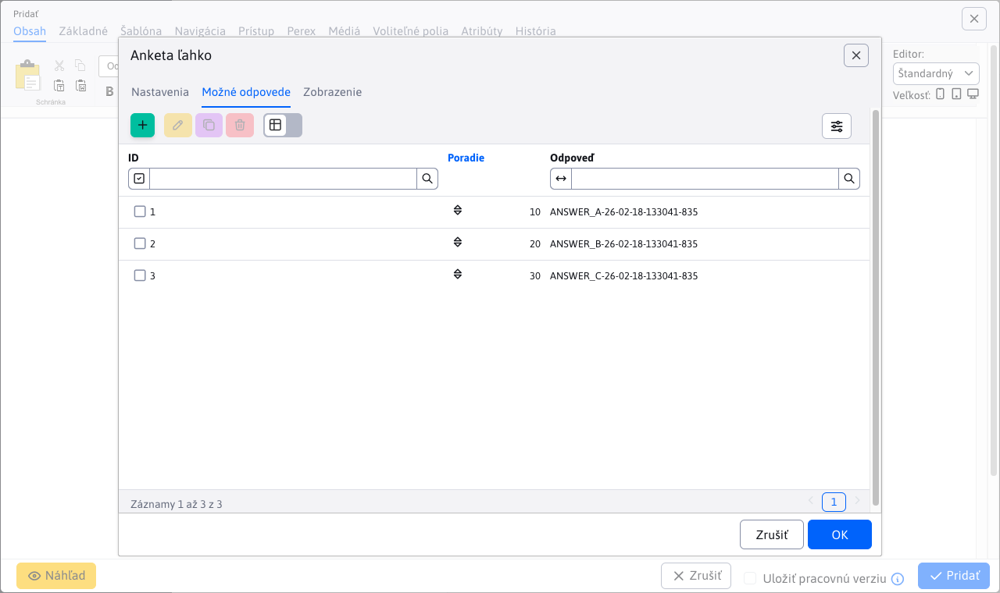

# Anketa snadno

Aplikace **Anketa snadno** je jednodušší a rychlejší forma ankety. Vytvořte si anketu pouhým zadáním otázky a definováním možných odpovědí.

## Karta - Nastavení

Karta obsahuje základní nastavení:

- **Název ankety (otázka)** - název ankety, který bude zobrazen uživatelem
- **Aktivní** - povolit nebo nepovolit hlasování, v případě neaktivního stavu zobrazuje pouze výsledky
- **Povolit více odpovědí** - pokud je povoleno, návštěvník může při hlasování označit více odpovědí
- **ID ankety** - generované nezměnitelné ID ankety

## Karta - Možné odpovědi

Karta obsahuje vnořenou tabulku pro definování a správu možných odpovědí.

