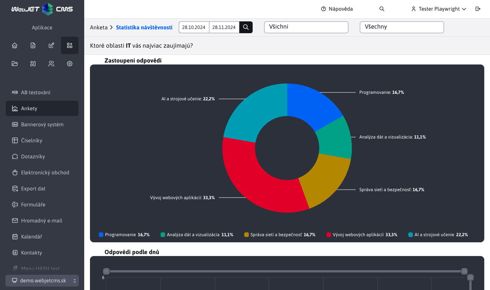
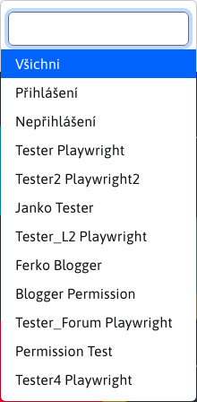
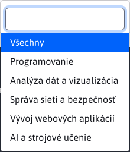
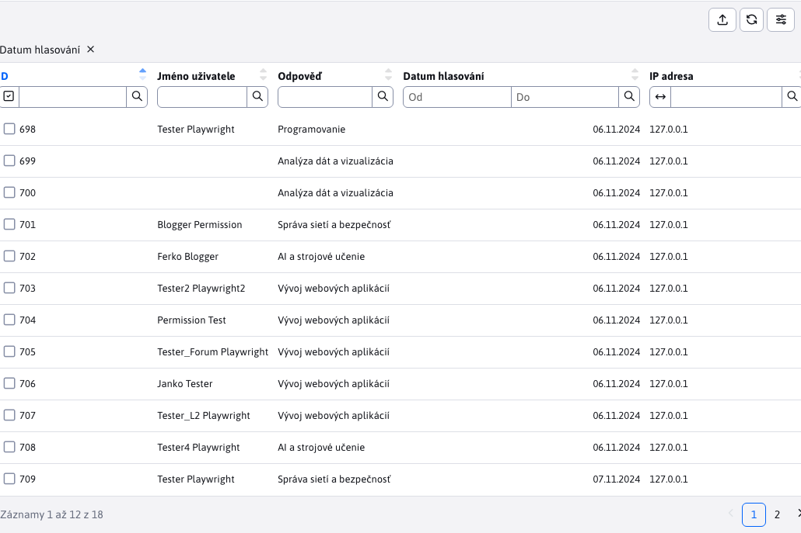
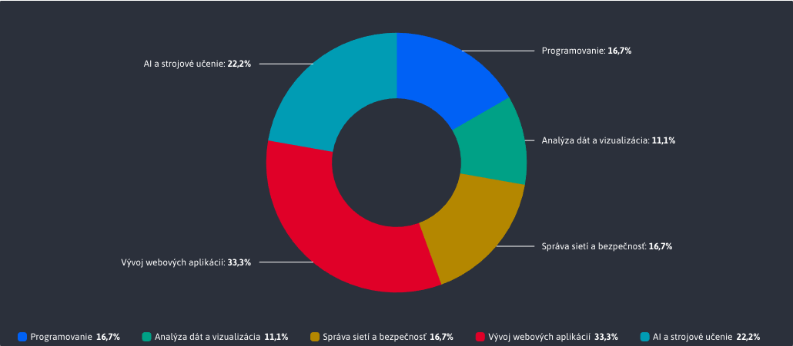
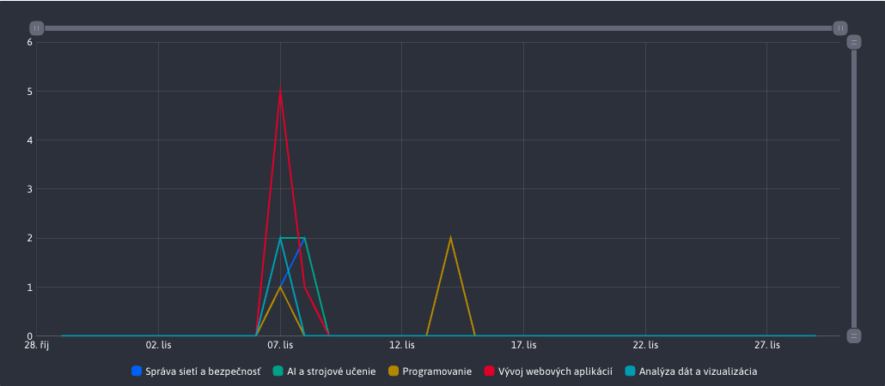

# Statistika ankety

Sekce **Statistika ankety** nabízí plný přehled o hlasování jednotlivých uživatelů v dané anketě. Kromě tabulky s daty poskytuje také grafy, jako rychlý a přehledný způsob analýzy dat.

Hlavička stránky obsahuje také část se samotnou otázkou, která si zachovává stejnou strukturu jako byla vytvořena.

## Filtrování dat

K filtrování všech dat (uživatelských odpovědí v anketě) se primárně využívá externí filtr v hlavičce stránky.

### Datové filtrování

Umožňuje filtrovat podle data, kdy uživatel hlasoval v dané anketě. Pokud žádné datum není zadáno, přednastavený je rozsah 1 měsíc.

### Filtrování podle uživatele

Umožňuje filtrovat podle toho, kdo hlasoval v anketě. Seznam možnosti obsahuje každého uživatele, který hlasoval v anketě a 3 přednastavené možnosti :
- Všichni
- Přihlášen
- Nepřihlášen

### Filtrování podle odpovědi

Umožňuje filtrování podle odhlasované odpovědi ankety. Umíte si tak odfiltrovat data pouze pro konkrétní odpověď a prohlédnout. Seznam možnosti obsahuje všechny možné odpovědi, které byly pro danou anketu vytvořeny.

## Tabulka

Tabulka obsahuje všechny odfiltrované záznamy o uživatelských hlasováních. Tato data lze v tabulce dále filtrovat (seřadit) podle potřeby, **ale** tyto akce nad tabulkou neovlivňují data použitá v grafech.

## Graf Zastoupení odpovědí

Graf **Zastoupení odpovědí** poskytuje rychlý přehled o tom, pro které odpovědi uživatelé nejvíce hlasovali ve zvoleném časovém rozsahu.

## Graf Odpovědi podle dnů

Graf **Odpovědi podle dnů** poskytuje rychlý přehled o tom, ve které dny uživatelé nejvíce hlasovali v dané anketě, za ve zvolený časový rozsah.

