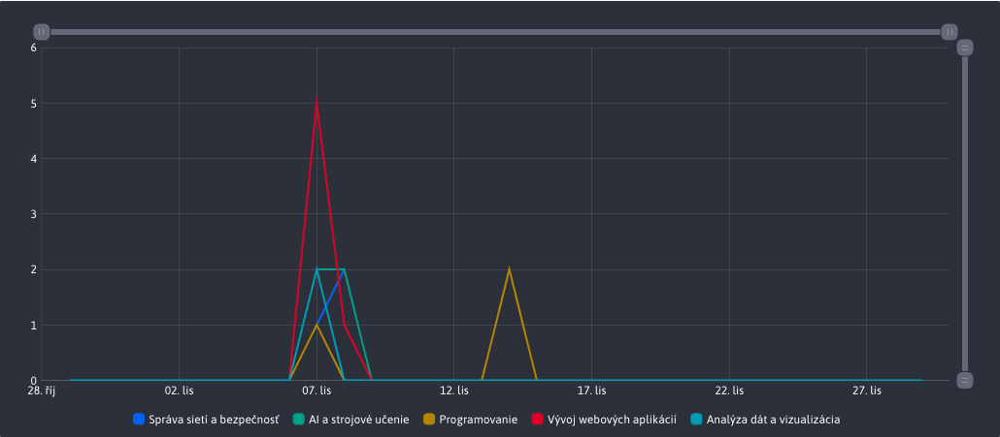

# Statistiky průzkumu

Sekce **Statistiky průzkumu** nabízí úplný přehled o tom, jak jednotliví uživatelé v dané anketě hlasovali. Kromě tabulky s údaji nabízí také grafy, které umožňují rychlou a snadnou analýzu dat.

Záhlaví stránky obsahuje také část se samotnou otázkou, která si zachovává stejnou strukturu jako při jejím vytvoření.

## Filtrování dat

K filtrování všech dat (odpovědí uživatele v dotazníku) se primárně používá externí filtr v záhlaví stránky.

### Filtrování podle data

Umožňuje filtrovat podle data hlasování uživatele v dané anketě. Pokud není zadáno žádné datum, je výchozí rozsah 1 měsíc.

### Filtrování podle uživatele

Umožňuje filtrovat podle toho, kdo v anketě hlasoval. Seznam možností zahrnuje každého uživatele, který v anketě hlasoval, a 3 přednastavené možnosti :
- Všechny
- Přihlášeno
- Nepřihlášen

### Filtrovat podle odpovědi

Umožňuje filtrovat podle odpovědi v anketě, pro kterou jste hlasovali. Můžete tak filtrovat data pouze pro konkrétní odpověď a zobrazit. Seznam možností obsahuje všechny možné odpovědi, které byly pro danou anketu vytvořeny.

## Tabulka

Tabulka obsahuje všechny filtrované záznamy o hlasování uživatelů. Tato data lze v tabulce dále filtrovat (třídit) podle potřeby, **Ale** tyto akce nad tabulkou nemají vliv na data použitá v grafech.

## Grafické znázornění odpovědí

Graf **Zastoupení odpovědí** poskytuje rychlý přehled o tom, pro které odpovědi uživatelé ve zvoleném časovém rozmezí hlasovali nejčastěji.

## Graf Odpovědi podle dnů

Graf **Odpovědi podle dnů** poskytuje rychlý přehled o tom, ve kterých dnech uživatelé v dané anketě hlasovali nejvíce, a to ve zvoleném časovém rozmezí.

