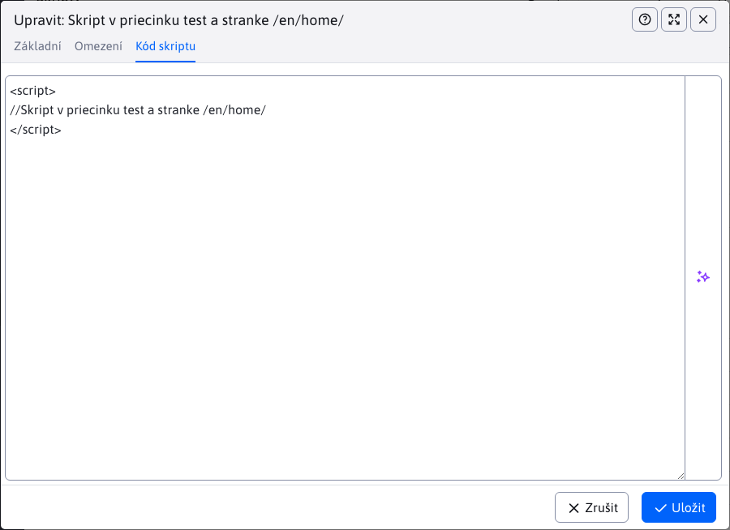

# Skripty

Aplikace „Skripty“ umožňuje vytváření skriptů, které můžete následně přidávat do libovolných stránek nebo skupiny stránek. Skripty lze vkládat dle souhlasu [návštěvníka s cookies/GDPR klasifikací](../gdpr/cookiesmanger.md).


Editor se skládá ze 3 karet **Základní**, **Omezení** a **Kód skriptu**.

## Základní

Karta "Základní" obsahuje základní nastavení, která jsou všechna povinná.

- **Název / popis skriptu** – vaše pojmenování/identifikace skriptu.
- **Umístění skriptu v šabloně** – výběrové pole typu `autocomplete` se seznamem již zadaných pozic skriptů v HTML kódu. Pokud hodnota (např. `after_body`) není zobrazena můžete ji zadat.
- **Cookie klasifikace** – výběrové pole s typy cookies podle kterých je povoleno vložení skriptu do stránky
  - **Vložit vždy** - skript se vloží do stránky vždy bez ohledu na povolené cookies/GDPR souhlas
  - **Nutné** – skript se vkládá, pokud jsou povoleny Nutné cookies
  - **Preferenční** – skript se vkládá, pokud jsou povoleny Preferenční cookies, například. jazyková nastavení.
  - **Marketingové** – skript se vkládá, pokud jsou povoleny Marketingové cookies – sledující uživatele k zobrazování personalizovaných reklam.
  - **Statistické** - skript se vkládá, pokud jsou povoleny Statistické cookies - shromažďují údaje pro analýzu návštěvnosti.
  - **Neklasifikováno** – skript se vkládá, pokud jsou povoleny Neklasifikované cookies, tedy ty, které nebyly přiřazeny do kategorie.


## Omezení

Karta omezení skriptů.

- **Začátek platnosti** – datum a čas, kdy je skript platný.
- **Konec platnosti** – datum a čas, do kdy je skript platný.
- **Vyberte adresář** – skript bude vložen do stránek ve zvolených složkách a jejich podsložkách.
- **Vyberte stránky** – skript bude vložen do vybraných web stránek.

Pokud nezadáte začátek ani konec platnosti skriptu, tak takový skript bude stále platný.


## Kód skriptu

Pole pro zadání samotného kódu skriptu (HTML zápis).

```html
<script>
// Sem vložte váš kód skriptu
</script>
```



Když si danou stránku kam se měl skript vložit otevřete, ve zdrojovém kódu stránky si umíte ověřit, zda byl skript úspěšně vložen.

## Integrace v šabloně

Technické vložení skriptu do HTML kódu zajišťuje [kód šablony](../../../frontend/thymeleaf/tags.md#vkládání-skriptů). Pro Thymeleaf šablony je to kód:

```html
<div data-iwcm-script="head"/>
```

a pro starší JSP šablony kód:

```jsp
<iwcm:insertScript position="head"/>
```

kde výraz `head` definuje pole **Umístění skriptu v šabloně**. Čili na uvedené místo se vloží všechny skripty, které mají nastavené pole Umístění skriptu v šabloně na hodnotu `head`.
