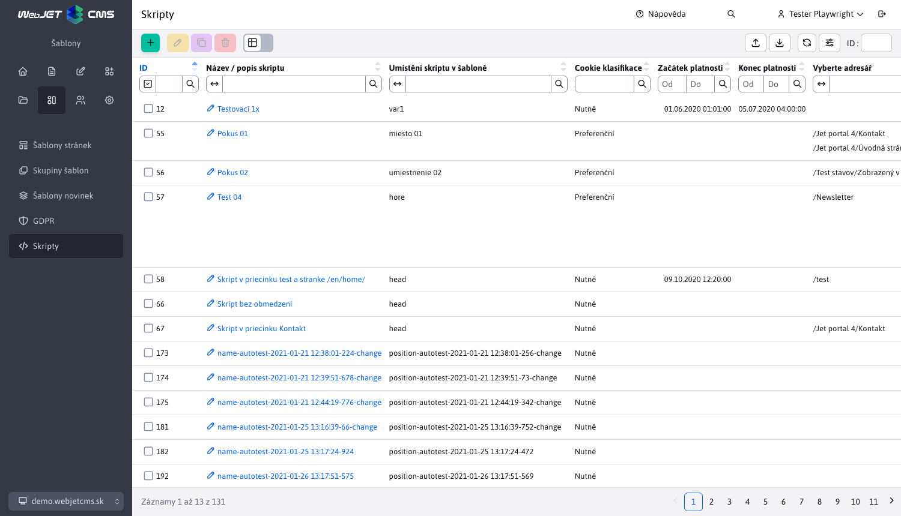
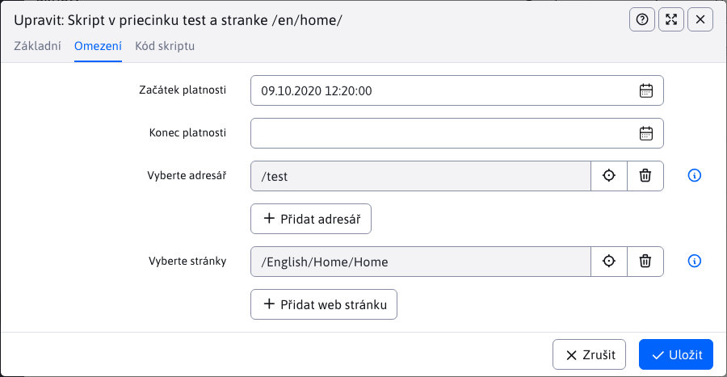

# Skripty

Aplikace "Skripty" umožňuje vytvářet skripty, které pak můžete přidat na libovolnou stránku nebo skupinu stránek. Skripty lze vkládat na základě povolení [návštěvník s klasifikací cookies/GDPR](../gdpr/cookiesmanger.md).



Editor se skládá ze 3 karet **Základní**, **Omezení** a **Kód skriptu**.

## Základní

Karta "Základní" obsahuje základní nastavení, která jsou všechna povinná.

- **Název / popis skriptu** - pojmenování/identifikace vašeho skriptu.
- **Umístění skriptu v šabloně** - typ výběrového pole `autocomplete` se seznamem již zadaných pozic skriptu v kódu HTML. Pokud je hodnota (např. `after_body`) není zobrazen, můžete jej zadat.
- **Klasifikace souborů cookie** - výběrové pole s typy souborů cookie, podle kterých je povoleno vkládání skriptů do stránky.
  - **Vložte vždy** - skript je vždy vložen do stránky bez ohledu na povolení cookies/GDPR.
  - **Požadované** - skript se vloží, pokud jsou povoleny soubory cookie Necessary.
  - **Upřednostňované** - skript se vloží, pokud jsou povoleny soubory cookie předvoleb, např. nastavení jazyka.
  - **Marketing** - skript je vložen, pokud jsou povoleny marketingové soubory cookie - sledují uživatele a zobrazují personalizované reklamy.
  - **Statistické** - skript je vložen, pokud jsou povoleny statistické soubory cookie - shromažďují data pro analýzu provozu.
  - **Nezařazené** - Skript se vloží, pokud jsou povoleny soubory cookie Uncategorized, tj. ty, které nebyly přiřazeny do kategorie.


## Omezení

Karta Omezení skriptu.

- **Začátek platnosti** - datum a čas, od kterého je skript platný.
- **Expirace** - datum a čas, do kterého je skript platný.
- **Výběr adresáře** - skript bude vložen do stránek ve vybraných složkách a jejich podsložkách.
- **Výběr místa** - skript bude vložen do vybraných webových stránek.

Pokud nezadáte čas začátku nebo konce skriptu, bude skript stále platný.



## Kód skriptu

Pole pro zadání samotného kódu skriptu (zápis HTML).

```html
<script>
// Sem vložte váš kód skriptu
</script>
```


Po otevření stránky, na kterou měl být skript vložen, můžete ve zdrojovém kódu stránky zkontrolovat, zda byl skript úspěšně vložen.

## Integrace do šablony

Technické vložení skriptu do kódu HTML zajišťuje nástroj [kód šablony](../../../frontend/thymeleaf/tags.md#vkládání-skriptů). Pro šablonu Thymeleaf je to tento kód:

```html
<div data-iwcm-script="head"/>
```

a pro starší kód šablony JSP:

```jsp
<iwcm:insertScript position="head"/>
```

kde výraz `head` definuje pole **Umístění skriptu v šabloně**. To znamená, že všechny skripty, které mají v poli Umístění skriptu v šabloně nastavenou hodnotu `head`.
