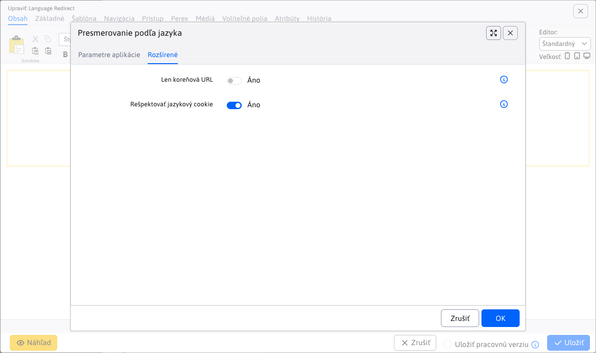

# Přesměrování podle jazyka

Aplikace umožňuje automatické přesměrování návštěvníků na jazykovou verzi stránky na základě jazyka jejich prohlížeče. Detekuje jazyk z HTTP hlavičky `Accept-Language` a přesměruje uživatele na příslušnou URL adresu podle nakonfigurovaných pravidel.

## Účel

Tato aplikace je určena pro vícejazyčné webové stránky, kde chcete návštěvníky automaticky rozdělit do příslušných jazykových variant. Například:

- Návštěvník se slovenským prohlížečem bude přesměrován na `/sk/`
- Návštěvník s anglickým prohlížečem bude přesměrován na `/en/`
- Pokud není jazyk detekován, použije se výchozí jazyk

## Instalace

Aplikaci **Přesměrování podle jazyka** vložíte přes seznam aplikací do web stránky v kořenové složce - typicky webová stránka s URL adresou `/`.

## Nastavení aplikace

Aplikace má dvě karty nastavení: **Základní** a **Pokročilé**.

### Základní nastavení


#### Výchozí jazyk

Určuje jazyk, který se použije v případě, že se jazyk prohlížeče nedetekuje nebo není nalezeno žádné přiřazení v konfiguraci. Výchozí hodnota je `sk`.

#### Přiřazení jazyků na URL adresy

Můžete nakonfigurovat **až 8 párů** přiřazení jazyka na URL adresu přesměrování. Každý pár se skládá z:

1. **Jazyk** – výběr jazyka z dostupných jazyků vašeho designu (stejný seznam jako při editaci šablony)
2. **Přesměrování** – URL adresa, na kterou se uživatel přesměruje (vybraný jazyk)

Pokud je pole jazyka prázdné, dané přiřazení se ignoruje. Pole pro URL můžete vybrat pomocí výběru odkazu.

**Příklad konfigurace:**

| # | Jazyk | Přesměrování |
| - | ----- | --------- |
| 1 | cs | /cs/ |
| 2 | en | /en/ |
| 3 | cs | /cs/ |
| 4–8 | (prázdné) | (prázdné) |

### Pokročilá nastavení



#### Jen kořenová URL

Je-li tato možnost zapnuta, přesměrování se provede **pouze na kořenové URL adrese** stránky (např. `/` nebo `/index.html`). Na ostatních stránkách se přesměrování neprovede. Použijte je-li aplikace vložena v nějaké společné části jako hlavička nebo patička. Doporučujeme ale aplikaci vložit přímo do stránky s URL adresou `/`, nebude se tak zbytečně provádět na jiných webových stránkách.

#### Respektovat jazykový cookie

Pokud je tato možnost zapnuta (výchozí), aplikace zkontroluje přítomnost **jazykového cookie s názvem `lng`**. Pokud uživatel má toto cookie nastaveno, jeho hodnota se použije namísto detekovaného jazyka z prohlížeče.

**Výhoda:** Uživatelé budou přesměrováni na stránku v jazykové mutaci, která jim byla naposledy zobrazena.

## Jak to funguje

Proces přesměrování probíhá v následujícím pořadí:

1. **Kontrola kořenové URL** – Pokud je zapnuta možnost *Jen kořenová URL* a aktuální URL není kořenová, přesměrování se neprovede.
2. **Kontrola jazykového cookie** – Je-li zapnuto *Respektovat jazykový cookie* a cookie `lng` existuje, použije se jeho hodnota jako jazyk.
3. **Detekce jazyka** – Pokud neexistuje cookie, aplikace detekuje jazyk z HTTP hlavičky `Accept-Language`. Parsed je první jazyk s nejvyšší prioritou, odstraní se regionální varianty (např. `en-US` → `en`) a quality faktory (např. `;q=0.7`).
4. **Vyhledání URL** – Aplikace projde všech 8 nakonfigurovaných přiřazení a hledá shodu s detekovaným jazykem.
5. **Fallback na výchozí jazyk** – Pokud není nalezeno přiřazení pro detekovaný jazyk, zkusí se přiřazení pro **výchozí jazyk**.
6. **Přesměrování** – Je-li nalezena URL adresa, provede se HTTP přesměrování na tuto adresu. V opačném případě se stránka načte normálně.

### Detekce jazyka

Aplikace kontroluje hodnotu HTTP hlavičky `Accept-Language` následovně:

- Rozdělí hodnotu podle čáry ( `,` ) a vezme první jazyk
- Odstraní quality faktor (např. `;q=0.8`)
- Odstraní regionální část (např. `en-US` → `en`, `sk_SK` → `sk`)
- Výsledek převede na malá písmena

**Příklady:**

| Hlavička | Detekovaný jazyk |
| -------- | ---------------- |
| `cs-CZ,cz;q=0.9,en-US;q=0.5` | cs |
| `en-GB,en;q=0.9` | en |
| `cs-CZ,cs;q=0.8,en;q=0.7` | cs |
| (prázdná) | výchozí jazyk |

## Příklady použití

### Příklad 1: Jednoduché rozdělení na SK a EN

Pro vícejazyčnou stránku se slovenskou a anglickou verzí:

```txt
Predvolený jazyk: sk
Mapping 1: sk → /sk/
Mapping 2: en → /en/
```

### Příklad 2: Několik jazyků s respektováním cookie

Pro stránku se slovenskou, českou a anglickou verzí, kde si mohou uživatelé měnit jazyk manuálně:

```txt
Predvolený jazyk: sk
Mapping 1: sk → /sk/
Mapping 2: en → /en/
Mapping 3: cs → /cs/
Len koreňová URL: ✓
Rešpektovať jazykový cookie: ✓
```

### Příklad 3: Pouze přesměrování na kořen

Pro případ, kdy chcete přesměrovat pouze návštěvníky přicházející na úvodní stránku:

```txt
Len koreňová URL: ✓
Rešpektovať jazykový cookie: ✓
Mapping 1: en → /english/
```

## Důležité poznámky

- Aplikace musí být vložena na stránku **před** obsahem, který má být přesměrován.
- Pokud je aplikace vložena na vnitřní stránku a je zapnuta možnost *Jen kořenová URL*, přesměrování se neprovede.
- Hodnota cookie `lng` má přednost před detekcí jazyka z prohlížeče.
- Není-li nalezeno žádné přiřazení pro detekovaný jazyk ani pro výchozí jazyk, přesměrování se neprovede a stránka se načte normálně.
- Možnosti jazyků v editoru se dynamicky načítají z konfigurace designu stránky pomocí `LayoutService.getLanguages()`.
