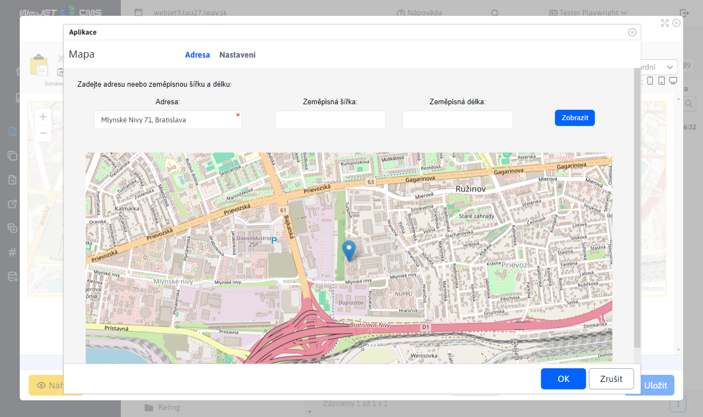
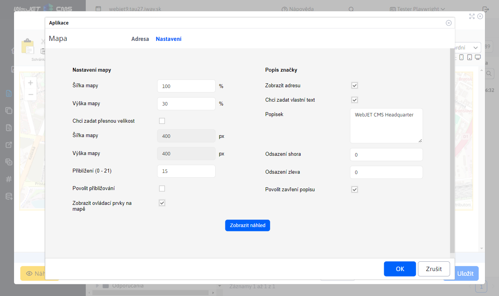
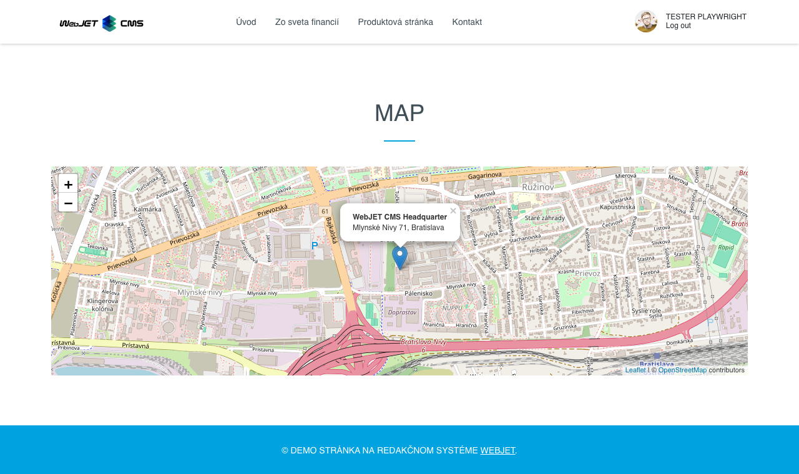

# Mapa

Vloží do stránky interaktivní mapu (Google maps nebo Open Street Map) podle zadaných GPS souřadnic nebo adresy. Pro použití Google maps je třeba mít zakoupený API klíč od Google nastavený v konf. proměnné googleMapsApiKey.

## Nastavení aplikace

### Adresa

V této části lze nastavit polohopisné atributy:
- Adresa
- Zeměpisná šířka, Zeměpisná délka

Je povinno nastavit buď adresu nebo zeměpisnou šířku a zeměpisnou délku. Místo lze nastavit kliknutím na mapu upřesněním bodu. Tímto krokem se na mapě zobrazí pin a přepíší hodnoty Zeměpisné šířky a zeměpisné délky.

### Nastavení

V této části lze nastavit rozměrové a vizuální atributy:
- Šířka mapy (v procentech)
- Výška mapy (v procentech)

Po zaškrtnutí pole Chci zadat přesnou velikost:
- Šířka mapy (v pixelech)
- Výška mapy (v pixelech)
- Přiblížení (v rozmezí 0 - 21)
- Povolit přibližování
- Zobrazit ovládací prvky na mapě
- Zobrazit adresu
- Popis
- Odsazení shora
- Odsazení sleva
- Povolit zavření popisu

Po změně atributů lze zobrazit náhled pomocí tlačítka

## Zobrazení aplikace

