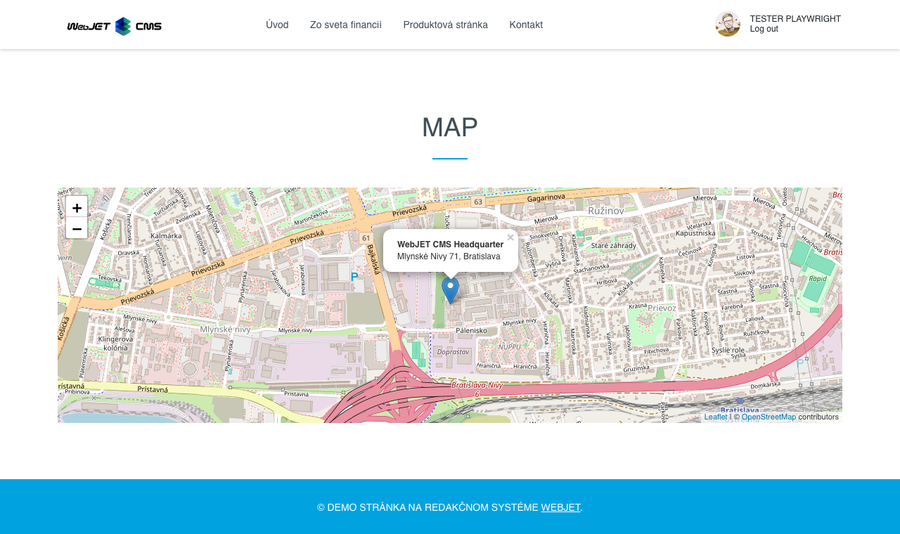
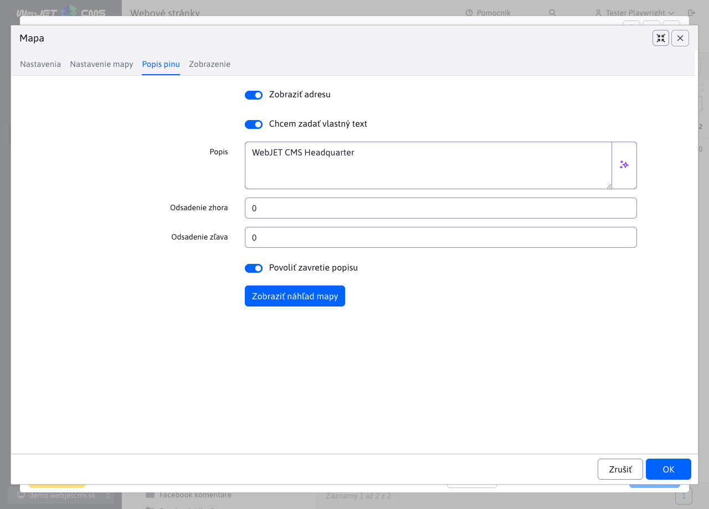

# Mapa

Vloží do stránky interaktivní mapu (`Google maps` nebo `Open Street Map`) podle zadaných GPS souřadnic, nebo adresy. Pro použití `Google maps` je třeba mít zakoupený API klíč od `Google` nastavený v konf. proměnné `googleMapsApiKey`.

## Nastavení aplikace

### Karta - Nastavení

V této části lze nastavit polohopisné atributy:

- **Adresa**
- **Zeměpisná šířka**, **Zeměpisná délka**

Je povinno nastavit buď adresu nebo zeměpisnou šířku a zeměpisnou délku. Místo lze nastavit kliknutím na mapu upřesněním bodu. Tímto krokem se na mapě zobrazí `pin` a přepíší hodnoty Zeměpisné šířky a zeměpisné délky.

Karta také obsahuje náhled mapy, kde lze vidět zadané údaje a nastavení.

!>**Upozornění:** náhled mapy se neaktualizuje automaticky při změně adresy nebo souřadnic, je nutné kliknout na tlačítko **Zobrazit náhled mapy** pro zobrazení změn v náhledu.

### Karta - Nastavení mapy

Karta slouží k nastavení velikosti mapy a dalších parametrů.

Přepínáním parametru **Chci zadat dynamickou velikost** se rozhodujeme, zda velikost mapy zadat v procentech (mapa se bude dynamicky přizpůsobovat velikosti obrazovky) nebo v pixelech (mapa bude mít pevnou velikost).

Další nastavení:

- **Přiblížení (0 - 21)**, čím větší číslo v rozsahu zadáte, tím větší přiblížení mapy bude
- **Povolit přibližování scrollováním**, povolením možnosti se umožní přiblížit mapu pomocí kolečka myši
- **Zobrazit ovládací prvky na mapě**, povolením možnosti se zobrazí ovládací prvky pro přiblížení a posouvání mapy

!>**Upozornění:** kliknutím na tlačítko **Zobrazit náhled mapy** se přepnete do karty **Nastavení**, kde se zobrazí aktualizovaný náhled mapy.

### Karta - Popis pinu

Karta slouží k nastavení popisu pinu, který se zobrazí po kliknutí na mapě.

Dostupná nastavení:

- **Zobrazit adresu**, povolením možnosti se zobrazí adresa, která byla zadána v kartě **Nastavení** (není-li zadaná adresa, zobrazí se souřadnice)
- **Chci zadat vlastní text**, povolením možnosti se zobrazí pole pro zadání vlastního textu, který se zobrazí v popisu pinu
- **Odsazení shora**, nastavením hodnoty v pixelech se nastaví odsazení popisu pinu od horního okraje mapy
- **Odsazení zleva**, nastavením hodnoty v pixelech se nastaví odsazení popisu pinu od levého okraje mapy
- **Povolit zavření popisu**, povolením možnosti se umožní zavřít popis pinu kliknutím na křížek v pravém horním rohu popisu

!>**Upozornění:** kliknutím na tlačítko **Zobrazit náhled mapy** se přepnete do karty **Nastavení**, kde se zobrazí aktualizovaný náhled mapy.

