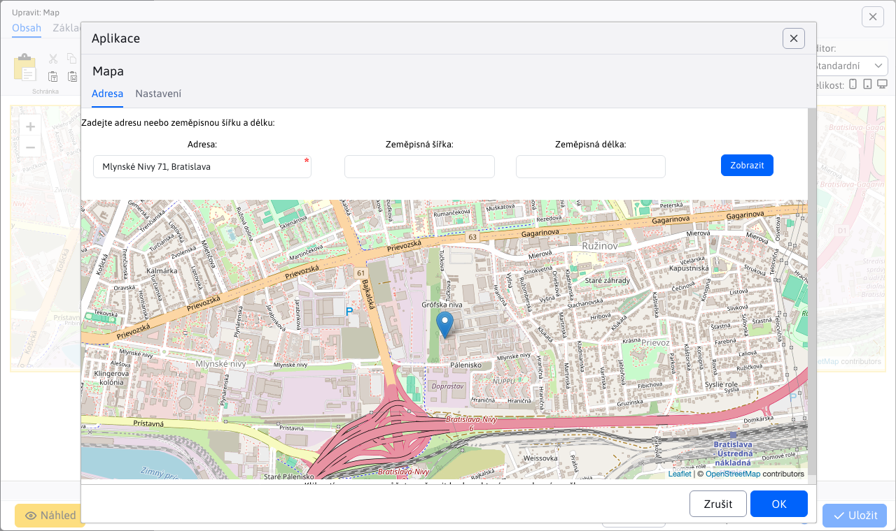
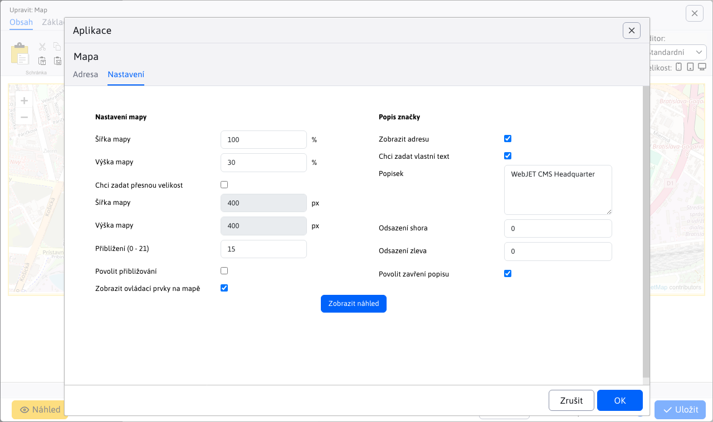

# Mapa

Vloží do stránky interaktivní mapu (Google Maps nebo Open Street Map) podle zadaných souřadnic GPS nebo adresy. Chcete-li používat mapy Google, musíte mít zakoupený klíč API od společnosti Google nastavený v konfigurační proměnné googleMapsApiKey.

## Nastavení aplikace

### Adresa

V této části můžete nastavit atributy polohy:
- Adresa
- Zeměpisná šířka, zeměpisná délka

Je povinné zadat buď adresu, nebo zeměpisnou šířku a délku. Polohu lze nastavit kliknutím na mapu a zadáním bodu. V tomto kroku se na mapě zobrazí špendlík a přepíší se hodnoty zeměpisné šířky a délky.

### Nastavení

V této části můžete nastavit rozměrové a vizuální atributy:
- Šířka mapy (v procentech)
- Výška mapy (v procentech)

Po zaškrtnutí políčka chci zadat přesnou velikost:
- Šířka mapy (v pixelech)
- Výška mapy (v pixelech)
- Zoom (rozsah 0 - 21)
- Umožnit přístup
- Zobrazení ovládacích prvků na mapě
- Zobrazit adresu
- Popis
- Odsazení shora
- Odsazení vlevo
- Povolit blízký popis

Po změně atributů je možné zobrazit náhled pomocí tlačítka

## Zobrazení aplikace

