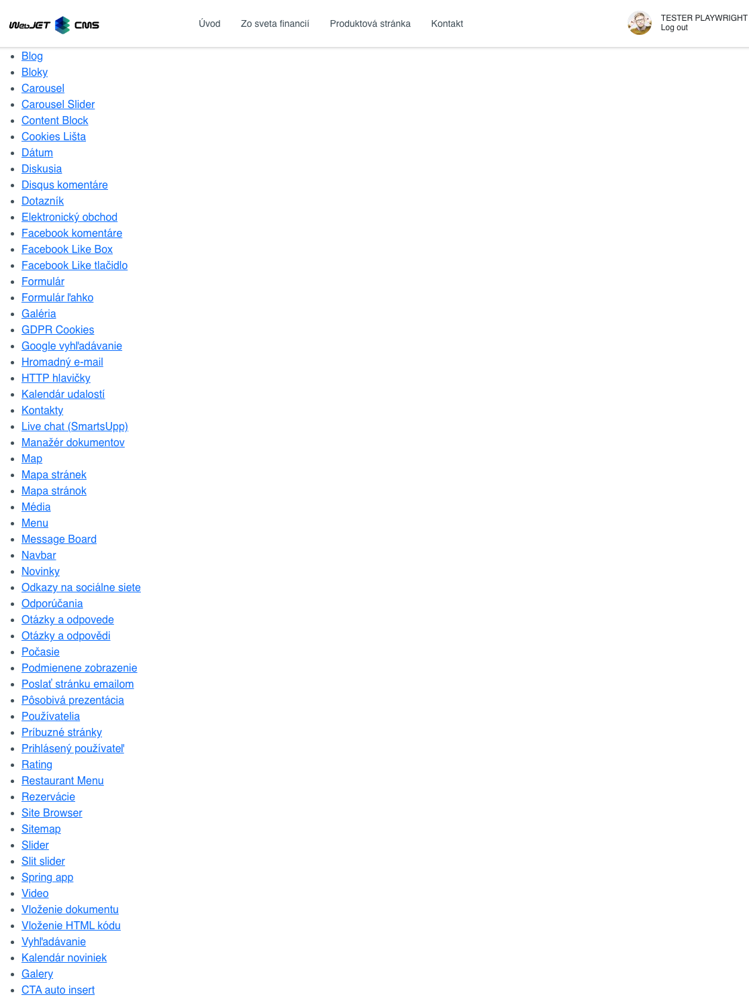
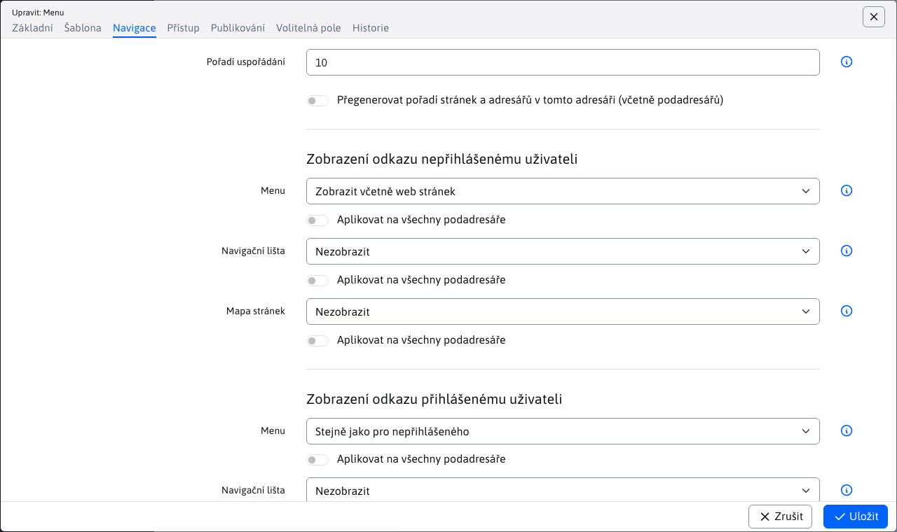

# Nabídka

Aplikace menu vytváří navigační menu pro celý web (tzv. horní menu nebo levé menu). Grafická podoba nabídky je definována pomocí kaskádových stylů (CSS). Příklady horního a levého menu:

Horní menu:

Levé menu:

Zobrazení položky nabídky závisí na nastavení pole Nabídka na kartě Navigace v adresáři webových stránek. Má následující možnosti:
- Zobrazit - položka se zobrazí v navigační nabídce.
- Nezobrazovat - položka se nezobrazí v navigační nabídce (včetně podsložek).
- Zobrazit bez podsložek - položka se zobrazí v navigační nabídce, ale její další podsložky se nezobrazí (výhodou je, že u podsložek není třeba nastavovat způsob zobrazení).
- Zobrazit včetně webových stránek - v navigační nabídce se zobrazí složka a webové stránky ze složky se zobrazí jako samostatné položky. Ve výchozím nastavení možnost Zobrazit nezobrazuje webové stránky ze složky jako samostatné položky nabídky.

Při zobrazování včetně webových stránek můžete ještě nastavit možnost zobrazit v nabídce každou webovou stránku zvlášť. Tato možnost se nachází rovněž na kartě Navigace a obsahuje volby:
- Zobrazit - webová stránka se zobrazí v nabídce.
- Nezobrazovat - webová stránka se v nabídce nezobrazí.

## Nastavení aplikace

Ve vlastnostech aplikace můžete nastavit:
- Kořenový adresář - výběr kořenového adresáře
- Odsazení od kořenového adresáře - počet úrovní adresáře od kořenového adresáře, o které má být výpis odsazen. Používá se v případě, že máte horní menu s hlavními položkami a levé menu s podpoložkami - menu s podpoložkami je nastaveno na posun o 2, takže menu nevypisuje hlavní položky, ale pouze podpoložky.
- Maximální hloubka menu - -1 menu bez omezení hloubky generování.
- Generované styly CSS
  - Žádné (čistý XHTML)
  - Základní - generuje otevřenou třídu na otevřeném prvku
  - Vše - vygeneruje řadu tříd: zobrazená úroveň, zda položka obsahuje podpoložky, ID adresáře, zda je položka otevřená nebo uzavřená
- Generovat prázdný span - vygeneruje prázdný html tag span v odkazu
- Rozbalit všechny položky - rozbalí se všechny úrovně nabídky
- Nastavit proměnné - tato funkce se používá, když chceme vygenerovat konkrétní název úrovně do nabídky mapr. prostřednictvím !WRITE(!ROOT\_GROUP\_NAME!)!
- ID stylu hlavního prvku UL - ID prvku
- Název adresáře pro MenuInfo
- Vložit perex - zabalí název název a odměna za to perexový text
- Vložit perex z úrovně - vloží perex pouze z definované úrovně

## MenuInfo

Slouží k vkládání popisů sekcí nebo reklamních bannerů do menu (megamenu).

Do pole MenuInfo zadáte název adresáře, který se v případě nalezení nevytvoří v menu jako standardní odkaz, ale v menu se vygeneruje obsah hlavní stránky tohoto adresáře. Vygeneruje se záhlaví a obsah stránky.

**Příklad:**

Při úpravě nabídky komponenty zadáte do pole MenuInfo název adresáře, např. Informace. Ve struktuře webu, která se v menu vygeneruje, vytvoříte adresář Informace. Do něj přidáte potřebné údaje a stránku publikujete. Ve vygenerovaném menu se místo standardního odkazu zobrazí název a obsah stránky Informace.
