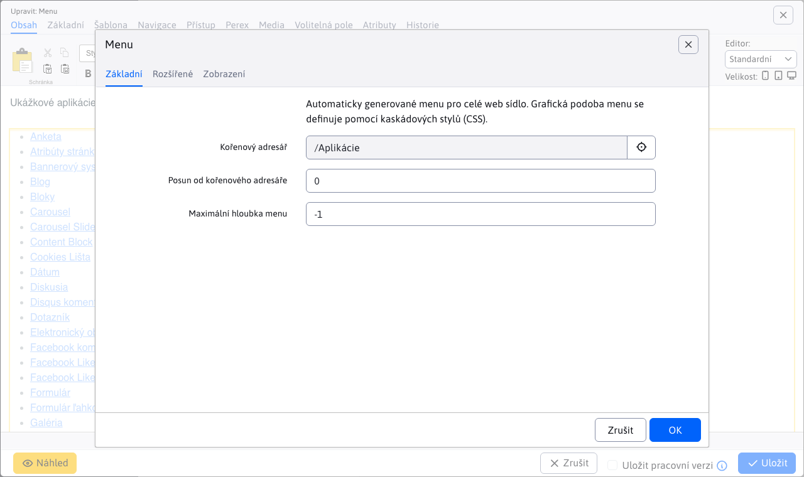

# Menu (navigační)

Aplikace menu generuje navigační menu pro celé web sídlo (tzv. horní menu, nebo levé menu). Grafická podoba menu se definuje pomocí kaskádových stylů (CSS). Příklady zobrazení horního a levého menu:

Horní menu:

Levé menu:

Zobrazení položky v menu je závislé na nastavení pole Menu v kartě Navigace adresáře web stránek. Má následující možnosti:
- Zobrazit - položka se v navigačním menu zobrazí.
- Nezobrazit - položka se v navigačním menu nezobrazí (a to včetně podsložek).
- Zobrazit bez podsložek - položka se v navigačním menu zobrazí, ale nebudou zobrazeny její další podsložky (výhoda je v tom, že podsložkou není třeba nastavovat způsob zobrazení).
- Zobrazit včetně web stránek - v navigačním menu se zobrazí složka a zobrazí se i web stránky ze složky jako samostatné položky. Standardně u možnosti Zobrazit se nezobrazují webové stránky z adresáře jako samostatné menu položky.

Při zobrazení včetně webových stránek můžete ještě samostatně každé webové stránce nastavit možnost zobrazení v menu. Možnost je rovněž v kartě Navigace a obsahuje možnosti:
- Zobrazit - web stránka se v menu zobrazí.
- Nezobrazit - web stránka se v menu nezobrazí.

## Nastavení aplikace

Ve vlastnostech aplikace lze nastavit:
- Kořenový adresář - výběr kořenového adresáře
- Posun od kořenového adresáře – počet úrovní adresářů od kořenového adresáře o které se výpis má posunout. Používá se v případě, kdy máte horní menu s hlavními položkami a levé menu s podpoložkami - menu podpoložek má nastavený posun o 2 aby se nevypsaly do menu hlavní položky ale až podpoložky.
- Maximální hloubka menu - -1 menu bez omezení hloubky generování.
- Generované CSS styly
  - Žádné (čisté XHTML)
  - Základní - generuje třídu open na otevřenou položku
  - Všechny - generuje řady tříd: zobrazovanou úroveň, zda položka obsahuje podpoložky, id adresáře, zda je položka otevřena nebo zavřená
- Generovat prázdný span - generuje prázdný html tag span do odkazu
- Rozbalit všechny položky - všechny úrovně menu budou rozbaleny
- Nastavit proměnné - tato funkcionalita se využívá, když chceme generovat nadpis specifické úrovně do menu mapr. přes !WRITE(!ROOT\_GROUP\_NAME!)!
- ID stylu hlavního UL elementu - ID elementu
- Název adresáře pro MenuInfo
- Vložit perex - obalí nazev název a přidá za to text perexu
- Vložit perex od úrovně - vloží perex až od definované úrovně

## MenuInfo

Slouží ke vkládání popisů k sekci nebo reklamních bannerů do menu (megamenu).

Do pole MenuInfo zadáváte název adresáře, který pokud se najde nevygeneruje se do menu jako standardní odkaz ale se do menu vygeneruje obsah hlavní stránky tohoto adresáře. Generuje se titulek a obsah stránky.

**Příklad:**

Při editaci menu komponenty zadáte do pole MenuInfo název adresáře. Informace. Ve struktuře web sídla která se generuje do menu vytvoříte adresář Informace. Doplníte potřebné údaje do stránky a stránku vypublikujete. Titulek a obsah stránky Informace se budou zobrazovat v generovaném menu namísto standardního odkazu.
